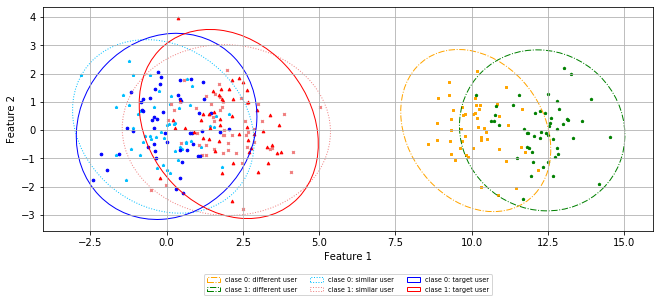

# Experiment 2

To evaluate how negative transfer learning affects the three
adaptive classifiers' accuracy, we use a synthetic database
to simulate source and target users. Each user is represented
as a binary classification problem (two classes and two
features) using Gaussian random data generators, as
illustrated an example in the following figure.

We group the source users into users who contribute
(similar users) and do not contribute (different users)
to the classifier's training for a target user. We assume
that the different-user data represent negative transfer
learning because they are not overlapped to the target-user
data, whereas the similar-user data are.

 Import the library developed to visualize the results


```python
import Experiments.Experiment2.VisualizationFunctions as VF2
```

*Gaussian Randomly Generated Data for a Different, Similar,
and Target user (2 Classes and 2 Features)*


```python
VF2.DataGenerator_TwoCL_TwoFeat_EXAMPLE()
```





*Adaptation techniques’ Accuracy vs. the Number of samples
in the Target Training Set*

The following figure illustrates the accuracy of the individual
classifier and the three adaptive classifiers, which take
advantage of 20 source classifiers trained with source-user
data from 20 simulated users. When all source users are
different, as illustrated in the figure(a), our classifier's
accuracy is equal to the individual classifier's one.
Therefore, our technique avoids negative transfer learning.
By contrast, Liu and Vidovic classifiers' accuracy is
negatively affected; even their performance is close to
a random classifier. For example, we can notice the Liu
and Vidovic classifiers also fail to avoid the negative
transfer learning because their accuracy in some cases is
less than the individual classifier's accuracy.

Additionally, when some source users are similar,
as shown in the figures (b-d), our classifier's performance
is better than the other three classifiers' ones because
our technique takes advantage of similar users to assist the
training.

Legend of the next figure: individual classifier (orange),
Liu classifier (green), Vidovic classifier (red), and
our classifier (blue).


```python
placeDataSyntheticResults = 'Experiments/Experiment2/results/results'
VF2.graphSyntheticDataALL(placeDataSyntheticResults)
```


