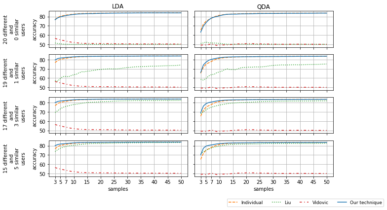

# Experiment 2

We use a synthetic database to evaluate how negative transfer learning affects the accuracy of DA classifiers using adaptation techniques. Using prior knowledge, the adaptation techniques, shown in the previous experiment, assist in training a DA classifier (target classifier) for a new user (target user). The prior knowledge is given by DA classifiers (source classifiers) trained by other users (source users). We develop a synthetic database using a Gaussian random number generator to simulate a classification problem of two classes and two features for each user.
The following figure shows the data to train the target classifier and the source classifiers. The data from a different user are not overlapped to the target user’s data. Different users represent negative transfer learning because their data is divergent to the target user’s data. The data from a similar user contribute to the target classifier’s training because they are overlapped to the target user’s data.

## Import the library developed to visualize the results


```python
import Experiments.Experiment2.VisualizationFunctions as VF2
```

## Gaussian Randomly Generated Data for a Different, Similar, and Target user (2 Classes and 2 Features)


```python
VF2.DataGenerator_TwoCL_TwoFeatEXAMPLE()
```


## Adaptation techniques’ Accuracy vs. the Number of samples in the Target Training Set.

For a target user and 20 source users, the following figure shows the accuracy of DA classifiers using the adaptation techniques and the accuracy of a non-adaptive DA classifier (individual classifier). When the prior-learned knowledge is obtained
by 20 classifiers trained only by different users (zero similar users), our adaptation technique’s accuracy is equal to the
accuracy of the individual classifier. However, when there is at least one classifier trained by one similar user in the
prior-learned knowledge, the accuracy of our adaptation technique is higher than the accuracy of all other classifiers.
Therefore, our technique minimises negative transfer learning because its accuracy is not affected by classifiers trained
by different users. Techniques by [Liu](https://ieeexplore.ieee.org/abstract/document/6985518/?casa_token=H9vZpl9IcF8AAAAA:Iom6Q55n9FSn-G9CqqS6bxQzzho7vvb0OtQPdgZMQBOuNo5HwCHZSh0wddgdSp6V3q_pFsSJ) and [Vidovic](https://ieeexplore.ieee.org/abstract/document/7302056/?casa_token=3KVFZed5PzoAAAAA:rQJutibAYMQ_Za4ZSNEee6VIR59ZlWlt9o6_MKLFY2GKq2_zgYBkFPqs5UhrFCvMyP41SBbJ) are affected by negative transfer learning, with their accuracy close to a random classifier, in some cases.


```python
placeDataSyntheticResults = 'Experiments/Experiment2/ResultsExp2/results'
VF2.graphSyntheticDataALL(placeDataSyntheticResults)
```




