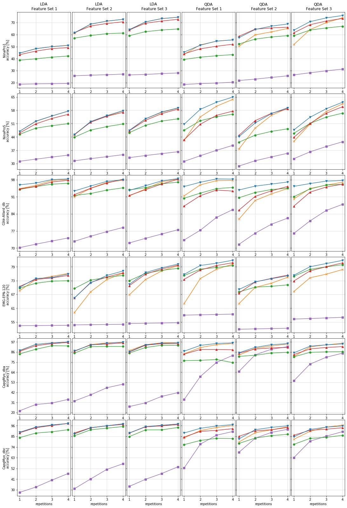
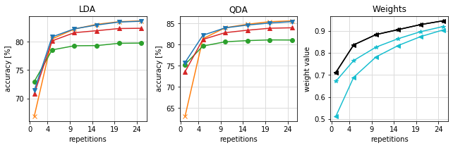
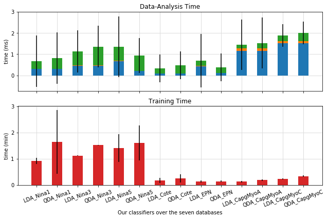
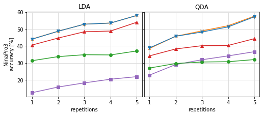

# Experiment 1

In this experiment, we compare the performance of the following LDA and QDA classifiers within the myoelectric
interface setups from section 3 (in the manuscript):
1. A non-adaptive DA classifier trained over a small-labeled target training set Tˆ (individual classifier).
2. A non-adaptive DA classifier trained over a small-labeled target training set Tˆ and training sets from the source
users (multi-user classifier).
3. Our adaptive DA classifier from section 2 (in the manuscript).
4. [Liu’s adaptive DA classifier](https://ieeexplore.ieee.org/abstract/document/6985518/?casa_token=H9vZpl9IcF8AAAAA:Iom6Q55n9FSn-G9CqqS6bxQzzho7vvb0OtQPdgZMQBOuNo5HwCHZSh0wddgdSp6V3q_pFsSJ).
5. [Vidovic’s adaptive DA classifier](https://ieeexplore.ieee.org/abstract/document/7302056/?casa_token=3KVFZed5PzoAAAAA:rQJutibAYMQ_Za4ZSNEee6VIR59ZlWlt9o6_MKLFY2GKq2_zgYBkFPqs5UhrFCvMyP41SBbJ).

We use seven databases are: [NinaPro1](http://ninaweb.hevs.ch/),
[NinaPro3](http://ninaweb.hevs.ch/)
[NinaPro5](http://ninaweb.hevs.ch/),
[Côté-Allard](https://github.com/UlysseCoteAllard/MyoArmbandDataset),
[EPN](https://ieeexplore.ieee.org/abstract/document/8903136/?casa_token=RYo5viuh6S8AAAAA:lizIpEqM4rK5eeo1Wxm-aPuDB20da2PngeRRnrC7agqSK1j26mqmtq5YJFLive7uW083m9tT).
[CapgMyo_dba](http://zju-capg.org/research_en_electro_capgmyo.html#download), and
[CapgMyo_dbc](http://zju-capg.org/research_en_electro_capgmyo.html#download).
All of them contain EMG data of hand gestures acquired by a Myo armband.
The three feature sets extracted from the databases are Hahne, Hudgins, and
Phinyomark sets.

*Feature Set 1 (Hahne):*
1. Logarithm of the variance (logVAR)

*Feature Set 2 (Hudgins):*
1. Mean absolute value (MAV)
2. Waveform length (WL)
3. Zero Crossing (ZC)
4. Slope sign change (SSC)

*Feature Set 3 (Phinyomark):*
1. L-scale (LS)
2. Maximum fractal length (MFL)
3. Mean of the square root (MSR)
4. Willison amplitude (WAMP)


## Load Results

First: Import the library developed to visualize the results


```python
import Experiments.Experiment1.VisualizationFunctions as VF1
import pandas as pd
```

Second: Load of the extraction times over the three databases


```python
place='ExtractedData/'
windowSize='295'
extractionTimeEPN=pd.read_csv(place+'EPN/timesFeatures'+windowSize+'.csv',header=None)
extractionTimeCote=pd.read_csv(place+'Cote/timesFeatures'+windowSize+'.csv',header=None)
extractionTimeNina5=pd.read_csv(place+'Nina5/timesFeatures'+windowSize+'.csv',header=None)
extractionTimeNina1=pd.read_csv(place+'Nina1/timesFeatures'+windowSize+'.csv',header=None)
extractionTimeNina3=pd.read_csv(place+'Nina3/timesFeatures'+windowSize+'.csv',header=None)
extractionTimeCapgmyoA=pd.read_csv(place+'Capgmyo_dba/timesFeatures'+windowSize+'.csv',header=None)
extractionTimeCapgmyoC=pd.read_csv(place+'Capgmyo_dbc/timesFeatures'+windowSize+'.csv',header=None)
```

Third: Load of the DA-based adaptation techniques' results over the three databases using the three feature sets.

Nina Pro 5 database


```python
pd.set_option('display.max_rows', 100)
pd.set_option('display.max_columns', 100)
place='Experiments/Experiment1/results/'
windowSize='295'

database='Nina5'
resultsNina5,timeNina5=VF1.uploadResultsDatabases(place,database,windowSize)
resultsNina5
```


<div>
<style scoped>
    .dataframe tbody tr th:only-of-type {
        vertical-align: middle;
    }

    .dataframe tbody tr th {
        vertical-align: top;
    }

    .dataframe thead th {
        text-align: right;
    }
</style>
<table border="1" class="dataframe">
  <thead>
    <tr style="text-align: right;">
      <th></th>
      <th>Feature Set</th>
      <th># shots</th>
      <th>IndLDA</th>
      <th>IndLDAstd</th>
      <th>IndQDA</th>
      <th>IndQDAstd</th>
      <th>MultiLDA</th>
      <th>MultiLDAstd</th>
      <th>MultiQDA</th>
      <th>MultiQDAstd</th>
      <th>LiuLDA</th>
      <th>LiuLDAstd</th>
      <th>LiuQDA</th>
      <th>LiuQDAstd</th>
      <th>VidLDA</th>
      <th>VidLDAstd</th>
      <th>VidQDA</th>
      <th>VidQDAstd</th>
      <th>OurLDA</th>
      <th>OurLDAstd</th>
      <th>OurQDA</th>
      <th>OurQDAstd</th>
      <th>wLDA</th>
      <th>lLDA</th>
      <th>wQDA</th>
      <th>lQDA</th>
    </tr>
  </thead>
  <tbody>
    <tr>
      <th>0</th>
      <td>1</td>
      <td>1</td>
      <td>0.469496</td>
      <td>0.060965</td>
      <td>0.422803</td>
      <td>0.065441</td>
      <td>0.312546</td>
      <td>0.070921</td>
      <td>0.311988</td>
      <td>0.077936</td>
      <td>0.453851</td>
      <td>0.049627</td>
      <td>0.475283</td>
      <td>0.083744</td>
      <td>0.461022</td>
      <td>0.056204</td>
      <td>0.425570</td>
      <td>0.065878</td>
      <td>0.469666</td>
      <td>0.062975</td>
      <td>0.506777</td>
      <td>0.071847</td>
      <td>0.918544</td>
      <td>0.918544</td>
      <td>0.859482</td>
      <td>0.624213</td>
    </tr>
    <tr>
      <th>1</th>
      <td>1</td>
      <td>2</td>
      <td>0.521554</td>
      <td>0.051513</td>
      <td>0.545461</td>
      <td>0.051622</td>
      <td>0.323491</td>
      <td>0.070998</td>
      <td>0.341456</td>
      <td>0.080460</td>
      <td>0.486173</td>
      <td>0.055212</td>
      <td>0.525321</td>
      <td>0.078764</td>
      <td>0.508808</td>
      <td>0.045406</td>
      <td>0.506843</td>
      <td>0.060067</td>
      <td>0.522988</td>
      <td>0.053649</td>
      <td>0.585133</td>
      <td>0.046786</td>
      <td>0.951340</td>
      <td>0.951340</td>
      <td>0.907888</td>
      <td>0.774826</td>
    </tr>
    <tr>
      <th>2</th>
      <td>1</td>
      <td>3</td>
      <td>0.549970</td>
      <td>0.053120</td>
      <td>0.601473</td>
      <td>0.050863</td>
      <td>0.334441</td>
      <td>0.070649</td>
      <td>0.369956</td>
      <td>0.079270</td>
      <td>0.499268</td>
      <td>0.055004</td>
      <td>0.546030</td>
      <td>0.073568</td>
      <td>0.537133</td>
      <td>0.049720</td>
      <td>0.553669</td>
      <td>0.048776</td>
      <td>0.550290</td>
      <td>0.053750</td>
      <td>0.622245</td>
      <td>0.046149</td>
      <td>0.967105</td>
      <td>0.967105</td>
      <td>0.934967</td>
      <td>0.848392</td>
    </tr>
    <tr>
      <th>3</th>
      <td>1</td>
      <td>4</td>
      <td>0.575601</td>
      <td>0.049358</td>
      <td>0.637058</td>
      <td>0.044869</td>
      <td>0.344707</td>
      <td>0.070109</td>
      <td>0.395753</td>
      <td>0.077023</td>
      <td>0.509878</td>
      <td>0.056163</td>
      <td>0.559818</td>
      <td>0.075246</td>
      <td>0.558708</td>
      <td>0.050394</td>
      <td>0.575438</td>
      <td>0.044523</td>
      <td>0.575581</td>
      <td>0.049710</td>
      <td>0.649323</td>
      <td>0.042801</td>
      <td>0.972773</td>
      <td>0.972773</td>
      <td>0.959278</td>
      <td>0.898823</td>
    </tr>
    <tr>
      <th>4</th>
      <td>2</td>
      <td>1</td>
      <td>0.450385</td>
      <td>0.066422</td>
      <td>0.377597</td>
      <td>0.065214</td>
      <td>0.314821</td>
      <td>0.069246</td>
      <td>0.287393</td>
      <td>0.075524</td>
      <td>0.438975</td>
      <td>0.079625</td>
      <td>0.412820</td>
      <td>0.071902</td>
      <td>0.453741</td>
      <td>0.058942</td>
      <td>0.448725</td>
      <td>0.061835</td>
      <td>0.452245</td>
      <td>0.067623</td>
      <td>0.441694</td>
      <td>0.066898</td>
      <td>0.922039</td>
      <td>0.922039</td>
      <td>0.719113</td>
      <td>0.583235</td>
    </tr>
    <tr>
      <th>5</th>
      <td>2</td>
      <td>2</td>
      <td>0.518605</td>
      <td>0.051153</td>
      <td>0.486443</td>
      <td>0.046113</td>
      <td>0.326292</td>
      <td>0.069567</td>
      <td>0.315136</td>
      <td>0.083908</td>
      <td>0.476249</td>
      <td>0.073608</td>
      <td>0.449254</td>
      <td>0.078110</td>
      <td>0.517411</td>
      <td>0.042640</td>
      <td>0.525773</td>
      <td>0.047754</td>
      <td>0.520784</td>
      <td>0.052472</td>
      <td>0.513426</td>
      <td>0.051779</td>
      <td>0.948073</td>
      <td>0.948073</td>
      <td>0.819421</td>
      <td>0.784355</td>
    </tr>
    <tr>
      <th>6</th>
      <td>2</td>
      <td>3</td>
      <td>0.549527</td>
      <td>0.042896</td>
      <td>0.553536</td>
      <td>0.045772</td>
      <td>0.336380</td>
      <td>0.070198</td>
      <td>0.335177</td>
      <td>0.091110</td>
      <td>0.494329</td>
      <td>0.069708</td>
      <td>0.469267</td>
      <td>0.089110</td>
      <td>0.548532</td>
      <td>0.040565</td>
      <td>0.564091</td>
      <td>0.045635</td>
      <td>0.551930</td>
      <td>0.044079</td>
      <td>0.562438</td>
      <td>0.053601</td>
      <td>0.963707</td>
      <td>0.963707</td>
      <td>0.877582</td>
      <td>0.880166</td>
    </tr>
    <tr>
      <th>7</th>
      <td>2</td>
      <td>4</td>
      <td>0.576946</td>
      <td>0.038291</td>
      <td>0.590562</td>
      <td>0.051153</td>
      <td>0.346937</td>
      <td>0.072060</td>
      <td>0.354230</td>
      <td>0.097943</td>
      <td>0.508217</td>
      <td>0.069746</td>
      <td>0.482522</td>
      <td>0.092739</td>
      <td>0.569556</td>
      <td>0.039128</td>
      <td>0.587607</td>
      <td>0.049158</td>
      <td>0.577768</td>
      <td>0.039172</td>
      <td>0.593305</td>
      <td>0.052599</td>
      <td>0.976980</td>
      <td>0.976980</td>
      <td>0.918370</td>
      <td>0.930324</td>
    </tr>
    <tr>
      <th>8</th>
      <td>3</td>
      <td>1</td>
      <td>0.472683</td>
      <td>0.059148</td>
      <td>0.416586</td>
      <td>0.060825</td>
      <td>0.331466</td>
      <td>0.083437</td>
      <td>0.326010</td>
      <td>0.074069</td>
      <td>0.462606</td>
      <td>0.065280</td>
      <td>0.459427</td>
      <td>0.066855</td>
      <td>0.472736</td>
      <td>0.050524</td>
      <td>0.438043</td>
      <td>0.065883</td>
      <td>0.474360</td>
      <td>0.057180</td>
      <td>0.476857</td>
      <td>0.060117</td>
      <td>0.914186</td>
      <td>0.914186</td>
      <td>0.732343</td>
      <td>0.553264</td>
    </tr>
    <tr>
      <th>9</th>
      <td>3</td>
      <td>2</td>
      <td>0.534814</td>
      <td>0.044637</td>
      <td>0.507842</td>
      <td>0.045683</td>
      <td>0.342576</td>
      <td>0.082135</td>
      <td>0.361956</td>
      <td>0.076631</td>
      <td>0.501084</td>
      <td>0.059337</td>
      <td>0.511081</td>
      <td>0.067064</td>
      <td>0.527383</td>
      <td>0.041397</td>
      <td>0.510812</td>
      <td>0.055721</td>
      <td>0.535589</td>
      <td>0.044320</td>
      <td>0.543343</td>
      <td>0.053363</td>
      <td>0.945303</td>
      <td>0.945303</td>
      <td>0.812947</td>
      <td>0.735331</td>
    </tr>
    <tr>
      <th>10</th>
      <td>3</td>
      <td>3</td>
      <td>0.569079</td>
      <td>0.039084</td>
      <td>0.573354</td>
      <td>0.042671</td>
      <td>0.352524</td>
      <td>0.080874</td>
      <td>0.389776</td>
      <td>0.074978</td>
      <td>0.523541</td>
      <td>0.057881</td>
      <td>0.544269</td>
      <td>0.065405</td>
      <td>0.562485</td>
      <td>0.037394</td>
      <td>0.564398</td>
      <td>0.050583</td>
      <td>0.570848</td>
      <td>0.039072</td>
      <td>0.588035</td>
      <td>0.049214</td>
      <td>0.960356</td>
      <td>0.960356</td>
      <td>0.882847</td>
      <td>0.855884</td>
    </tr>
    <tr>
      <th>11</th>
      <td>3</td>
      <td>4</td>
      <td>0.591195</td>
      <td>0.041341</td>
      <td>0.613604</td>
      <td>0.049484</td>
      <td>0.362348</td>
      <td>0.079519</td>
      <td>0.414453</td>
      <td>0.081734</td>
      <td>0.534895</td>
      <td>0.060130</td>
      <td>0.564787</td>
      <td>0.069401</td>
      <td>0.585903</td>
      <td>0.041815</td>
      <td>0.598595</td>
      <td>0.049920</td>
      <td>0.592342</td>
      <td>0.041669</td>
      <td>0.622137</td>
      <td>0.051638</td>
      <td>0.974177</td>
      <td>0.974177</td>
      <td>0.926212</td>
      <td>0.919112</td>
    </tr>
  </tbody>
</table>
</div>


Cote-Allard database


```python
database='Cote'
resultsCote,timeCote=VF1.uploadResultsDatabases(place,database,windowSize)
resultsCote
```


<div>
<style scoped>
    .dataframe tbody tr th:only-of-type {
        vertical-align: middle;
    }

    .dataframe tbody tr th {
        vertical-align: top;
    }

    .dataframe thead th {
        text-align: right;
    }
</style>
<table border="1" class="dataframe">
  <thead>
    <tr style="text-align: right;">
      <th></th>
      <th>Feature Set</th>
      <th># shots</th>
      <th>IndLDA</th>
      <th>IndLDAstd</th>
      <th>IndQDA</th>
      <th>IndQDAstd</th>
      <th>MultiLDA</th>
      <th>MultiLDAstd</th>
      <th>MultiQDA</th>
      <th>MultiQDAstd</th>
      <th>LiuLDA</th>
      <th>LiuLDAstd</th>
      <th>LiuQDA</th>
      <th>LiuQDAstd</th>
      <th>VidLDA</th>
      <th>VidLDAstd</th>
      <th>VidQDA</th>
      <th>VidQDAstd</th>
      <th>OurLDA</th>
      <th>OurLDAstd</th>
      <th>OurQDA</th>
      <th>OurQDAstd</th>
      <th>wLDA</th>
      <th>lLDA</th>
      <th>wQDA</th>
      <th>lQDA</th>
    </tr>
  </thead>
  <tbody>
    <tr>
      <th>0</th>
      <td>1</td>
      <td>1</td>
      <td>0.943640</td>
      <td>0.053431</td>
      <td>0.914393</td>
      <td>0.086532</td>
      <td>0.701505</td>
      <td>0.238031</td>
      <td>0.732781</td>
      <td>0.199898</td>
      <td>0.940876</td>
      <td>0.048241</td>
      <td>0.904222</td>
      <td>0.099606</td>
      <td>0.942476</td>
      <td>0.056406</td>
      <td>0.872334</td>
      <td>0.071262</td>
      <td>0.959534</td>
      <td>0.040697</td>
      <td>0.952639</td>
      <td>0.042390</td>
      <td>0.605248</td>
      <td>0.605248</td>
      <td>0.618660</td>
      <td>0.500105</td>
    </tr>
    <tr>
      <th>1</th>
      <td>1</td>
      <td>2</td>
      <td>0.957327</td>
      <td>0.049524</td>
      <td>0.959355</td>
      <td>0.052859</td>
      <td>0.715593</td>
      <td>0.232228</td>
      <td>0.773073</td>
      <td>0.170238</td>
      <td>0.952183</td>
      <td>0.050239</td>
      <td>0.925510</td>
      <td>0.087370</td>
      <td>0.952811</td>
      <td>0.048167</td>
      <td>0.915026</td>
      <td>0.043341</td>
      <td>0.966594</td>
      <td>0.042999</td>
      <td>0.970041</td>
      <td>0.048065</td>
      <td>0.731176</td>
      <td>0.731176</td>
      <td>0.728087</td>
      <td>0.639358</td>
    </tr>
    <tr>
      <th>2</th>
      <td>1</td>
      <td>3</td>
      <td>0.977673</td>
      <td>0.022352</td>
      <td>0.976573</td>
      <td>0.021488</td>
      <td>0.728691</td>
      <td>0.226035</td>
      <td>0.825591</td>
      <td>0.118134</td>
      <td>0.962241</td>
      <td>0.042114</td>
      <td>0.943855</td>
      <td>0.065457</td>
      <td>0.971266</td>
      <td>0.021481</td>
      <td>0.938019</td>
      <td>0.048435</td>
      <td>0.981010</td>
      <td>0.019028</td>
      <td>0.983712</td>
      <td>0.019488</td>
      <td>0.828510</td>
      <td>0.828510</td>
      <td>0.828178</td>
      <td>0.762754</td>
    </tr>
    <tr>
      <th>3</th>
      <td>1</td>
      <td>4</td>
      <td>0.981882</td>
      <td>0.020309</td>
      <td>0.977272</td>
      <td>0.022945</td>
      <td>0.741107</td>
      <td>0.218632</td>
      <td>0.857591</td>
      <td>0.092089</td>
      <td>0.965628</td>
      <td>0.042584</td>
      <td>0.948689</td>
      <td>0.068327</td>
      <td>0.978001</td>
      <td>0.015898</td>
      <td>0.933895</td>
      <td>0.051514</td>
      <td>0.983744</td>
      <td>0.018142</td>
      <td>0.983076</td>
      <td>0.019830</td>
      <td>0.915816</td>
      <td>0.915816</td>
      <td>0.917949</td>
      <td>0.881239</td>
    </tr>
    <tr>
      <th>4</th>
      <td>2</td>
      <td>1</td>
      <td>0.909874</td>
      <td>0.109100</td>
      <td>0.818818</td>
      <td>0.108093</td>
      <td>0.727513</td>
      <td>0.212953</td>
      <td>0.715136</td>
      <td>0.187280</td>
      <td>0.915733</td>
      <td>0.075071</td>
      <td>0.906386</td>
      <td>0.078004</td>
      <td>0.919391</td>
      <td>0.108805</td>
      <td>0.855717</td>
      <td>0.105036</td>
      <td>0.934514</td>
      <td>0.089406</td>
      <td>0.938464</td>
      <td>0.064684</td>
      <td>0.618528</td>
      <td>0.618528</td>
      <td>0.637523</td>
      <td>0.542160</td>
    </tr>
    <tr>
      <th>5</th>
      <td>2</td>
      <td>2</td>
      <td>0.945417</td>
      <td>0.084247</td>
      <td>0.895282</td>
      <td>0.073392</td>
      <td>0.748305</td>
      <td>0.196651</td>
      <td>0.760803</td>
      <td>0.150154</td>
      <td>0.923891</td>
      <td>0.084314</td>
      <td>0.927974</td>
      <td>0.075004</td>
      <td>0.945227</td>
      <td>0.096295</td>
      <td>0.912096</td>
      <td>0.079487</td>
      <td>0.954429</td>
      <td>0.079507</td>
      <td>0.954096</td>
      <td>0.059201</td>
      <td>0.753080</td>
      <td>0.753080</td>
      <td>0.735224</td>
      <td>0.698452</td>
    </tr>
    <tr>
      <th>6</th>
      <td>2</td>
      <td>3</td>
      <td>0.969438</td>
      <td>0.038156</td>
      <td>0.922262</td>
      <td>0.050130</td>
      <td>0.767207</td>
      <td>0.182514</td>
      <td>0.797529</td>
      <td>0.118060</td>
      <td>0.937713</td>
      <td>0.068967</td>
      <td>0.940033</td>
      <td>0.066551</td>
      <td>0.966775</td>
      <td>0.064826</td>
      <td>0.934636</td>
      <td>0.052413</td>
      <td>0.973630</td>
      <td>0.034246</td>
      <td>0.962644</td>
      <td>0.048416</td>
      <td>0.835696</td>
      <td>0.835696</td>
      <td>0.824567</td>
      <td>0.810581</td>
    </tr>
    <tr>
      <th>7</th>
      <td>2</td>
      <td>4</td>
      <td>0.978541</td>
      <td>0.025791</td>
      <td>0.943979</td>
      <td>0.030199</td>
      <td>0.784083</td>
      <td>0.171070</td>
      <td>0.822530</td>
      <td>0.100187</td>
      <td>0.947048</td>
      <td>0.060803</td>
      <td>0.945668</td>
      <td>0.054501</td>
      <td>0.982800</td>
      <td>0.018878</td>
      <td>0.952765</td>
      <td>0.028002</td>
      <td>0.980194</td>
      <td>0.025164</td>
      <td>0.970838</td>
      <td>0.026931</td>
      <td>0.920051</td>
      <td>0.920051</td>
      <td>0.913514</td>
      <td>0.909561</td>
    </tr>
    <tr>
      <th>8</th>
      <td>3</td>
      <td>1</td>
      <td>0.914089</td>
      <td>0.102151</td>
      <td>0.901808</td>
      <td>0.085922</td>
      <td>0.720824</td>
      <td>0.235403</td>
      <td>0.759881</td>
      <td>0.201857</td>
      <td>0.938754</td>
      <td>0.053922</td>
      <td>0.910927</td>
      <td>0.083738</td>
      <td>0.915828</td>
      <td>0.115327</td>
      <td>0.871927</td>
      <td>0.100809</td>
      <td>0.936768</td>
      <td>0.084660</td>
      <td>0.953218</td>
      <td>0.040356</td>
      <td>0.621783</td>
      <td>0.621783</td>
      <td>0.608913</td>
      <td>0.505873</td>
    </tr>
    <tr>
      <th>9</th>
      <td>3</td>
      <td>2</td>
      <td>0.942654</td>
      <td>0.085124</td>
      <td>0.944160</td>
      <td>0.051821</td>
      <td>0.739606</td>
      <td>0.224899</td>
      <td>0.811444</td>
      <td>0.154473</td>
      <td>0.947834</td>
      <td>0.060809</td>
      <td>0.942863</td>
      <td>0.057258</td>
      <td>0.939704</td>
      <td>0.102129</td>
      <td>0.929486</td>
      <td>0.065380</td>
      <td>0.955776</td>
      <td>0.072040</td>
      <td>0.964647</td>
      <td>0.042749</td>
      <td>0.743224</td>
      <td>0.743224</td>
      <td>0.723823</td>
      <td>0.661485</td>
    </tr>
    <tr>
      <th>10</th>
      <td>3</td>
      <td>3</td>
      <td>0.971714</td>
      <td>0.040443</td>
      <td>0.958511</td>
      <td>0.037047</td>
      <td>0.757362</td>
      <td>0.213818</td>
      <td>0.854229</td>
      <td>0.111295</td>
      <td>0.963698</td>
      <td>0.042172</td>
      <td>0.958804</td>
      <td>0.051514</td>
      <td>0.962653</td>
      <td>0.076876</td>
      <td>0.950510</td>
      <td>0.038543</td>
      <td>0.975780</td>
      <td>0.035136</td>
      <td>0.974619</td>
      <td>0.030176</td>
      <td>0.835291</td>
      <td>0.835291</td>
      <td>0.818161</td>
      <td>0.785718</td>
    </tr>
    <tr>
      <th>11</th>
      <td>3</td>
      <td>4</td>
      <td>0.983464</td>
      <td>0.018633</td>
      <td>0.969912</td>
      <td>0.026316</td>
      <td>0.774881</td>
      <td>0.200310</td>
      <td>0.879035</td>
      <td>0.088150</td>
      <td>0.970301</td>
      <td>0.037570</td>
      <td>0.961497</td>
      <td>0.049482</td>
      <td>0.982214</td>
      <td>0.016972</td>
      <td>0.961951</td>
      <td>0.028846</td>
      <td>0.984765</td>
      <td>0.017413</td>
      <td>0.977465</td>
      <td>0.025338</td>
      <td>0.921220</td>
      <td>0.921220</td>
      <td>0.910499</td>
      <td>0.896635</td>
    </tr>
  </tbody>
</table>
</div>


EPN database


```python
database='EPN'
resultsEPN,timeEPN=VF1.uploadResultsDatabases(place,database,windowSize)
resultsEPN
```


<div>
<style scoped>
    .dataframe tbody tr th:only-of-type {
        vertical-align: middle;
    }

    .dataframe tbody tr th {
        vertical-align: top;
    }

    .dataframe thead th {
        text-align: right;
    }
</style>
<table border="1" class="dataframe">
  <thead>
    <tr style="text-align: right;">
      <th></th>
      <th>Feature Set</th>
      <th># shots</th>
      <th>IndLDA</th>
      <th>IndLDAstd</th>
      <th>IndQDA</th>
      <th>IndQDAstd</th>
      <th>MultiLDA</th>
      <th>MultiLDAstd</th>
      <th>MultiQDA</th>
      <th>MultiQDAstd</th>
      <th>LiuLDA</th>
      <th>LiuLDAstd</th>
      <th>LiuQDA</th>
      <th>LiuQDAstd</th>
      <th>VidLDA</th>
      <th>VidLDAstd</th>
      <th>VidQDA</th>
      <th>VidQDAstd</th>
      <th>OurLDA</th>
      <th>OurLDAstd</th>
      <th>OurQDA</th>
      <th>OurQDAstd</th>
      <th>wLDA</th>
      <th>lLDA</th>
      <th>wQDA</th>
      <th>lQDA</th>
    </tr>
  </thead>
  <tbody>
    <tr>
      <th>0</th>
      <td>1</td>
      <td>1</td>
      <td>0.686165</td>
      <td>0.131710</td>
      <td>0.630271</td>
      <td>0.107627</td>
      <td>0.533857</td>
      <td>0.175196</td>
      <td>0.580119</td>
      <td>0.144893</td>
      <td>0.697570</td>
      <td>0.132179</td>
      <td>0.752834</td>
      <td>0.118613</td>
      <td>0.704752</td>
      <td>0.129903</td>
      <td>0.735736</td>
      <td>0.120711</td>
      <td>0.701020</td>
      <td>0.134794</td>
      <td>0.757560</td>
      <td>0.116491</td>
      <td>0.684092</td>
      <td>0.684092</td>
      <td>0.685373</td>
      <td>0.519844</td>
    </tr>
    <tr>
      <th>1</th>
      <td>1</td>
      <td>2</td>
      <td>0.735432</td>
      <td>0.132918</td>
      <td>0.739476</td>
      <td>0.098510</td>
      <td>0.534449</td>
      <td>0.175118</td>
      <td>0.581342</td>
      <td>0.144714</td>
      <td>0.718829</td>
      <td>0.130946</td>
      <td>0.780134</td>
      <td>0.115667</td>
      <td>0.735477</td>
      <td>0.127296</td>
      <td>0.776397</td>
      <td>0.113106</td>
      <td>0.739378</td>
      <td>0.125045</td>
      <td>0.796140</td>
      <td>0.107603</td>
      <td>0.743739</td>
      <td>0.743739</td>
      <td>0.703862</td>
      <td>0.587330</td>
    </tr>
    <tr>
      <th>2</th>
      <td>1</td>
      <td>3</td>
      <td>0.748962</td>
      <td>0.134980</td>
      <td>0.779787</td>
      <td>0.104635</td>
      <td>0.535097</td>
      <td>0.174918</td>
      <td>0.582900</td>
      <td>0.143875</td>
      <td>0.727982</td>
      <td>0.132072</td>
      <td>0.787558</td>
      <td>0.119224</td>
      <td>0.742000</td>
      <td>0.130462</td>
      <td>0.795827</td>
      <td>0.113339</td>
      <td>0.743847</td>
      <td>0.134618</td>
      <td>0.806050</td>
      <td>0.111963</td>
      <td>0.762402</td>
      <td>0.762402</td>
      <td>0.731689</td>
      <td>0.630666</td>
    </tr>
    <tr>
      <th>3</th>
      <td>1</td>
      <td>4</td>
      <td>0.761555</td>
      <td>0.127999</td>
      <td>0.801943</td>
      <td>0.104483</td>
      <td>0.535648</td>
      <td>0.174711</td>
      <td>0.584319</td>
      <td>0.143217</td>
      <td>0.729871</td>
      <td>0.128714</td>
      <td>0.795766</td>
      <td>0.114037</td>
      <td>0.752873</td>
      <td>0.121666</td>
      <td>0.808157</td>
      <td>0.109975</td>
      <td>0.758816</td>
      <td>0.120699</td>
      <td>0.818900</td>
      <td>0.105799</td>
      <td>0.788799</td>
      <td>0.788799</td>
      <td>0.758027</td>
      <td>0.662957</td>
    </tr>
    <tr>
      <th>4</th>
      <td>1</td>
      <td>5</td>
      <td>0.762991</td>
      <td>0.128283</td>
      <td>0.813814</td>
      <td>0.103458</td>
      <td>0.536169</td>
      <td>0.174669</td>
      <td>0.585422</td>
      <td>0.142791</td>
      <td>0.729272</td>
      <td>0.129066</td>
      <td>0.796465</td>
      <td>0.114393</td>
      <td>0.752144</td>
      <td>0.122658</td>
      <td>0.812133</td>
      <td>0.106486</td>
      <td>0.758873</td>
      <td>0.122089</td>
      <td>0.822057</td>
      <td>0.104811</td>
      <td>0.804994</td>
      <td>0.804994</td>
      <td>0.773394</td>
      <td>0.686847</td>
    </tr>
    <tr>
      <th>5</th>
      <td>1</td>
      <td>6</td>
      <td>0.766549</td>
      <td>0.127004</td>
      <td>0.820638</td>
      <td>0.104015</td>
      <td>0.536694</td>
      <td>0.174529</td>
      <td>0.586754</td>
      <td>0.142140</td>
      <td>0.730997</td>
      <td>0.128723</td>
      <td>0.798831</td>
      <td>0.113214</td>
      <td>0.755750</td>
      <td>0.121235</td>
      <td>0.814328</td>
      <td>0.104439</td>
      <td>0.764022</td>
      <td>0.118906</td>
      <td>0.825411</td>
      <td>0.102967</td>
      <td>0.798849</td>
      <td>0.798849</td>
      <td>0.788621</td>
      <td>0.707911</td>
    </tr>
    <tr>
      <th>6</th>
      <td>1</td>
      <td>7</td>
      <td>0.769889</td>
      <td>0.125337</td>
      <td>0.826622</td>
      <td>0.103587</td>
      <td>0.537267</td>
      <td>0.174425</td>
      <td>0.588119</td>
      <td>0.141618</td>
      <td>0.733064</td>
      <td>0.127086</td>
      <td>0.802123</td>
      <td>0.111162</td>
      <td>0.759254</td>
      <td>0.119632</td>
      <td>0.819496</td>
      <td>0.100847</td>
      <td>0.765974</td>
      <td>0.121511</td>
      <td>0.829996</td>
      <td>0.102136</td>
      <td>0.825552</td>
      <td>0.825552</td>
      <td>0.801786</td>
      <td>0.726911</td>
    </tr>
    <tr>
      <th>7</th>
      <td>1</td>
      <td>8</td>
      <td>0.772781</td>
      <td>0.122992</td>
      <td>0.833954</td>
      <td>0.097421</td>
      <td>0.537830</td>
      <td>0.174261</td>
      <td>0.589448</td>
      <td>0.140926</td>
      <td>0.734392</td>
      <td>0.125085</td>
      <td>0.806034</td>
      <td>0.106868</td>
      <td>0.761411</td>
      <td>0.117178</td>
      <td>0.825673</td>
      <td>0.096316</td>
      <td>0.767704</td>
      <td>0.119086</td>
      <td>0.835348</td>
      <td>0.097869</td>
      <td>0.833671</td>
      <td>0.833671</td>
      <td>0.811484</td>
      <td>0.739889</td>
    </tr>
    <tr>
      <th>8</th>
      <td>1</td>
      <td>9</td>
      <td>0.772835</td>
      <td>0.123537</td>
      <td>0.838562</td>
      <td>0.098573</td>
      <td>0.538266</td>
      <td>0.174182</td>
      <td>0.590562</td>
      <td>0.140583</td>
      <td>0.733314</td>
      <td>0.127012</td>
      <td>0.806688</td>
      <td>0.108459</td>
      <td>0.761853</td>
      <td>0.117168</td>
      <td>0.827644</td>
      <td>0.098264</td>
      <td>0.769067</td>
      <td>0.119004</td>
      <td>0.837685</td>
      <td>0.099193</td>
      <td>0.848074</td>
      <td>0.848074</td>
      <td>0.821138</td>
      <td>0.755840</td>
    </tr>
    <tr>
      <th>9</th>
      <td>1</td>
      <td>10</td>
      <td>0.773819</td>
      <td>0.123246</td>
      <td>0.839854</td>
      <td>0.099086</td>
      <td>0.538769</td>
      <td>0.174086</td>
      <td>0.591751</td>
      <td>0.139960</td>
      <td>0.732833</td>
      <td>0.127821</td>
      <td>0.806543</td>
      <td>0.108881</td>
      <td>0.763406</td>
      <td>0.116440</td>
      <td>0.828187</td>
      <td>0.099558</td>
      <td>0.770495</td>
      <td>0.118196</td>
      <td>0.839484</td>
      <td>0.098356</td>
      <td>0.855087</td>
      <td>0.855087</td>
      <td>0.829092</td>
      <td>0.768416</td>
    </tr>
    <tr>
      <th>10</th>
      <td>1</td>
      <td>11</td>
      <td>0.776445</td>
      <td>0.122868</td>
      <td>0.841099</td>
      <td>0.098916</td>
      <td>0.539416</td>
      <td>0.173928</td>
      <td>0.593632</td>
      <td>0.138937</td>
      <td>0.731926</td>
      <td>0.125761</td>
      <td>0.806330</td>
      <td>0.107273</td>
      <td>0.765038</td>
      <td>0.115930</td>
      <td>0.827066</td>
      <td>0.097549</td>
      <td>0.772169</td>
      <td>0.119650</td>
      <td>0.840873</td>
      <td>0.098258</td>
      <td>0.861145</td>
      <td>0.861145</td>
      <td>0.838685</td>
      <td>0.779774</td>
    </tr>
    <tr>
      <th>11</th>
      <td>1</td>
      <td>12</td>
      <td>0.776941</td>
      <td>0.121486</td>
      <td>0.844236</td>
      <td>0.098766</td>
      <td>0.539900</td>
      <td>0.173792</td>
      <td>0.594831</td>
      <td>0.138391</td>
      <td>0.733338</td>
      <td>0.125470</td>
      <td>0.807863</td>
      <td>0.107121</td>
      <td>0.765973</td>
      <td>0.115498</td>
      <td>0.829749</td>
      <td>0.097586</td>
      <td>0.774352</td>
      <td>0.116592</td>
      <td>0.843007</td>
      <td>0.097126</td>
      <td>0.859914</td>
      <td>0.859914</td>
      <td>0.844578</td>
      <td>0.789334</td>
    </tr>
    <tr>
      <th>12</th>
      <td>1</td>
      <td>13</td>
      <td>0.777486</td>
      <td>0.122354</td>
      <td>0.845469</td>
      <td>0.097756</td>
      <td>0.540423</td>
      <td>0.173680</td>
      <td>0.595823</td>
      <td>0.138030</td>
      <td>0.733312</td>
      <td>0.126547</td>
      <td>0.808849</td>
      <td>0.106790</td>
      <td>0.766112</td>
      <td>0.116066</td>
      <td>0.831941</td>
      <td>0.097668</td>
      <td>0.774121</td>
      <td>0.118615</td>
      <td>0.843962</td>
      <td>0.097419</td>
      <td>0.871662</td>
      <td>0.871662</td>
      <td>0.851676</td>
      <td>0.799551</td>
    </tr>
    <tr>
      <th>13</th>
      <td>1</td>
      <td>14</td>
      <td>0.778543</td>
      <td>0.121466</td>
      <td>0.846764</td>
      <td>0.097379</td>
      <td>0.541023</td>
      <td>0.173471</td>
      <td>0.597136</td>
      <td>0.137479</td>
      <td>0.733936</td>
      <td>0.126083</td>
      <td>0.808767</td>
      <td>0.106147</td>
      <td>0.766328</td>
      <td>0.115995</td>
      <td>0.833044</td>
      <td>0.096754</td>
      <td>0.774054</td>
      <td>0.119352</td>
      <td>0.844908</td>
      <td>0.097230</td>
      <td>0.875274</td>
      <td>0.875274</td>
      <td>0.863225</td>
      <td>0.808687</td>
    </tr>
    <tr>
      <th>14</th>
      <td>1</td>
      <td>15</td>
      <td>0.778179</td>
      <td>0.123308</td>
      <td>0.848025</td>
      <td>0.097582</td>
      <td>0.541655</td>
      <td>0.173400</td>
      <td>0.598420</td>
      <td>0.136740</td>
      <td>0.732994</td>
      <td>0.127554</td>
      <td>0.809356</td>
      <td>0.105963</td>
      <td>0.766156</td>
      <td>0.117493</td>
      <td>0.833934</td>
      <td>0.096525</td>
      <td>0.773384</td>
      <td>0.122692</td>
      <td>0.846160</td>
      <td>0.096871</td>
      <td>0.879068</td>
      <td>0.879068</td>
      <td>0.866076</td>
      <td>0.817805</td>
    </tr>
    <tr>
      <th>15</th>
      <td>1</td>
      <td>16</td>
      <td>0.779150</td>
      <td>0.122339</td>
      <td>0.849950</td>
      <td>0.096151</td>
      <td>0.542227</td>
      <td>0.173202</td>
      <td>0.599895</td>
      <td>0.135823</td>
      <td>0.732933</td>
      <td>0.126593</td>
      <td>0.809805</td>
      <td>0.105658</td>
      <td>0.766681</td>
      <td>0.116600</td>
      <td>0.835037</td>
      <td>0.095401</td>
      <td>0.774809</td>
      <td>0.119863</td>
      <td>0.848209</td>
      <td>0.095353</td>
      <td>0.890339</td>
      <td>0.890339</td>
      <td>0.871774</td>
      <td>0.826189</td>
    </tr>
    <tr>
      <th>16</th>
      <td>1</td>
      <td>17</td>
      <td>0.780041</td>
      <td>0.123234</td>
      <td>0.851446</td>
      <td>0.095295</td>
      <td>0.542658</td>
      <td>0.173199</td>
      <td>0.600836</td>
      <td>0.135408</td>
      <td>0.733883</td>
      <td>0.126713</td>
      <td>0.810052</td>
      <td>0.106018</td>
      <td>0.767192</td>
      <td>0.117092</td>
      <td>0.835949</td>
      <td>0.094850</td>
      <td>0.776208</td>
      <td>0.119975</td>
      <td>0.849537</td>
      <td>0.094333</td>
      <td>0.890607</td>
      <td>0.890607</td>
      <td>0.882158</td>
      <td>0.836421</td>
    </tr>
    <tr>
      <th>17</th>
      <td>1</td>
      <td>18</td>
      <td>0.779762</td>
      <td>0.123017</td>
      <td>0.851511</td>
      <td>0.094602</td>
      <td>0.543257</td>
      <td>0.172999</td>
      <td>0.602323</td>
      <td>0.134773</td>
      <td>0.734157</td>
      <td>0.126664</td>
      <td>0.810147</td>
      <td>0.105141</td>
      <td>0.767051</td>
      <td>0.116541</td>
      <td>0.835558</td>
      <td>0.094443</td>
      <td>0.775706</td>
      <td>0.120660</td>
      <td>0.848628</td>
      <td>0.094487</td>
      <td>0.899723</td>
      <td>0.899723</td>
      <td>0.880934</td>
      <td>0.839990</td>
    </tr>
    <tr>
      <th>18</th>
      <td>1</td>
      <td>19</td>
      <td>0.780699</td>
      <td>0.123055</td>
      <td>0.853112</td>
      <td>0.094358</td>
      <td>0.543815</td>
      <td>0.172802</td>
      <td>0.604948</td>
      <td>0.135125</td>
      <td>0.734473</td>
      <td>0.126754</td>
      <td>0.810668</td>
      <td>0.105734</td>
      <td>0.767984</td>
      <td>0.116448</td>
      <td>0.837606</td>
      <td>0.095184</td>
      <td>0.776919</td>
      <td>0.121018</td>
      <td>0.849886</td>
      <td>0.094047</td>
      <td>0.899775</td>
      <td>0.899775</td>
      <td>0.888641</td>
      <td>0.849135</td>
    </tr>
    <tr>
      <th>19</th>
      <td>1</td>
      <td>20</td>
      <td>0.781275</td>
      <td>0.123613</td>
      <td>0.854134</td>
      <td>0.094141</td>
      <td>0.544351</td>
      <td>0.172543</td>
      <td>0.606489</td>
      <td>0.134851</td>
      <td>0.734586</td>
      <td>0.127032</td>
      <td>0.811013</td>
      <td>0.105632</td>
      <td>0.767909</td>
      <td>0.116525</td>
      <td>0.838624</td>
      <td>0.094571</td>
      <td>0.777092</td>
      <td>0.121530</td>
      <td>0.850954</td>
      <td>0.093496</td>
      <td>0.909084</td>
      <td>0.909084</td>
      <td>0.893523</td>
      <td>0.856719</td>
    </tr>
    <tr>
      <th>20</th>
      <td>1</td>
      <td>21</td>
      <td>0.780997</td>
      <td>0.123208</td>
      <td>0.853767</td>
      <td>0.094892</td>
      <td>0.544881</td>
      <td>0.172390</td>
      <td>0.609927</td>
      <td>0.137158</td>
      <td>0.733743</td>
      <td>0.128463</td>
      <td>0.811182</td>
      <td>0.106715</td>
      <td>0.768044</td>
      <td>0.116623</td>
      <td>0.838443</td>
      <td>0.096304</td>
      <td>0.777890</td>
      <td>0.120406</td>
      <td>0.850725</td>
      <td>0.095263</td>
      <td>0.910009</td>
      <td>0.910009</td>
      <td>0.898011</td>
      <td>0.860431</td>
    </tr>
    <tr>
      <th>21</th>
      <td>1</td>
      <td>22</td>
      <td>0.781337</td>
      <td>0.122563</td>
      <td>0.855022</td>
      <td>0.094638</td>
      <td>0.545496</td>
      <td>0.172203</td>
      <td>0.612574</td>
      <td>0.138446</td>
      <td>0.734275</td>
      <td>0.128186</td>
      <td>0.810792</td>
      <td>0.106602</td>
      <td>0.768786</td>
      <td>0.116759</td>
      <td>0.839463</td>
      <td>0.095789</td>
      <td>0.779076</td>
      <td>0.119197</td>
      <td>0.851170</td>
      <td>0.096076</td>
      <td>0.914473</td>
      <td>0.914473</td>
      <td>0.906464</td>
      <td>0.864190</td>
    </tr>
    <tr>
      <th>22</th>
      <td>1</td>
      <td>23</td>
      <td>0.782186</td>
      <td>0.122218</td>
      <td>0.855967</td>
      <td>0.094355</td>
      <td>0.546022</td>
      <td>0.172105</td>
      <td>0.613986</td>
      <td>0.138465</td>
      <td>0.734357</td>
      <td>0.128291</td>
      <td>0.810650</td>
      <td>0.106795</td>
      <td>0.769263</td>
      <td>0.116599</td>
      <td>0.839781</td>
      <td>0.094765</td>
      <td>0.780382</td>
      <td>0.118219</td>
      <td>0.853351</td>
      <td>0.093421</td>
      <td>0.918647</td>
      <td>0.918647</td>
      <td>0.906896</td>
      <td>0.873824</td>
    </tr>
    <tr>
      <th>23</th>
      <td>1</td>
      <td>24</td>
      <td>0.780565</td>
      <td>0.121588</td>
      <td>0.856128</td>
      <td>0.094233</td>
      <td>0.546578</td>
      <td>0.171938</td>
      <td>0.615497</td>
      <td>0.139099</td>
      <td>0.733199</td>
      <td>0.127802</td>
      <td>0.809758</td>
      <td>0.106415</td>
      <td>0.767814</td>
      <td>0.116044</td>
      <td>0.839362</td>
      <td>0.094516</td>
      <td>0.777664</td>
      <td>0.120126</td>
      <td>0.853494</td>
      <td>0.092960</td>
      <td>0.929125</td>
      <td>0.929125</td>
      <td>0.913253</td>
      <td>0.881966</td>
    </tr>
    <tr>
      <th>24</th>
      <td>1</td>
      <td>25</td>
      <td>0.781206</td>
      <td>0.121805</td>
      <td>0.856114</td>
      <td>0.093871</td>
      <td>0.547068</td>
      <td>0.171682</td>
      <td>0.617044</td>
      <td>0.139303</td>
      <td>0.733543</td>
      <td>0.127902</td>
      <td>0.810746</td>
      <td>0.106995</td>
      <td>0.768011</td>
      <td>0.116053</td>
      <td>0.839728</td>
      <td>0.094445</td>
      <td>0.779004</td>
      <td>0.119907</td>
      <td>0.854288</td>
      <td>0.092718</td>
      <td>0.932083</td>
      <td>0.932083</td>
      <td>0.917931</td>
      <td>0.888878</td>
    </tr>
    <tr>
      <th>25</th>
      <td>2</td>
      <td>1</td>
      <td>0.591542</td>
      <td>0.146240</td>
      <td>0.630270</td>
      <td>0.107845</td>
      <td>0.537603</td>
      <td>0.172186</td>
      <td>0.518646</td>
      <td>0.148770</td>
      <td>0.696048</td>
      <td>0.131738</td>
      <td>0.680896</td>
      <td>0.134705</td>
      <td>0.654350</td>
      <td>0.135542</td>
      <td>0.676189</td>
      <td>0.124554</td>
      <td>0.655095</td>
      <td>0.155274</td>
      <td>0.691782</td>
      <td>0.130341</td>
      <td>0.743706</td>
      <td>0.743706</td>
      <td>0.670778</td>
      <td>0.513329</td>
    </tr>
    <tr>
      <th>26</th>
      <td>2</td>
      <td>2</td>
      <td>0.681608</td>
      <td>0.130218</td>
      <td>0.700833</td>
      <td>0.103088</td>
      <td>0.538358</td>
      <td>0.172096</td>
      <td>0.520102</td>
      <td>0.148629</td>
      <td>0.732124</td>
      <td>0.125322</td>
      <td>0.701808</td>
      <td>0.132279</td>
      <td>0.722181</td>
      <td>0.121593</td>
      <td>0.724381</td>
      <td>0.114869</td>
      <td>0.720295</td>
      <td>0.132026</td>
      <td>0.724916</td>
      <td>0.125409</td>
      <td>0.800979</td>
      <td>0.800979</td>
      <td>0.704499</td>
      <td>0.581806</td>
    </tr>
    <tr>
      <th>27</th>
      <td>2</td>
      <td>3</td>
      <td>0.735057</td>
      <td>0.119321</td>
      <td>0.719101</td>
      <td>0.102186</td>
      <td>0.539236</td>
      <td>0.171845</td>
      <td>0.521587</td>
      <td>0.147964</td>
      <td>0.744691</td>
      <td>0.128598</td>
      <td>0.705483</td>
      <td>0.131617</td>
      <td>0.745688</td>
      <td>0.122710</td>
      <td>0.739974</td>
      <td>0.110986</td>
      <td>0.752615</td>
      <td>0.123911</td>
      <td>0.738676</td>
      <td>0.119980</td>
      <td>0.830923</td>
      <td>0.830923</td>
      <td>0.733607</td>
      <td>0.632267</td>
    </tr>
    <tr>
      <th>28</th>
      <td>2</td>
      <td>4</td>
      <td>0.762499</td>
      <td>0.112714</td>
      <td>0.744778</td>
      <td>0.092716</td>
      <td>0.540110</td>
      <td>0.171634</td>
      <td>0.522763</td>
      <td>0.147761</td>
      <td>0.752866</td>
      <td>0.124779</td>
      <td>0.711776</td>
      <td>0.128136</td>
      <td>0.764193</td>
      <td>0.116163</td>
      <td>0.754159</td>
      <td>0.108038</td>
      <td>0.772199</td>
      <td>0.114572</td>
      <td>0.750860</td>
      <td>0.114848</td>
      <td>0.846923</td>
      <td>0.846923</td>
      <td>0.755517</td>
      <td>0.670756</td>
    </tr>
    <tr>
      <th>29</th>
      <td>2</td>
      <td>5</td>
      <td>0.771498</td>
      <td>0.112566</td>
      <td>0.754959</td>
      <td>0.098147</td>
      <td>0.541015</td>
      <td>0.171424</td>
      <td>0.524062</td>
      <td>0.147164</td>
      <td>0.754982</td>
      <td>0.124723</td>
      <td>0.715751</td>
      <td>0.128441</td>
      <td>0.768350</td>
      <td>0.113264</td>
      <td>0.759394</td>
      <td>0.110785</td>
      <td>0.778167</td>
      <td>0.112494</td>
      <td>0.759004</td>
      <td>0.112697</td>
      <td>0.859251</td>
      <td>0.859251</td>
      <td>0.769560</td>
      <td>0.700791</td>
    </tr>
    <tr>
      <th>30</th>
      <td>2</td>
      <td>6</td>
      <td>0.780869</td>
      <td>0.111822</td>
      <td>0.759730</td>
      <td>0.101034</td>
      <td>0.541750</td>
      <td>0.171156</td>
      <td>0.525414</td>
      <td>0.146659</td>
      <td>0.757465</td>
      <td>0.123981</td>
      <td>0.718535</td>
      <td>0.128961</td>
      <td>0.775579</td>
      <td>0.112147</td>
      <td>0.764087</td>
      <td>0.110834</td>
      <td>0.785326</td>
      <td>0.110694</td>
      <td>0.763244</td>
      <td>0.115441</td>
      <td>0.870929</td>
      <td>0.870929</td>
      <td>0.790425</td>
      <td>0.728317</td>
    </tr>
    <tr>
      <th>31</th>
      <td>2</td>
      <td>7</td>
      <td>0.788350</td>
      <td>0.109440</td>
      <td>0.770140</td>
      <td>0.104786</td>
      <td>0.542544</td>
      <td>0.170835</td>
      <td>0.526753</td>
      <td>0.146359</td>
      <td>0.759834</td>
      <td>0.123099</td>
      <td>0.720293</td>
      <td>0.127150</td>
      <td>0.781847</td>
      <td>0.110852</td>
      <td>0.772636</td>
      <td>0.112015</td>
      <td>0.791946</td>
      <td>0.108518</td>
      <td>0.767745</td>
      <td>0.121515</td>
      <td>0.879134</td>
      <td>0.879134</td>
      <td>0.802727</td>
      <td>0.748104</td>
    </tr>
    <tr>
      <th>32</th>
      <td>2</td>
      <td>8</td>
      <td>0.793952</td>
      <td>0.108848</td>
      <td>0.779418</td>
      <td>0.102105</td>
      <td>0.543461</td>
      <td>0.170699</td>
      <td>0.527965</td>
      <td>0.145912</td>
      <td>0.761780</td>
      <td>0.120393</td>
      <td>0.724466</td>
      <td>0.123738</td>
      <td>0.786475</td>
      <td>0.108567</td>
      <td>0.778645</td>
      <td>0.108445</td>
      <td>0.795034</td>
      <td>0.108542</td>
      <td>0.774319</td>
      <td>0.116447</td>
      <td>0.887492</td>
      <td>0.887492</td>
      <td>0.812353</td>
      <td>0.767887</td>
    </tr>
    <tr>
      <th>33</th>
      <td>2</td>
      <td>9</td>
      <td>0.797555</td>
      <td>0.106605</td>
      <td>0.782598</td>
      <td>0.104484</td>
      <td>0.544094</td>
      <td>0.170555</td>
      <td>0.529053</td>
      <td>0.145675</td>
      <td>0.762348</td>
      <td>0.120166</td>
      <td>0.723671</td>
      <td>0.125561</td>
      <td>0.789006</td>
      <td>0.107622</td>
      <td>0.779948</td>
      <td>0.112619</td>
      <td>0.798709</td>
      <td>0.106234</td>
      <td>0.777354</td>
      <td>0.116119</td>
      <td>0.893790</td>
      <td>0.893790</td>
      <td>0.827963</td>
      <td>0.786512</td>
    </tr>
    <tr>
      <th>34</th>
      <td>2</td>
      <td>10</td>
      <td>0.801219</td>
      <td>0.106785</td>
      <td>0.785850</td>
      <td>0.106428</td>
      <td>0.544936</td>
      <td>0.170390</td>
      <td>0.530243</td>
      <td>0.145367</td>
      <td>0.763461</td>
      <td>0.119825</td>
      <td>0.724222</td>
      <td>0.127275</td>
      <td>0.790533</td>
      <td>0.106912</td>
      <td>0.780975</td>
      <td>0.110411</td>
      <td>0.801719</td>
      <td>0.105804</td>
      <td>0.776074</td>
      <td>0.117844</td>
      <td>0.899663</td>
      <td>0.899663</td>
      <td>0.828142</td>
      <td>0.796791</td>
    </tr>
    <tr>
      <th>35</th>
      <td>2</td>
      <td>11</td>
      <td>0.801237</td>
      <td>0.105232</td>
      <td>0.787452</td>
      <td>0.103716</td>
      <td>0.545730</td>
      <td>0.170002</td>
      <td>0.531682</td>
      <td>0.144813</td>
      <td>0.763925</td>
      <td>0.118052</td>
      <td>0.722239</td>
      <td>0.126003</td>
      <td>0.791584</td>
      <td>0.105590</td>
      <td>0.783947</td>
      <td>0.107316</td>
      <td>0.801349</td>
      <td>0.104621</td>
      <td>0.776694</td>
      <td>0.118426</td>
      <td>0.906734</td>
      <td>0.906734</td>
      <td>0.840142</td>
      <td>0.810816</td>
    </tr>
    <tr>
      <th>36</th>
      <td>2</td>
      <td>12</td>
      <td>0.804469</td>
      <td>0.102615</td>
      <td>0.787778</td>
      <td>0.106700</td>
      <td>0.546435</td>
      <td>0.169755</td>
      <td>0.532715</td>
      <td>0.144387</td>
      <td>0.766312</td>
      <td>0.116829</td>
      <td>0.722761</td>
      <td>0.126166</td>
      <td>0.794126</td>
      <td>0.104086</td>
      <td>0.783698</td>
      <td>0.108822</td>
      <td>0.804498</td>
      <td>0.102295</td>
      <td>0.780657</td>
      <td>0.116042</td>
      <td>0.909058</td>
      <td>0.909058</td>
      <td>0.852005</td>
      <td>0.823893</td>
    </tr>
    <tr>
      <th>37</th>
      <td>2</td>
      <td>13</td>
      <td>0.806084</td>
      <td>0.102909</td>
      <td>0.789856</td>
      <td>0.107843</td>
      <td>0.547164</td>
      <td>0.169714</td>
      <td>0.533745</td>
      <td>0.144026</td>
      <td>0.765321</td>
      <td>0.117784</td>
      <td>0.723287</td>
      <td>0.126341</td>
      <td>0.795219</td>
      <td>0.104781</td>
      <td>0.784983</td>
      <td>0.109782</td>
      <td>0.806092</td>
      <td>0.102714</td>
      <td>0.783294</td>
      <td>0.116065</td>
      <td>0.909248</td>
      <td>0.909248</td>
      <td>0.855771</td>
      <td>0.833324</td>
    </tr>
    <tr>
      <th>38</th>
      <td>2</td>
      <td>14</td>
      <td>0.807224</td>
      <td>0.102230</td>
      <td>0.791661</td>
      <td>0.109264</td>
      <td>0.548062</td>
      <td>0.169611</td>
      <td>0.535015</td>
      <td>0.143735</td>
      <td>0.765628</td>
      <td>0.117873</td>
      <td>0.724112</td>
      <td>0.126632</td>
      <td>0.795734</td>
      <td>0.104200</td>
      <td>0.786120</td>
      <td>0.109943</td>
      <td>0.807297</td>
      <td>0.101984</td>
      <td>0.783822</td>
      <td>0.115382</td>
      <td>0.918311</td>
      <td>0.918311</td>
      <td>0.865204</td>
      <td>0.844719</td>
    </tr>
    <tr>
      <th>39</th>
      <td>2</td>
      <td>15</td>
      <td>0.808708</td>
      <td>0.102220</td>
      <td>0.793233</td>
      <td>0.111159</td>
      <td>0.548790</td>
      <td>0.169418</td>
      <td>0.535988</td>
      <td>0.143467</td>
      <td>0.765018</td>
      <td>0.118286</td>
      <td>0.723929</td>
      <td>0.127140</td>
      <td>0.796273</td>
      <td>0.104485</td>
      <td>0.786857</td>
      <td>0.111696</td>
      <td>0.808403</td>
      <td>0.102085</td>
      <td>0.783027</td>
      <td>0.118308</td>
      <td>0.919214</td>
      <td>0.919214</td>
      <td>0.865708</td>
      <td>0.847496</td>
    </tr>
    <tr>
      <th>40</th>
      <td>2</td>
      <td>16</td>
      <td>0.809889</td>
      <td>0.101177</td>
      <td>0.793988</td>
      <td>0.112332</td>
      <td>0.549529</td>
      <td>0.169198</td>
      <td>0.537083</td>
      <td>0.143091</td>
      <td>0.765791</td>
      <td>0.117886</td>
      <td>0.723992</td>
      <td>0.127231</td>
      <td>0.797768</td>
      <td>0.103497</td>
      <td>0.787208</td>
      <td>0.111077</td>
      <td>0.809770</td>
      <td>0.101450</td>
      <td>0.787576</td>
      <td>0.114400</td>
      <td>0.924848</td>
      <td>0.924848</td>
      <td>0.879386</td>
      <td>0.859302</td>
    </tr>
    <tr>
      <th>41</th>
      <td>2</td>
      <td>17</td>
      <td>0.811246</td>
      <td>0.100706</td>
      <td>0.794395</td>
      <td>0.113527</td>
      <td>0.550230</td>
      <td>0.169020</td>
      <td>0.538064</td>
      <td>0.142792</td>
      <td>0.767099</td>
      <td>0.118084</td>
      <td>0.723815</td>
      <td>0.127625</td>
      <td>0.798633</td>
      <td>0.102214</td>
      <td>0.786233</td>
      <td>0.112849</td>
      <td>0.811159</td>
      <td>0.100693</td>
      <td>0.786041</td>
      <td>0.116443</td>
      <td>0.928984</td>
      <td>0.928984</td>
      <td>0.881264</td>
      <td>0.868263</td>
    </tr>
    <tr>
      <th>42</th>
      <td>2</td>
      <td>18</td>
      <td>0.812105</td>
      <td>0.099958</td>
      <td>0.794557</td>
      <td>0.113316</td>
      <td>0.550981</td>
      <td>0.168859</td>
      <td>0.539105</td>
      <td>0.142489</td>
      <td>0.767712</td>
      <td>0.117574</td>
      <td>0.724235</td>
      <td>0.127641</td>
      <td>0.799366</td>
      <td>0.101828</td>
      <td>0.786415</td>
      <td>0.113376</td>
      <td>0.812006</td>
      <td>0.099961</td>
      <td>0.785038</td>
      <td>0.117341</td>
      <td>0.931739</td>
      <td>0.931739</td>
      <td>0.884148</td>
      <td>0.870256</td>
    </tr>
    <tr>
      <th>43</th>
      <td>2</td>
      <td>19</td>
      <td>0.812089</td>
      <td>0.099966</td>
      <td>0.796554</td>
      <td>0.112850</td>
      <td>0.551809</td>
      <td>0.168691</td>
      <td>0.539993</td>
      <td>0.142296</td>
      <td>0.768231</td>
      <td>0.117825</td>
      <td>0.725868</td>
      <td>0.128507</td>
      <td>0.799878</td>
      <td>0.101963</td>
      <td>0.787874</td>
      <td>0.112361</td>
      <td>0.811817</td>
      <td>0.100077</td>
      <td>0.787178</td>
      <td>0.116721</td>
      <td>0.933792</td>
      <td>0.933792</td>
      <td>0.892312</td>
      <td>0.877907</td>
    </tr>
    <tr>
      <th>44</th>
      <td>2</td>
      <td>20</td>
      <td>0.813403</td>
      <td>0.099638</td>
      <td>0.797013</td>
      <td>0.113343</td>
      <td>0.552658</td>
      <td>0.168402</td>
      <td>0.541105</td>
      <td>0.141928</td>
      <td>0.769217</td>
      <td>0.117646</td>
      <td>0.725974</td>
      <td>0.128104</td>
      <td>0.800811</td>
      <td>0.102088</td>
      <td>0.787981</td>
      <td>0.113461</td>
      <td>0.813492</td>
      <td>0.099694</td>
      <td>0.789178</td>
      <td>0.115929</td>
      <td>0.939577</td>
      <td>0.939577</td>
      <td>0.900930</td>
      <td>0.888073</td>
    </tr>
    <tr>
      <th>45</th>
      <td>2</td>
      <td>21</td>
      <td>0.814293</td>
      <td>0.099241</td>
      <td>0.797514</td>
      <td>0.112407</td>
      <td>0.553472</td>
      <td>0.168216</td>
      <td>0.541971</td>
      <td>0.141694</td>
      <td>0.768856</td>
      <td>0.117873</td>
      <td>0.726450</td>
      <td>0.128143</td>
      <td>0.801634</td>
      <td>0.101645</td>
      <td>0.789065</td>
      <td>0.111828</td>
      <td>0.814037</td>
      <td>0.099660</td>
      <td>0.787327</td>
      <td>0.113808</td>
      <td>0.941440</td>
      <td>0.941440</td>
      <td>0.897995</td>
      <td>0.890378</td>
    </tr>
    <tr>
      <th>46</th>
      <td>2</td>
      <td>22</td>
      <td>0.814983</td>
      <td>0.099064</td>
      <td>0.799514</td>
      <td>0.112520</td>
      <td>0.554348</td>
      <td>0.168021</td>
      <td>0.543106</td>
      <td>0.141400</td>
      <td>0.769437</td>
      <td>0.118077</td>
      <td>0.727235</td>
      <td>0.128344</td>
      <td>0.802084</td>
      <td>0.101347</td>
      <td>0.791146</td>
      <td>0.111759</td>
      <td>0.814781</td>
      <td>0.098985</td>
      <td>0.789963</td>
      <td>0.113569</td>
      <td>0.945183</td>
      <td>0.945183</td>
      <td>0.908389</td>
      <td>0.899141</td>
    </tr>
    <tr>
      <th>47</th>
      <td>2</td>
      <td>23</td>
      <td>0.815880</td>
      <td>0.098741</td>
      <td>0.800143</td>
      <td>0.112297</td>
      <td>0.555142</td>
      <td>0.167987</td>
      <td>0.544080</td>
      <td>0.141130</td>
      <td>0.769947</td>
      <td>0.117631</td>
      <td>0.727866</td>
      <td>0.128803</td>
      <td>0.803069</td>
      <td>0.101068</td>
      <td>0.791322</td>
      <td>0.112221</td>
      <td>0.815149</td>
      <td>0.098667</td>
      <td>0.789377</td>
      <td>0.116114</td>
      <td>0.944593</td>
      <td>0.944593</td>
      <td>0.908958</td>
      <td>0.901312</td>
    </tr>
    <tr>
      <th>48</th>
      <td>2</td>
      <td>24</td>
      <td>0.815813</td>
      <td>0.098672</td>
      <td>0.799463</td>
      <td>0.113632</td>
      <td>0.555916</td>
      <td>0.167852</td>
      <td>0.544877</td>
      <td>0.141048</td>
      <td>0.769065</td>
      <td>0.118381</td>
      <td>0.728233</td>
      <td>0.129000</td>
      <td>0.802450</td>
      <td>0.101120</td>
      <td>0.790849</td>
      <td>0.113676</td>
      <td>0.815185</td>
      <td>0.098399</td>
      <td>0.791663</td>
      <td>0.113734</td>
      <td>0.948047</td>
      <td>0.948047</td>
      <td>0.916443</td>
      <td>0.911094</td>
    </tr>
    <tr>
      <th>49</th>
      <td>2</td>
      <td>25</td>
      <td>0.816141</td>
      <td>0.098563</td>
      <td>0.799089</td>
      <td>0.115177</td>
      <td>0.556683</td>
      <td>0.167495</td>
      <td>0.545762</td>
      <td>0.140699</td>
      <td>0.769321</td>
      <td>0.118930</td>
      <td>0.728320</td>
      <td>0.128460</td>
      <td>0.802770</td>
      <td>0.101260</td>
      <td>0.790093</td>
      <td>0.114195</td>
      <td>0.815765</td>
      <td>0.098438</td>
      <td>0.793867</td>
      <td>0.114632</td>
      <td>0.952160</td>
      <td>0.952160</td>
      <td>0.921976</td>
      <td>0.915402</td>
    </tr>
    <tr>
      <th>50</th>
      <td>3</td>
      <td>1</td>
      <td>0.668291</td>
      <td>0.141663</td>
      <td>0.683025</td>
      <td>0.116897</td>
      <td>0.543728</td>
      <td>0.177965</td>
      <td>0.562942</td>
      <td>0.147311</td>
      <td>0.729736</td>
      <td>0.126042</td>
      <td>0.749231</td>
      <td>0.119475</td>
      <td>0.708171</td>
      <td>0.135394</td>
      <td>0.728549</td>
      <td>0.115078</td>
      <td>0.713868</td>
      <td>0.142849</td>
      <td>0.753471</td>
      <td>0.119015</td>
      <td>0.704990</td>
      <td>0.704990</td>
      <td>0.656478</td>
      <td>0.504185</td>
    </tr>
    <tr>
      <th>51</th>
      <td>3</td>
      <td>2</td>
      <td>0.734835</td>
      <td>0.127364</td>
      <td>0.742815</td>
      <td>0.106122</td>
      <td>0.544658</td>
      <td>0.178081</td>
      <td>0.565125</td>
      <td>0.146970</td>
      <td>0.761911</td>
      <td>0.123006</td>
      <td>0.779269</td>
      <td>0.117599</td>
      <td>0.758292</td>
      <td>0.123570</td>
      <td>0.772711</td>
      <td>0.109653</td>
      <td>0.765117</td>
      <td>0.127972</td>
      <td>0.790809</td>
      <td>0.112665</td>
      <td>0.769491</td>
      <td>0.769491</td>
      <td>0.685689</td>
      <td>0.564718</td>
    </tr>
    <tr>
      <th>52</th>
      <td>3</td>
      <td>3</td>
      <td>0.772320</td>
      <td>0.121300</td>
      <td>0.758285</td>
      <td>0.105066</td>
      <td>0.545827</td>
      <td>0.177699</td>
      <td>0.567753</td>
      <td>0.145773</td>
      <td>0.775013</td>
      <td>0.125498</td>
      <td>0.790272</td>
      <td>0.117424</td>
      <td>0.781136</td>
      <td>0.119985</td>
      <td>0.790752</td>
      <td>0.110302</td>
      <td>0.785707</td>
      <td>0.122854</td>
      <td>0.804603</td>
      <td>0.112149</td>
      <td>0.804463</td>
      <td>0.804463</td>
      <td>0.717171</td>
      <td>0.609581</td>
    </tr>
    <tr>
      <th>53</th>
      <td>3</td>
      <td>4</td>
      <td>0.795407</td>
      <td>0.112135</td>
      <td>0.778415</td>
      <td>0.094739</td>
      <td>0.546874</td>
      <td>0.177404</td>
      <td>0.570293</td>
      <td>0.144793</td>
      <td>0.783511</td>
      <td>0.119202</td>
      <td>0.799598</td>
      <td>0.114705</td>
      <td>0.797506</td>
      <td>0.111028</td>
      <td>0.807288</td>
      <td>0.103773</td>
      <td>0.802213</td>
      <td>0.111702</td>
      <td>0.818286</td>
      <td>0.106582</td>
      <td>0.831084</td>
      <td>0.831084</td>
      <td>0.736641</td>
      <td>0.649814</td>
    </tr>
    <tr>
      <th>54</th>
      <td>3</td>
      <td>5</td>
      <td>0.805136</td>
      <td>0.111768</td>
      <td>0.791467</td>
      <td>0.094871</td>
      <td>0.547897</td>
      <td>0.177284</td>
      <td>0.572486</td>
      <td>0.144099</td>
      <td>0.785716</td>
      <td>0.118836</td>
      <td>0.800318</td>
      <td>0.114696</td>
      <td>0.801714</td>
      <td>0.110348</td>
      <td>0.813499</td>
      <td>0.102442</td>
      <td>0.808688</td>
      <td>0.111170</td>
      <td>0.822220</td>
      <td>0.103564</td>
      <td>0.843764</td>
      <td>0.843764</td>
      <td>0.752876</td>
      <td>0.679920</td>
    </tr>
    <tr>
      <th>55</th>
      <td>3</td>
      <td>6</td>
      <td>0.808663</td>
      <td>0.113221</td>
      <td>0.799950</td>
      <td>0.096352</td>
      <td>0.548903</td>
      <td>0.177027</td>
      <td>0.574774</td>
      <td>0.143096</td>
      <td>0.787778</td>
      <td>0.119678</td>
      <td>0.803257</td>
      <td>0.114810</td>
      <td>0.803839</td>
      <td>0.111178</td>
      <td>0.818852</td>
      <td>0.101299</td>
      <td>0.809534</td>
      <td>0.112417</td>
      <td>0.825745</td>
      <td>0.104482</td>
      <td>0.858756</td>
      <td>0.858756</td>
      <td>0.767357</td>
      <td>0.705476</td>
    </tr>
    <tr>
      <th>56</th>
      <td>3</td>
      <td>7</td>
      <td>0.814560</td>
      <td>0.110911</td>
      <td>0.813836</td>
      <td>0.097856</td>
      <td>0.549801</td>
      <td>0.176649</td>
      <td>0.577053</td>
      <td>0.142074</td>
      <td>0.789109</td>
      <td>0.118224</td>
      <td>0.807912</td>
      <td>0.112246</td>
      <td>0.808645</td>
      <td>0.109108</td>
      <td>0.825867</td>
      <td>0.100467</td>
      <td>0.815002</td>
      <td>0.109777</td>
      <td>0.831883</td>
      <td>0.102025</td>
      <td>0.872178</td>
      <td>0.872178</td>
      <td>0.785000</td>
      <td>0.728492</td>
    </tr>
    <tr>
      <th>57</th>
      <td>3</td>
      <td>8</td>
      <td>0.819244</td>
      <td>0.106301</td>
      <td>0.825801</td>
      <td>0.090810</td>
      <td>0.551046</td>
      <td>0.176562</td>
      <td>0.579511</td>
      <td>0.140809</td>
      <td>0.790212</td>
      <td>0.115766</td>
      <td>0.813191</td>
      <td>0.105418</td>
      <td>0.812675</td>
      <td>0.105444</td>
      <td>0.833400</td>
      <td>0.094199</td>
      <td>0.819380</td>
      <td>0.104992</td>
      <td>0.838648</td>
      <td>0.095454</td>
      <td>0.875337</td>
      <td>0.875337</td>
      <td>0.797566</td>
      <td>0.746347</td>
    </tr>
    <tr>
      <th>58</th>
      <td>3</td>
      <td>9</td>
      <td>0.821159</td>
      <td>0.104192</td>
      <td>0.833243</td>
      <td>0.090605</td>
      <td>0.551801</td>
      <td>0.176471</td>
      <td>0.581221</td>
      <td>0.140441</td>
      <td>0.791257</td>
      <td>0.117159</td>
      <td>0.814920</td>
      <td>0.107511</td>
      <td>0.815169</td>
      <td>0.103914</td>
      <td>0.837313</td>
      <td>0.094801</td>
      <td>0.821450</td>
      <td>0.103824</td>
      <td>0.842195</td>
      <td>0.095927</td>
      <td>0.884560</td>
      <td>0.884560</td>
      <td>0.808941</td>
      <td>0.763826</td>
    </tr>
    <tr>
      <th>59</th>
      <td>3</td>
      <td>10</td>
      <td>0.822575</td>
      <td>0.105066</td>
      <td>0.837450</td>
      <td>0.090690</td>
      <td>0.552816</td>
      <td>0.176367</td>
      <td>0.583622</td>
      <td>0.139686</td>
      <td>0.793015</td>
      <td>0.115750</td>
      <td>0.814813</td>
      <td>0.108304</td>
      <td>0.816177</td>
      <td>0.104120</td>
      <td>0.839493</td>
      <td>0.094690</td>
      <td>0.822971</td>
      <td>0.104479</td>
      <td>0.842858</td>
      <td>0.096661</td>
      <td>0.893019</td>
      <td>0.893019</td>
      <td>0.820169</td>
      <td>0.778768</td>
    </tr>
    <tr>
      <th>60</th>
      <td>3</td>
      <td>11</td>
      <td>0.826054</td>
      <td>0.103916</td>
      <td>0.840231</td>
      <td>0.089993</td>
      <td>0.553657</td>
      <td>0.175710</td>
      <td>0.586526</td>
      <td>0.138376</td>
      <td>0.793568</td>
      <td>0.113389</td>
      <td>0.815738</td>
      <td>0.105666</td>
      <td>0.817723</td>
      <td>0.103050</td>
      <td>0.841188</td>
      <td>0.092787</td>
      <td>0.825699</td>
      <td>0.103619</td>
      <td>0.845319</td>
      <td>0.094704</td>
      <td>0.901839</td>
      <td>0.901839</td>
      <td>0.831226</td>
      <td>0.792842</td>
    </tr>
    <tr>
      <th>61</th>
      <td>3</td>
      <td>12</td>
      <td>0.828725</td>
      <td>0.103022</td>
      <td>0.844371</td>
      <td>0.089284</td>
      <td>0.554505</td>
      <td>0.175458</td>
      <td>0.588299</td>
      <td>0.137414</td>
      <td>0.794349</td>
      <td>0.113927</td>
      <td>0.815856</td>
      <td>0.105562</td>
      <td>0.818968</td>
      <td>0.102478</td>
      <td>0.842661</td>
      <td>0.092962</td>
      <td>0.828168</td>
      <td>0.102671</td>
      <td>0.846643</td>
      <td>0.095438</td>
      <td>0.905710</td>
      <td>0.905710</td>
      <td>0.837432</td>
      <td>0.804567</td>
    </tr>
    <tr>
      <th>62</th>
      <td>3</td>
      <td>13</td>
      <td>0.829297</td>
      <td>0.102622</td>
      <td>0.848195</td>
      <td>0.089549</td>
      <td>0.555300</td>
      <td>0.175587</td>
      <td>0.589749</td>
      <td>0.137150</td>
      <td>0.794105</td>
      <td>0.114222</td>
      <td>0.816903</td>
      <td>0.105973</td>
      <td>0.819287</td>
      <td>0.102031</td>
      <td>0.846104</td>
      <td>0.092524</td>
      <td>0.828879</td>
      <td>0.101965</td>
      <td>0.848375</td>
      <td>0.094656</td>
      <td>0.909065</td>
      <td>0.909065</td>
      <td>0.846074</td>
      <td>0.815487</td>
    </tr>
    <tr>
      <th>63</th>
      <td>3</td>
      <td>14</td>
      <td>0.829769</td>
      <td>0.102256</td>
      <td>0.850039</td>
      <td>0.088652</td>
      <td>0.556560</td>
      <td>0.175646</td>
      <td>0.592463</td>
      <td>0.136475</td>
      <td>0.793518</td>
      <td>0.114166</td>
      <td>0.818050</td>
      <td>0.105220</td>
      <td>0.819066</td>
      <td>0.101973</td>
      <td>0.848442</td>
      <td>0.091472</td>
      <td>0.828843</td>
      <td>0.101827</td>
      <td>0.851133</td>
      <td>0.092564</td>
      <td>0.913040</td>
      <td>0.913040</td>
      <td>0.854213</td>
      <td>0.827060</td>
    </tr>
    <tr>
      <th>64</th>
      <td>3</td>
      <td>15</td>
      <td>0.830905</td>
      <td>0.102702</td>
      <td>0.852920</td>
      <td>0.088875</td>
      <td>0.557480</td>
      <td>0.175498</td>
      <td>0.595611</td>
      <td>0.136031</td>
      <td>0.793341</td>
      <td>0.115110</td>
      <td>0.819832</td>
      <td>0.104646</td>
      <td>0.819622</td>
      <td>0.102332</td>
      <td>0.851053</td>
      <td>0.091382</td>
      <td>0.829691</td>
      <td>0.102049</td>
      <td>0.853313</td>
      <td>0.093258</td>
      <td>0.917560</td>
      <td>0.917560</td>
      <td>0.860823</td>
      <td>0.834478</td>
    </tr>
    <tr>
      <th>65</th>
      <td>3</td>
      <td>16</td>
      <td>0.831241</td>
      <td>0.101252</td>
      <td>0.855349</td>
      <td>0.088399</td>
      <td>0.558397</td>
      <td>0.175056</td>
      <td>0.597697</td>
      <td>0.135309</td>
      <td>0.793504</td>
      <td>0.114012</td>
      <td>0.820475</td>
      <td>0.103977</td>
      <td>0.819382</td>
      <td>0.101396</td>
      <td>0.853041</td>
      <td>0.090726</td>
      <td>0.830100</td>
      <td>0.100958</td>
      <td>0.855179</td>
      <td>0.092250</td>
      <td>0.918422</td>
      <td>0.918422</td>
      <td>0.865115</td>
      <td>0.841236</td>
    </tr>
    <tr>
      <th>66</th>
      <td>3</td>
      <td>17</td>
      <td>0.832852</td>
      <td>0.100501</td>
      <td>0.857106</td>
      <td>0.087423</td>
      <td>0.558992</td>
      <td>0.175027</td>
      <td>0.599463</td>
      <td>0.135330</td>
      <td>0.795212</td>
      <td>0.114059</td>
      <td>0.820709</td>
      <td>0.103844</td>
      <td>0.821778</td>
      <td>0.100480</td>
      <td>0.853769</td>
      <td>0.089795</td>
      <td>0.832157</td>
      <td>0.100276</td>
      <td>0.857445</td>
      <td>0.090872</td>
      <td>0.927121</td>
      <td>0.927121</td>
      <td>0.875485</td>
      <td>0.854501</td>
    </tr>
    <tr>
      <th>67</th>
      <td>3</td>
      <td>18</td>
      <td>0.834447</td>
      <td>0.099031</td>
      <td>0.857889</td>
      <td>0.086501</td>
      <td>0.560175</td>
      <td>0.174739</td>
      <td>0.602015</td>
      <td>0.135100</td>
      <td>0.796225</td>
      <td>0.112942</td>
      <td>0.821422</td>
      <td>0.103334</td>
      <td>0.822355</td>
      <td>0.099237</td>
      <td>0.854627</td>
      <td>0.088840</td>
      <td>0.833526</td>
      <td>0.098618</td>
      <td>0.857646</td>
      <td>0.091064</td>
      <td>0.929969</td>
      <td>0.929969</td>
      <td>0.877650</td>
      <td>0.858063</td>
    </tr>
    <tr>
      <th>68</th>
      <td>3</td>
      <td>19</td>
      <td>0.834931</td>
      <td>0.098498</td>
      <td>0.859066</td>
      <td>0.086306</td>
      <td>0.561324</td>
      <td>0.174681</td>
      <td>0.605118</td>
      <td>0.135191</td>
      <td>0.797121</td>
      <td>0.112713</td>
      <td>0.822838</td>
      <td>0.103767</td>
      <td>0.823070</td>
      <td>0.098908</td>
      <td>0.855489</td>
      <td>0.088511</td>
      <td>0.834508</td>
      <td>0.098383</td>
      <td>0.859613</td>
      <td>0.090675</td>
      <td>0.932147</td>
      <td>0.932147</td>
      <td>0.883676</td>
      <td>0.866360</td>
    </tr>
    <tr>
      <th>69</th>
      <td>3</td>
      <td>20</td>
      <td>0.835562</td>
      <td>0.098537</td>
      <td>0.860320</td>
      <td>0.087729</td>
      <td>0.562268</td>
      <td>0.174517</td>
      <td>0.607916</td>
      <td>0.134459</td>
      <td>0.797340</td>
      <td>0.112791</td>
      <td>0.822790</td>
      <td>0.104385</td>
      <td>0.823487</td>
      <td>0.099468</td>
      <td>0.857172</td>
      <td>0.089738</td>
      <td>0.834923</td>
      <td>0.098386</td>
      <td>0.860847</td>
      <td>0.090588</td>
      <td>0.935024</td>
      <td>0.935024</td>
      <td>0.892849</td>
      <td>0.875382</td>
    </tr>
    <tr>
      <th>70</th>
      <td>3</td>
      <td>21</td>
      <td>0.836371</td>
      <td>0.098388</td>
      <td>0.861048</td>
      <td>0.088255</td>
      <td>0.563355</td>
      <td>0.174556</td>
      <td>0.610979</td>
      <td>0.135410</td>
      <td>0.797221</td>
      <td>0.113687</td>
      <td>0.822988</td>
      <td>0.104774</td>
      <td>0.823572</td>
      <td>0.099633</td>
      <td>0.857576</td>
      <td>0.089895</td>
      <td>0.835463</td>
      <td>0.098472</td>
      <td>0.860625</td>
      <td>0.092092</td>
      <td>0.937088</td>
      <td>0.937088</td>
      <td>0.895895</td>
      <td>0.878556</td>
    </tr>
    <tr>
      <th>71</th>
      <td>3</td>
      <td>22</td>
      <td>0.836381</td>
      <td>0.096907</td>
      <td>0.861901</td>
      <td>0.087720</td>
      <td>0.564397</td>
      <td>0.174430</td>
      <td>0.614066</td>
      <td>0.135267</td>
      <td>0.797447</td>
      <td>0.113248</td>
      <td>0.823421</td>
      <td>0.104498</td>
      <td>0.823727</td>
      <td>0.098531</td>
      <td>0.858527</td>
      <td>0.088987</td>
      <td>0.835156</td>
      <td>0.096694</td>
      <td>0.860886</td>
      <td>0.090737</td>
      <td>0.941929</td>
      <td>0.941929</td>
      <td>0.902648</td>
      <td>0.888506</td>
    </tr>
    <tr>
      <th>72</th>
      <td>3</td>
      <td>23</td>
      <td>0.836682</td>
      <td>0.096461</td>
      <td>0.862118</td>
      <td>0.087625</td>
      <td>0.565158</td>
      <td>0.174430</td>
      <td>0.616028</td>
      <td>0.135560</td>
      <td>0.797806</td>
      <td>0.113140</td>
      <td>0.822525</td>
      <td>0.104432</td>
      <td>0.824177</td>
      <td>0.098049</td>
      <td>0.859196</td>
      <td>0.088496</td>
      <td>0.835723</td>
      <td>0.096313</td>
      <td>0.862061</td>
      <td>0.089940</td>
      <td>0.944265</td>
      <td>0.944265</td>
      <td>0.904207</td>
      <td>0.891676</td>
    </tr>
    <tr>
      <th>73</th>
      <td>3</td>
      <td>24</td>
      <td>0.836138</td>
      <td>0.096393</td>
      <td>0.863461</td>
      <td>0.087355</td>
      <td>0.566109</td>
      <td>0.174214</td>
      <td>0.618088</td>
      <td>0.135822</td>
      <td>0.798013</td>
      <td>0.113313</td>
      <td>0.821959</td>
      <td>0.104469</td>
      <td>0.823855</td>
      <td>0.098195</td>
      <td>0.859821</td>
      <td>0.088392</td>
      <td>0.835329</td>
      <td>0.096273</td>
      <td>0.861809</td>
      <td>0.090736</td>
      <td>0.945843</td>
      <td>0.945843</td>
      <td>0.911917</td>
      <td>0.899277</td>
    </tr>
    <tr>
      <th>74</th>
      <td>3</td>
      <td>25</td>
      <td>0.837082</td>
      <td>0.097028</td>
      <td>0.864465</td>
      <td>0.087483</td>
      <td>0.566809</td>
      <td>0.173998</td>
      <td>0.620421</td>
      <td>0.135462</td>
      <td>0.797772</td>
      <td>0.113625</td>
      <td>0.822701</td>
      <td>0.104354</td>
      <td>0.823942</td>
      <td>0.098880</td>
      <td>0.861102</td>
      <td>0.087994</td>
      <td>0.836450</td>
      <td>0.096944</td>
      <td>0.862905</td>
      <td>0.090922</td>
      <td>0.950501</td>
      <td>0.950501</td>
      <td>0.916955</td>
      <td>0.906316</td>
    </tr>
  </tbody>
</table>
</div>


Capgmyo dba database


```python
database='Capgmyo_dba'
resultsCapgmyoA,timeCapgmyoA=VF1.uploadResultsDatabases(place,database,windowSize)
resultsCapgmyoA
```


<div>
<style scoped>
    .dataframe tbody tr th:only-of-type {
        vertical-align: middle;
    }

    .dataframe tbody tr th {
        vertical-align: top;
    }

    .dataframe thead th {
        text-align: right;
    }
</style>
<table border="1" class="dataframe">
  <thead>
    <tr style="text-align: right;">
      <th></th>
      <th>Feature Set</th>
      <th># shots</th>
      <th>IndLDA</th>
      <th>IndLDAstd</th>
      <th>IndQDA</th>
      <th>IndQDAstd</th>
      <th>MultiLDA</th>
      <th>MultiLDAstd</th>
      <th>MultiQDA</th>
      <th>MultiQDAstd</th>
      <th>LiuLDA</th>
      <th>LiuLDAstd</th>
      <th>LiuQDA</th>
      <th>LiuQDAstd</th>
      <th>VidLDA</th>
      <th>VidLDAstd</th>
      <th>VidQDA</th>
      <th>VidQDAstd</th>
      <th>OurLDA</th>
      <th>OurLDAstd</th>
      <th>OurQDA</th>
      <th>OurQDAstd</th>
      <th>wLDA</th>
      <th>lLDA</th>
      <th>wQDA</th>
      <th>lQDA</th>
    </tr>
  </thead>
  <tbody>
    <tr>
      <th>0</th>
      <td>1</td>
      <td>1</td>
      <td>0.873940</td>
      <td>0.085883</td>
      <td>0.840566</td>
      <td>0.116170</td>
      <td>0.218408</td>
      <td>0.110501</td>
      <td>0.341832</td>
      <td>0.141136</td>
      <td>0.839626</td>
      <td>0.085796</td>
      <td>0.766877</td>
      <td>0.130554</td>
      <td>0.867730</td>
      <td>0.084387</td>
      <td>0.837229</td>
      <td>0.075847</td>
      <td>0.876978</td>
      <td>0.073937</td>
      <td>0.869208</td>
      <td>0.086002</td>
      <td>0.774103</td>
      <td>0.774103</td>
      <td>0.820702</td>
      <td>0.500000</td>
    </tr>
    <tr>
      <th>1</th>
      <td>1</td>
      <td>2</td>
      <td>0.942091</td>
      <td>0.038715</td>
      <td>0.908732</td>
      <td>0.064710</td>
      <td>0.287235</td>
      <td>0.116834</td>
      <td>0.592876</td>
      <td>0.171171</td>
      <td>0.889916</td>
      <td>0.054996</td>
      <td>0.769195</td>
      <td>0.124303</td>
      <td>0.928856</td>
      <td>0.040055</td>
      <td>0.887782</td>
      <td>0.058350</td>
      <td>0.943203</td>
      <td>0.036304</td>
      <td>0.932182</td>
      <td>0.053322</td>
      <td>0.849497</td>
      <td>0.849497</td>
      <td>0.870658</td>
      <td>0.585323</td>
    </tr>
    <tr>
      <th>2</th>
      <td>1</td>
      <td>3</td>
      <td>0.959563</td>
      <td>0.034160</td>
      <td>0.940392</td>
      <td>0.047268</td>
      <td>0.303536</td>
      <td>0.125267</td>
      <td>0.746507</td>
      <td>0.121284</td>
      <td>0.928823</td>
      <td>0.042543</td>
      <td>0.778414</td>
      <td>0.106939</td>
      <td>0.951564</td>
      <td>0.039807</td>
      <td>0.887995</td>
      <td>0.055614</td>
      <td>0.958361</td>
      <td>0.033233</td>
      <td>0.953331</td>
      <td>0.037343</td>
      <td>0.897089</td>
      <td>0.897089</td>
      <td>0.901810</td>
      <td>0.651383</td>
    </tr>
    <tr>
      <th>3</th>
      <td>1</td>
      <td>4</td>
      <td>0.971016</td>
      <td>0.030812</td>
      <td>0.952872</td>
      <td>0.042304</td>
      <td>0.342935</td>
      <td>0.135558</td>
      <td>0.822998</td>
      <td>0.143041</td>
      <td>0.926627</td>
      <td>0.043911</td>
      <td>0.744409</td>
      <td>0.116341</td>
      <td>0.963941</td>
      <td>0.036448</td>
      <td>0.884797</td>
      <td>0.071314</td>
      <td>0.970649</td>
      <td>0.027045</td>
      <td>0.959678</td>
      <td>0.036544</td>
      <td>0.936575</td>
      <td>0.936575</td>
      <td>0.921029</td>
      <td>0.707335</td>
    </tr>
    <tr>
      <th>4</th>
      <td>1</td>
      <td>5</td>
      <td>0.973415</td>
      <td>0.028286</td>
      <td>0.955145</td>
      <td>0.039622</td>
      <td>0.377778</td>
      <td>0.132865</td>
      <td>0.847134</td>
      <td>0.121949</td>
      <td>0.914446</td>
      <td>0.071009</td>
      <td>0.755135</td>
      <td>0.130362</td>
      <td>0.963595</td>
      <td>0.031628</td>
      <td>0.903414</td>
      <td>0.065841</td>
      <td>0.972486</td>
      <td>0.026212</td>
      <td>0.961004</td>
      <td>0.032884</td>
      <td>0.962570</td>
      <td>0.962570</td>
      <td>0.945137</td>
      <td>0.760954</td>
    </tr>
    <tr>
      <th>5</th>
      <td>1</td>
      <td>6</td>
      <td>0.977773</td>
      <td>0.031089</td>
      <td>0.966977</td>
      <td>0.035348</td>
      <td>0.422853</td>
      <td>0.152723</td>
      <td>0.888058</td>
      <td>0.098602</td>
      <td>0.908744</td>
      <td>0.086441</td>
      <td>0.768339</td>
      <td>0.119427</td>
      <td>0.963334</td>
      <td>0.041161</td>
      <td>0.901775</td>
      <td>0.079484</td>
      <td>0.977088</td>
      <td>0.031038</td>
      <td>0.973225</td>
      <td>0.027482</td>
      <td>0.966886</td>
      <td>0.966886</td>
      <td>0.960524</td>
      <td>0.810165</td>
    </tr>
    <tr>
      <th>6</th>
      <td>1</td>
      <td>7</td>
      <td>0.982362</td>
      <td>0.020755</td>
      <td>0.968750</td>
      <td>0.040030</td>
      <td>0.454486</td>
      <td>0.154535</td>
      <td>0.905826</td>
      <td>0.081545</td>
      <td>0.927246</td>
      <td>0.069860</td>
      <td>0.720364</td>
      <td>0.140708</td>
      <td>0.976135</td>
      <td>0.025432</td>
      <td>0.885449</td>
      <td>0.096636</td>
      <td>0.982150</td>
      <td>0.020570</td>
      <td>0.979721</td>
      <td>0.028408</td>
      <td>0.980827</td>
      <td>0.980827</td>
      <td>0.968309</td>
      <td>0.856547</td>
    </tr>
    <tr>
      <th>7</th>
      <td>1</td>
      <td>8</td>
      <td>0.988752</td>
      <td>0.016635</td>
      <td>0.985084</td>
      <td>0.024512</td>
      <td>0.485598</td>
      <td>0.173805</td>
      <td>0.939676</td>
      <td>0.082326</td>
      <td>0.942684</td>
      <td>0.055925</td>
      <td>0.772080</td>
      <td>0.156813</td>
      <td>0.989999</td>
      <td>0.017891</td>
      <td>0.905492</td>
      <td>0.089795</td>
      <td>0.989999</td>
      <td>0.014231</td>
      <td>0.992567</td>
      <td>0.017419</td>
      <td>0.989179</td>
      <td>0.989179</td>
      <td>0.981561</td>
      <td>0.898811</td>
    </tr>
    <tr>
      <th>8</th>
      <td>1</td>
      <td>9</td>
      <td>0.993985</td>
      <td>0.020158</td>
      <td>0.996528</td>
      <td>0.012132</td>
      <td>0.508950</td>
      <td>0.177442</td>
      <td>0.942342</td>
      <td>0.091403</td>
      <td>0.918183</td>
      <td>0.107829</td>
      <td>0.749853</td>
      <td>0.155061</td>
      <td>0.991686</td>
      <td>0.018277</td>
      <td>0.878130</td>
      <td>0.104192</td>
      <td>0.994131</td>
      <td>0.019350</td>
      <td>0.997946</td>
      <td>0.007879</td>
      <td>0.993092</td>
      <td>0.993092</td>
      <td>0.986368</td>
      <td>0.935535</td>
    </tr>
    <tr>
      <th>9</th>
      <td>2</td>
      <td>1</td>
      <td>0.866659</td>
      <td>0.073761</td>
      <td>0.826335</td>
      <td>0.058991</td>
      <td>0.325405</td>
      <td>0.096502</td>
      <td>0.648778</td>
      <td>0.122220</td>
      <td>0.847853</td>
      <td>0.063658</td>
      <td>0.812277</td>
      <td>0.059249</td>
      <td>0.870126</td>
      <td>0.056732</td>
      <td>0.847554</td>
      <td>0.050345</td>
      <td>0.872305</td>
      <td>0.066804</td>
      <td>0.852379</td>
      <td>0.062148</td>
      <td>0.646130</td>
      <td>0.646130</td>
      <td>0.714391</td>
      <td>0.501192</td>
    </tr>
    <tr>
      <th>10</th>
      <td>2</td>
      <td>2</td>
      <td>0.942262</td>
      <td>0.035728</td>
      <td>0.901488</td>
      <td>0.039181</td>
      <td>0.392624</td>
      <td>0.112946</td>
      <td>0.829152</td>
      <td>0.068167</td>
      <td>0.917963</td>
      <td>0.053227</td>
      <td>0.825160</td>
      <td>0.071124</td>
      <td>0.938399</td>
      <td>0.038145</td>
      <td>0.892569</td>
      <td>0.062447</td>
      <td>0.936180</td>
      <td>0.040507</td>
      <td>0.910688</td>
      <td>0.046108</td>
      <td>0.777948</td>
      <td>0.777948</td>
      <td>0.821361</td>
      <td>0.595813</td>
    </tr>
    <tr>
      <th>11</th>
      <td>2</td>
      <td>3</td>
      <td>0.958718</td>
      <td>0.029479</td>
      <td>0.926140</td>
      <td>0.058090</td>
      <td>0.470035</td>
      <td>0.135374</td>
      <td>0.890307</td>
      <td>0.063682</td>
      <td>0.921166</td>
      <td>0.050124</td>
      <td>0.849220</td>
      <td>0.070406</td>
      <td>0.946974</td>
      <td>0.038387</td>
      <td>0.904818</td>
      <td>0.057200</td>
      <td>0.955273</td>
      <td>0.036192</td>
      <td>0.939917</td>
      <td>0.044057</td>
      <td>0.863980</td>
      <td>0.863980</td>
      <td>0.857493</td>
      <td>0.672245</td>
    </tr>
    <tr>
      <th>12</th>
      <td>2</td>
      <td>4</td>
      <td>0.965856</td>
      <td>0.028590</td>
      <td>0.947395</td>
      <td>0.037456</td>
      <td>0.509080</td>
      <td>0.137817</td>
      <td>0.918313</td>
      <td>0.048983</td>
      <td>0.920701</td>
      <td>0.040331</td>
      <td>0.856628</td>
      <td>0.066335</td>
      <td>0.959230</td>
      <td>0.030426</td>
      <td>0.910700</td>
      <td>0.051976</td>
      <td>0.968302</td>
      <td>0.027787</td>
      <td>0.951919</td>
      <td>0.034603</td>
      <td>0.928406</td>
      <td>0.928406</td>
      <td>0.891919</td>
      <td>0.734186</td>
    </tr>
    <tr>
      <th>13</th>
      <td>2</td>
      <td>5</td>
      <td>0.975254</td>
      <td>0.025092</td>
      <td>0.950499</td>
      <td>0.032022</td>
      <td>0.578531</td>
      <td>0.133791</td>
      <td>0.926770</td>
      <td>0.038828</td>
      <td>0.936277</td>
      <td>0.046557</td>
      <td>0.866725</td>
      <td>0.071699</td>
      <td>0.970550</td>
      <td>0.022784</td>
      <td>0.930419</td>
      <td>0.039574</td>
      <td>0.976223</td>
      <td>0.025246</td>
      <td>0.961581</td>
      <td>0.033863</td>
      <td>0.955532</td>
      <td>0.955532</td>
      <td>0.916829</td>
      <td>0.786805</td>
    </tr>
    <tr>
      <th>14</th>
      <td>2</td>
      <td>6</td>
      <td>0.978812</td>
      <td>0.021329</td>
      <td>0.960779</td>
      <td>0.033618</td>
      <td>0.624768</td>
      <td>0.112295</td>
      <td>0.941205</td>
      <td>0.044787</td>
      <td>0.952220</td>
      <td>0.033011</td>
      <td>0.869559</td>
      <td>0.060563</td>
      <td>0.976746</td>
      <td>0.021576</td>
      <td>0.937940</td>
      <td>0.042344</td>
      <td>0.979020</td>
      <td>0.021452</td>
      <td>0.967747</td>
      <td>0.028442</td>
      <td>0.970624</td>
      <td>0.970624</td>
      <td>0.936384</td>
      <td>0.835476</td>
    </tr>
    <tr>
      <th>15</th>
      <td>2</td>
      <td>7</td>
      <td>0.984253</td>
      <td>0.014742</td>
      <td>0.964724</td>
      <td>0.036739</td>
      <td>0.640535</td>
      <td>0.110605</td>
      <td>0.941461</td>
      <td>0.035479</td>
      <td>0.957812</td>
      <td>0.039297</td>
      <td>0.858617</td>
      <td>0.066774</td>
      <td>0.982492</td>
      <td>0.018649</td>
      <td>0.941771</td>
      <td>0.044217</td>
      <td>0.984579</td>
      <td>0.014108</td>
      <td>0.966843</td>
      <td>0.035616</td>
      <td>0.981378</td>
      <td>0.981378</td>
      <td>0.957488</td>
      <td>0.874186</td>
    </tr>
    <tr>
      <th>16</th>
      <td>2</td>
      <td>8</td>
      <td>0.986062</td>
      <td>0.022602</td>
      <td>0.973738</td>
      <td>0.028786</td>
      <td>0.703492</td>
      <td>0.128691</td>
      <td>0.956915</td>
      <td>0.029962</td>
      <td>0.963395</td>
      <td>0.045429</td>
      <td>0.881480</td>
      <td>0.066052</td>
      <td>0.985598</td>
      <td>0.021484</td>
      <td>0.953834</td>
      <td>0.042120</td>
      <td>0.986331</td>
      <td>0.022165</td>
      <td>0.966525</td>
      <td>0.031374</td>
      <td>0.991539</td>
      <td>0.991539</td>
      <td>0.970795</td>
      <td>0.911500</td>
    </tr>
    <tr>
      <th>17</th>
      <td>2</td>
      <td>9</td>
      <td>0.995941</td>
      <td>0.014490</td>
      <td>0.977504</td>
      <td>0.051009</td>
      <td>0.690239</td>
      <td>0.147065</td>
      <td>0.977797</td>
      <td>0.034466</td>
      <td>0.972173</td>
      <td>0.054049</td>
      <td>0.866931</td>
      <td>0.093836</td>
      <td>0.990170</td>
      <td>0.026743</td>
      <td>0.957404</td>
      <td>0.067404</td>
      <td>0.995941</td>
      <td>0.014490</td>
      <td>0.983910</td>
      <td>0.035318</td>
      <td>0.994361</td>
      <td>0.994361</td>
      <td>0.979894</td>
      <td>0.944026</td>
    </tr>
    <tr>
      <th>18</th>
      <td>3</td>
      <td>1</td>
      <td>0.875663</td>
      <td>0.079003</td>
      <td>0.809968</td>
      <td>0.088572</td>
      <td>0.264905</td>
      <td>0.089701</td>
      <td>0.546421</td>
      <td>0.145535</td>
      <td>0.848320</td>
      <td>0.077560</td>
      <td>0.807936</td>
      <td>0.078389</td>
      <td>0.859568</td>
      <td>0.073594</td>
      <td>0.832866</td>
      <td>0.075971</td>
      <td>0.864567</td>
      <td>0.076625</td>
      <td>0.851308</td>
      <td>0.064510</td>
      <td>0.636256</td>
      <td>0.636256</td>
      <td>0.670223</td>
      <td>0.500062</td>
    </tr>
    <tr>
      <th>19</th>
      <td>3</td>
      <td>2</td>
      <td>0.940385</td>
      <td>0.042936</td>
      <td>0.915725</td>
      <td>0.048241</td>
      <td>0.304987</td>
      <td>0.106773</td>
      <td>0.727816</td>
      <td>0.142205</td>
      <td>0.909215</td>
      <td>0.063890</td>
      <td>0.856612</td>
      <td>0.076071</td>
      <td>0.934285</td>
      <td>0.043559</td>
      <td>0.893865</td>
      <td>0.059553</td>
      <td>0.937867</td>
      <td>0.042661</td>
      <td>0.923727</td>
      <td>0.054971</td>
      <td>0.744803</td>
      <td>0.744803</td>
      <td>0.764252</td>
      <td>0.584674</td>
    </tr>
    <tr>
      <th>20</th>
      <td>3</td>
      <td>3</td>
      <td>0.960394</td>
      <td>0.028191</td>
      <td>0.938653</td>
      <td>0.039255</td>
      <td>0.375838</td>
      <td>0.111383</td>
      <td>0.803075</td>
      <td>0.113033</td>
      <td>0.934014</td>
      <td>0.033308</td>
      <td>0.861747</td>
      <td>0.056802</td>
      <td>0.951284</td>
      <td>0.031603</td>
      <td>0.909841</td>
      <td>0.051396</td>
      <td>0.957118</td>
      <td>0.032270</td>
      <td>0.938394</td>
      <td>0.038784</td>
      <td>0.804880</td>
      <td>0.804880</td>
      <td>0.811229</td>
      <td>0.649908</td>
    </tr>
    <tr>
      <th>21</th>
      <td>3</td>
      <td>4</td>
      <td>0.962156</td>
      <td>0.032912</td>
      <td>0.955040</td>
      <td>0.036748</td>
      <td>0.416699</td>
      <td>0.129699</td>
      <td>0.847043</td>
      <td>0.115542</td>
      <td>0.931257</td>
      <td>0.043313</td>
      <td>0.863695</td>
      <td>0.080709</td>
      <td>0.950843</td>
      <td>0.039815</td>
      <td>0.919120</td>
      <td>0.046947</td>
      <td>0.960469</td>
      <td>0.031726</td>
      <td>0.948781</td>
      <td>0.032748</td>
      <td>0.850478</td>
      <td>0.850478</td>
      <td>0.845639</td>
      <td>0.708540</td>
    </tr>
    <tr>
      <th>22</th>
      <td>3</td>
      <td>5</td>
      <td>0.969053</td>
      <td>0.032227</td>
      <td>0.959791</td>
      <td>0.035946</td>
      <td>0.461473</td>
      <td>0.138486</td>
      <td>0.866080</td>
      <td>0.092541</td>
      <td>0.944836</td>
      <td>0.043765</td>
      <td>0.877445</td>
      <td>0.065676</td>
      <td>0.958157</td>
      <td>0.035844</td>
      <td>0.923944</td>
      <td>0.048371</td>
      <td>0.968955</td>
      <td>0.026855</td>
      <td>0.959742</td>
      <td>0.034325</td>
      <td>0.888773</td>
      <td>0.888773</td>
      <td>0.884152</td>
      <td>0.759528</td>
    </tr>
    <tr>
      <th>23</th>
      <td>3</td>
      <td>6</td>
      <td>0.973677</td>
      <td>0.028821</td>
      <td>0.968664</td>
      <td>0.032171</td>
      <td>0.482345</td>
      <td>0.151258</td>
      <td>0.890393</td>
      <td>0.095900</td>
      <td>0.937231</td>
      <td>0.047327</td>
      <td>0.867298</td>
      <td>0.066651</td>
      <td>0.966708</td>
      <td>0.033278</td>
      <td>0.935214</td>
      <td>0.051381</td>
      <td>0.973396</td>
      <td>0.029264</td>
      <td>0.964728</td>
      <td>0.029393</td>
      <td>0.931043</td>
      <td>0.931043</td>
      <td>0.915745</td>
      <td>0.811492</td>
    </tr>
    <tr>
      <th>24</th>
      <td>3</td>
      <td>7</td>
      <td>0.974113</td>
      <td>0.026782</td>
      <td>0.962344</td>
      <td>0.038019</td>
      <td>0.513351</td>
      <td>0.142823</td>
      <td>0.899338</td>
      <td>0.073743</td>
      <td>0.949172</td>
      <td>0.047413</td>
      <td>0.855340</td>
      <td>0.094417</td>
      <td>0.972092</td>
      <td>0.026290</td>
      <td>0.934305</td>
      <td>0.048699</td>
      <td>0.974993</td>
      <td>0.026354</td>
      <td>0.971668</td>
      <td>0.029703</td>
      <td>0.948464</td>
      <td>0.948464</td>
      <td>0.937294</td>
      <td>0.855765</td>
    </tr>
    <tr>
      <th>25</th>
      <td>3</td>
      <td>8</td>
      <td>0.981539</td>
      <td>0.020266</td>
      <td>0.982199</td>
      <td>0.016112</td>
      <td>0.566681</td>
      <td>0.176224</td>
      <td>0.908671</td>
      <td>0.085658</td>
      <td>0.949848</td>
      <td>0.055041</td>
      <td>0.845755</td>
      <td>0.085279</td>
      <td>0.978922</td>
      <td>0.024401</td>
      <td>0.945056</td>
      <td>0.038930</td>
      <td>0.981856</td>
      <td>0.020606</td>
      <td>0.974570</td>
      <td>0.022987</td>
      <td>0.966192</td>
      <td>0.966192</td>
      <td>0.957669</td>
      <td>0.899172</td>
    </tr>
    <tr>
      <th>26</th>
      <td>3</td>
      <td>9</td>
      <td>0.990072</td>
      <td>0.022290</td>
      <td>0.992322</td>
      <td>0.017015</td>
      <td>0.585143</td>
      <td>0.173003</td>
      <td>0.903120</td>
      <td>0.114141</td>
      <td>0.950020</td>
      <td>0.076466</td>
      <td>0.841207</td>
      <td>0.110223</td>
      <td>0.981514</td>
      <td>0.036236</td>
      <td>0.945960</td>
      <td>0.052708</td>
      <td>0.990072</td>
      <td>0.022335</td>
      <td>0.983079</td>
      <td>0.029637</td>
      <td>0.981493</td>
      <td>0.981493</td>
      <td>0.971514</td>
      <td>0.936060</td>
    </tr>
  </tbody>
</table>
</div>


Capgmyo dbc database


```python
database='Capgmyo_dbc'
resultsCapgmyoC,timeCapgmyoC=VF1.uploadResultsDatabases(place,database,windowSize)
resultsCapgmyoC
```


<div>
<style scoped>
    .dataframe tbody tr th:only-of-type {
        vertical-align: middle;
    }

    .dataframe tbody tr th {
        vertical-align: top;
    }

    .dataframe thead th {
        text-align: right;
    }
</style>
<table border="1" class="dataframe">
  <thead>
    <tr style="text-align: right;">
      <th></th>
      <th>Feature Set</th>
      <th># shots</th>
      <th>IndLDA</th>
      <th>IndLDAstd</th>
      <th>IndQDA</th>
      <th>IndQDAstd</th>
      <th>MultiLDA</th>
      <th>MultiLDAstd</th>
      <th>MultiQDA</th>
      <th>MultiQDAstd</th>
      <th>LiuLDA</th>
      <th>LiuLDAstd</th>
      <th>LiuQDA</th>
      <th>LiuQDAstd</th>
      <th>VidLDA</th>
      <th>VidLDAstd</th>
      <th>VidQDA</th>
      <th>VidQDAstd</th>
      <th>OurLDA</th>
      <th>OurLDAstd</th>
      <th>OurQDA</th>
      <th>OurQDAstd</th>
      <th>wLDA</th>
      <th>lLDA</th>
      <th>wQDA</th>
      <th>lQDA</th>
    </tr>
  </thead>
  <tbody>
    <tr>
      <th>0</th>
      <td>1</td>
      <td>1</td>
      <td>0.887546</td>
      <td>0.043606</td>
      <td>0.834605</td>
      <td>0.065863</td>
      <td>0.273089</td>
      <td>0.096716</td>
      <td>0.524817</td>
      <td>0.145384</td>
      <td>0.837396</td>
      <td>0.044503</td>
      <td>0.764887</td>
      <td>0.083615</td>
      <td>0.887448</td>
      <td>0.047997</td>
      <td>0.843310</td>
      <td>0.051772</td>
      <td>0.892384</td>
      <td>0.035306</td>
      <td>0.885055</td>
      <td>0.059053</td>
      <td>0.829362</td>
      <td>0.829362</td>
      <td>0.877257</td>
      <td>0.500000</td>
    </tr>
    <tr>
      <th>1</th>
      <td>1</td>
      <td>2</td>
      <td>0.939752</td>
      <td>0.049794</td>
      <td>0.910519</td>
      <td>0.062678</td>
      <td>0.327545</td>
      <td>0.088502</td>
      <td>0.770070</td>
      <td>0.157277</td>
      <td>0.883979</td>
      <td>0.058351</td>
      <td>0.808047</td>
      <td>0.115231</td>
      <td>0.939627</td>
      <td>0.036437</td>
      <td>0.901548</td>
      <td>0.055553</td>
      <td>0.945217</td>
      <td>0.043272</td>
      <td>0.932981</td>
      <td>0.045351</td>
      <td>0.901582</td>
      <td>0.901582</td>
      <td>0.892344</td>
      <td>0.584883</td>
    </tr>
    <tr>
      <th>2</th>
      <td>1</td>
      <td>3</td>
      <td>0.966415</td>
      <td>0.021018</td>
      <td>0.941264</td>
      <td>0.029972</td>
      <td>0.399807</td>
      <td>0.100888</td>
      <td>0.862005</td>
      <td>0.106636</td>
      <td>0.897166</td>
      <td>0.083608</td>
      <td>0.830013</td>
      <td>0.105306</td>
      <td>0.962232</td>
      <td>0.019770</td>
      <td>0.911896</td>
      <td>0.062377</td>
      <td>0.967446</td>
      <td>0.020341</td>
      <td>0.956724</td>
      <td>0.023526</td>
      <td>0.950941</td>
      <td>0.950941</td>
      <td>0.930119</td>
      <td>0.650081</td>
    </tr>
    <tr>
      <th>3</th>
      <td>1</td>
      <td>4</td>
      <td>0.982707</td>
      <td>0.018577</td>
      <td>0.962148</td>
      <td>0.031430</td>
      <td>0.467752</td>
      <td>0.077479</td>
      <td>0.899707</td>
      <td>0.093458</td>
      <td>0.918662</td>
      <td>0.070610</td>
      <td>0.828179</td>
      <td>0.110123</td>
      <td>0.982835</td>
      <td>0.016952</td>
      <td>0.929137</td>
      <td>0.062483</td>
      <td>0.983216</td>
      <td>0.018405</td>
      <td>0.971137</td>
      <td>0.024373</td>
      <td>0.963998</td>
      <td>0.963998</td>
      <td>0.944920</td>
      <td>0.708176</td>
    </tr>
    <tr>
      <th>4</th>
      <td>1</td>
      <td>5</td>
      <td>0.988838</td>
      <td>0.010266</td>
      <td>0.972840</td>
      <td>0.019849</td>
      <td>0.509296</td>
      <td>0.077577</td>
      <td>0.919225</td>
      <td>0.084907</td>
      <td>0.912840</td>
      <td>0.073187</td>
      <td>0.850293</td>
      <td>0.117738</td>
      <td>0.986209</td>
      <td>0.009777</td>
      <td>0.941362</td>
      <td>0.047784</td>
      <td>0.988732</td>
      <td>0.010546</td>
      <td>0.978263</td>
      <td>0.012310</td>
      <td>0.975015</td>
      <td>0.975015</td>
      <td>0.963544</td>
      <td>0.760840</td>
    </tr>
    <tr>
      <th>5</th>
      <td>1</td>
      <td>6</td>
      <td>0.983011</td>
      <td>0.019563</td>
      <td>0.970012</td>
      <td>0.025820</td>
      <td>0.565962</td>
      <td>0.103906</td>
      <td>0.909888</td>
      <td>0.093885</td>
      <td>0.906940</td>
      <td>0.075632</td>
      <td>0.846024</td>
      <td>0.119263</td>
      <td>0.981045</td>
      <td>0.020294</td>
      <td>0.917430</td>
      <td>0.059291</td>
      <td>0.983421</td>
      <td>0.018058</td>
      <td>0.977245</td>
      <td>0.023371</td>
      <td>0.977247</td>
      <td>0.977247</td>
      <td>0.965245</td>
      <td>0.807972</td>
    </tr>
    <tr>
      <th>6</th>
      <td>1</td>
      <td>7</td>
      <td>0.991882</td>
      <td>0.008399</td>
      <td>0.975489</td>
      <td>0.023511</td>
      <td>0.594092</td>
      <td>0.082722</td>
      <td>0.937598</td>
      <td>0.057422</td>
      <td>0.927347</td>
      <td>0.070755</td>
      <td>0.841882</td>
      <td>0.102031</td>
      <td>0.985446</td>
      <td>0.012919</td>
      <td>0.944288</td>
      <td>0.042710</td>
      <td>0.992038</td>
      <td>0.008200</td>
      <td>0.981847</td>
      <td>0.019387</td>
      <td>0.986091</td>
      <td>0.986091</td>
      <td>0.977815</td>
      <td>0.853846</td>
    </tr>
    <tr>
      <th>7</th>
      <td>1</td>
      <td>8</td>
      <td>0.987500</td>
      <td>0.013453</td>
      <td>0.982160</td>
      <td>0.017174</td>
      <td>0.663615</td>
      <td>0.118634</td>
      <td>0.938762</td>
      <td>0.063496</td>
      <td>0.930340</td>
      <td>0.080867</td>
      <td>0.876408</td>
      <td>0.138834</td>
      <td>0.982893</td>
      <td>0.018902</td>
      <td>0.954137</td>
      <td>0.051424</td>
      <td>0.987471</td>
      <td>0.013539</td>
      <td>0.991315</td>
      <td>0.008336</td>
      <td>0.990362</td>
      <td>0.990362</td>
      <td>0.983496</td>
      <td>0.894309</td>
    </tr>
    <tr>
      <th>8</th>
      <td>1</td>
      <td>9</td>
      <td>1.000000</td>
      <td>0.000000</td>
      <td>0.989143</td>
      <td>0.021463</td>
      <td>0.704871</td>
      <td>0.134428</td>
      <td>0.960915</td>
      <td>0.037957</td>
      <td>0.916315</td>
      <td>0.067791</td>
      <td>0.863732</td>
      <td>0.111366</td>
      <td>0.996185</td>
      <td>0.007199</td>
      <td>0.956338</td>
      <td>0.047986</td>
      <td>1.000000</td>
      <td>0.000000</td>
      <td>0.995775</td>
      <td>0.010905</td>
      <td>0.994134</td>
      <td>0.994134</td>
      <td>0.989666</td>
      <td>0.932355</td>
    </tr>
    <tr>
      <th>9</th>
      <td>2</td>
      <td>1</td>
      <td>0.878593</td>
      <td>0.042090</td>
      <td>0.792345</td>
      <td>0.097051</td>
      <td>0.311007</td>
      <td>0.059915</td>
      <td>0.686339</td>
      <td>0.077588</td>
      <td>0.856266</td>
      <td>0.050478</td>
      <td>0.777660</td>
      <td>0.070358</td>
      <td>0.885570</td>
      <td>0.041488</td>
      <td>0.850998</td>
      <td>0.060994</td>
      <td>0.874902</td>
      <td>0.049975</td>
      <td>0.823363</td>
      <td>0.063838</td>
      <td>0.725262</td>
      <td>0.725262</td>
      <td>0.745523</td>
      <td>0.500076</td>
    </tr>
    <tr>
      <th>10</th>
      <td>2</td>
      <td>2</td>
      <td>0.939297</td>
      <td>0.032957</td>
      <td>0.887427</td>
      <td>0.075426</td>
      <td>0.411605</td>
      <td>0.078573</td>
      <td>0.830832</td>
      <td>0.060051</td>
      <td>0.917818</td>
      <td>0.046760</td>
      <td>0.832321</td>
      <td>0.095215</td>
      <td>0.938615</td>
      <td>0.034535</td>
      <td>0.907622</td>
      <td>0.045278</td>
      <td>0.937478</td>
      <td>0.037554</td>
      <td>0.918875</td>
      <td>0.051723</td>
      <td>0.824622</td>
      <td>0.824622</td>
      <td>0.836612</td>
      <td>0.589503</td>
    </tr>
    <tr>
      <th>11</th>
      <td>2</td>
      <td>3</td>
      <td>0.958551</td>
      <td>0.026413</td>
      <td>0.917723</td>
      <td>0.039224</td>
      <td>0.509759</td>
      <td>0.077087</td>
      <td>0.890728</td>
      <td>0.054545</td>
      <td>0.934759</td>
      <td>0.047242</td>
      <td>0.857445</td>
      <td>0.074338</td>
      <td>0.958627</td>
      <td>0.024197</td>
      <td>0.917891</td>
      <td>0.053326</td>
      <td>0.959549</td>
      <td>0.024482</td>
      <td>0.942455</td>
      <td>0.034377</td>
      <td>0.898969</td>
      <td>0.898969</td>
      <td>0.869738</td>
      <td>0.663522</td>
    </tr>
    <tr>
      <th>12</th>
      <td>2</td>
      <td>4</td>
      <td>0.979186</td>
      <td>0.018489</td>
      <td>0.948279</td>
      <td>0.034037</td>
      <td>0.568114</td>
      <td>0.097516</td>
      <td>0.922408</td>
      <td>0.043476</td>
      <td>0.950685</td>
      <td>0.045870</td>
      <td>0.871176</td>
      <td>0.077288</td>
      <td>0.973777</td>
      <td>0.021173</td>
      <td>0.942195</td>
      <td>0.041632</td>
      <td>0.978834</td>
      <td>0.016748</td>
      <td>0.958529</td>
      <td>0.029024</td>
      <td>0.948299</td>
      <td>0.948299</td>
      <td>0.904973</td>
      <td>0.728396</td>
    </tr>
    <tr>
      <th>13</th>
      <td>2</td>
      <td>5</td>
      <td>0.986244</td>
      <td>0.018415</td>
      <td>0.962218</td>
      <td>0.029795</td>
      <td>0.626538</td>
      <td>0.105364</td>
      <td>0.938099</td>
      <td>0.049067</td>
      <td>0.954836</td>
      <td>0.065426</td>
      <td>0.879437</td>
      <td>0.080011</td>
      <td>0.984695</td>
      <td>0.023977</td>
      <td>0.944096</td>
      <td>0.047664</td>
      <td>0.986268</td>
      <td>0.018170</td>
      <td>0.967934</td>
      <td>0.029014</td>
      <td>0.969400</td>
      <td>0.969400</td>
      <td>0.916933</td>
      <td>0.784109</td>
    </tr>
    <tr>
      <th>14</th>
      <td>2</td>
      <td>6</td>
      <td>0.977934</td>
      <td>0.019102</td>
      <td>0.958509</td>
      <td>0.035239</td>
      <td>0.662881</td>
      <td>0.093784</td>
      <td>0.934390</td>
      <td>0.042231</td>
      <td>0.953697</td>
      <td>0.034147</td>
      <td>0.876262</td>
      <td>0.088550</td>
      <td>0.975822</td>
      <td>0.018574</td>
      <td>0.940684</td>
      <td>0.049486</td>
      <td>0.976819</td>
      <td>0.022239</td>
      <td>0.957424</td>
      <td>0.028494</td>
      <td>0.980814</td>
      <td>0.980814</td>
      <td>0.938698</td>
      <td>0.831596</td>
    </tr>
    <tr>
      <th>15</th>
      <td>2</td>
      <td>7</td>
      <td>0.987226</td>
      <td>0.016721</td>
      <td>0.969797</td>
      <td>0.033022</td>
      <td>0.719992</td>
      <td>0.099025</td>
      <td>0.953756</td>
      <td>0.043275</td>
      <td>0.959487</td>
      <td>0.040240</td>
      <td>0.871322</td>
      <td>0.095738</td>
      <td>0.986483</td>
      <td>0.017113</td>
      <td>0.951213</td>
      <td>0.050522</td>
      <td>0.987363</td>
      <td>0.016679</td>
      <td>0.969131</td>
      <td>0.029775</td>
      <td>0.989306</td>
      <td>0.989306</td>
      <td>0.953998</td>
      <td>0.874178</td>
    </tr>
    <tr>
      <th>16</th>
      <td>2</td>
      <td>8</td>
      <td>0.990522</td>
      <td>0.015803</td>
      <td>0.964818</td>
      <td>0.038278</td>
      <td>0.722477</td>
      <td>0.111660</td>
      <td>0.937559</td>
      <td>0.043255</td>
      <td>0.953140</td>
      <td>0.057941</td>
      <td>0.873621</td>
      <td>0.090013</td>
      <td>0.988791</td>
      <td>0.021004</td>
      <td>0.949560</td>
      <td>0.051705</td>
      <td>0.990669</td>
      <td>0.015829</td>
      <td>0.954812</td>
      <td>0.039373</td>
      <td>0.993361</td>
      <td>0.993361</td>
      <td>0.967396</td>
      <td>0.911591</td>
    </tr>
    <tr>
      <th>17</th>
      <td>2</td>
      <td>9</td>
      <td>0.997300</td>
      <td>0.004419</td>
      <td>0.987148</td>
      <td>0.019144</td>
      <td>0.795012</td>
      <td>0.108462</td>
      <td>0.984800</td>
      <td>0.021770</td>
      <td>0.971009</td>
      <td>0.042166</td>
      <td>0.921772</td>
      <td>0.080769</td>
      <td>0.998298</td>
      <td>0.003086</td>
      <td>0.975117</td>
      <td>0.032623</td>
      <td>0.997300</td>
      <td>0.003963</td>
      <td>0.981866</td>
      <td>0.022949</td>
      <td>0.996047</td>
      <td>0.996047</td>
      <td>0.979097</td>
      <td>0.944247</td>
    </tr>
    <tr>
      <th>18</th>
      <td>3</td>
      <td>1</td>
      <td>0.883020</td>
      <td>0.032478</td>
      <td>0.820260</td>
      <td>0.076223</td>
      <td>0.334800</td>
      <td>0.073851</td>
      <td>0.631345</td>
      <td>0.111646</td>
      <td>0.847555</td>
      <td>0.064593</td>
      <td>0.767984</td>
      <td>0.095484</td>
      <td>0.884409</td>
      <td>0.037314</td>
      <td>0.862226</td>
      <td>0.058137</td>
      <td>0.884605</td>
      <td>0.024646</td>
      <td>0.846192</td>
      <td>0.049690</td>
      <td>0.708258</td>
      <td>0.708258</td>
      <td>0.745454</td>
      <td>0.500000</td>
    </tr>
    <tr>
      <th>19</th>
      <td>3</td>
      <td>2</td>
      <td>0.949890</td>
      <td>0.032620</td>
      <td>0.902267</td>
      <td>0.062647</td>
      <td>0.407710</td>
      <td>0.068360</td>
      <td>0.800227</td>
      <td>0.092338</td>
      <td>0.916828</td>
      <td>0.061989</td>
      <td>0.829218</td>
      <td>0.118500</td>
      <td>0.947975</td>
      <td>0.032011</td>
      <td>0.912999</td>
      <td>0.047195</td>
      <td>0.950337</td>
      <td>0.029586</td>
      <td>0.921141</td>
      <td>0.040834</td>
      <td>0.798665</td>
      <td>0.798665</td>
      <td>0.827073</td>
      <td>0.584550</td>
    </tr>
    <tr>
      <th>20</th>
      <td>3</td>
      <td>3</td>
      <td>0.961838</td>
      <td>0.022794</td>
      <td>0.945355</td>
      <td>0.033376</td>
      <td>0.467346</td>
      <td>0.070078</td>
      <td>0.851693</td>
      <td>0.102606</td>
      <td>0.917237</td>
      <td>0.063412</td>
      <td>0.840635</td>
      <td>0.086600</td>
      <td>0.957889</td>
      <td>0.021392</td>
      <td>0.923684</td>
      <td>0.048712</td>
      <td>0.964177</td>
      <td>0.022695</td>
      <td>0.944567</td>
      <td>0.034141</td>
      <td>0.883532</td>
      <td>0.883532</td>
      <td>0.870559</td>
      <td>0.649364</td>
    </tr>
    <tr>
      <th>21</th>
      <td>3</td>
      <td>4</td>
      <td>0.977142</td>
      <td>0.020165</td>
      <td>0.965601</td>
      <td>0.027062</td>
      <td>0.536502</td>
      <td>0.089269</td>
      <td>0.898631</td>
      <td>0.075500</td>
      <td>0.941676</td>
      <td>0.064184</td>
      <td>0.860671</td>
      <td>0.096357</td>
      <td>0.971704</td>
      <td>0.024107</td>
      <td>0.938977</td>
      <td>0.050912</td>
      <td>0.977435</td>
      <td>0.019934</td>
      <td>0.957238</td>
      <td>0.034349</td>
      <td>0.924593</td>
      <td>0.924593</td>
      <td>0.902257</td>
      <td>0.707573</td>
    </tr>
    <tr>
      <th>22</th>
      <td>3</td>
      <td>5</td>
      <td>0.988486</td>
      <td>0.010254</td>
      <td>0.980035</td>
      <td>0.019203</td>
      <td>0.581561</td>
      <td>0.084384</td>
      <td>0.913732</td>
      <td>0.087188</td>
      <td>0.939049</td>
      <td>0.070930</td>
      <td>0.872465</td>
      <td>0.107851</td>
      <td>0.983486</td>
      <td>0.016709</td>
      <td>0.945117</td>
      <td>0.060548</td>
      <td>0.989038</td>
      <td>0.009863</td>
      <td>0.963697</td>
      <td>0.033925</td>
      <td>0.944841</td>
      <td>0.944841</td>
      <td>0.920722</td>
      <td>0.760399</td>
    </tr>
    <tr>
      <th>23</th>
      <td>3</td>
      <td>6</td>
      <td>0.984287</td>
      <td>0.014573</td>
      <td>0.970540</td>
      <td>0.028178</td>
      <td>0.614011</td>
      <td>0.092281</td>
      <td>0.915992</td>
      <td>0.077732</td>
      <td>0.937383</td>
      <td>0.058084</td>
      <td>0.878477</td>
      <td>0.113051</td>
      <td>0.978800</td>
      <td>0.015171</td>
      <td>0.946259</td>
      <td>0.053540</td>
      <td>0.984727</td>
      <td>0.014754</td>
      <td>0.962735</td>
      <td>0.036539</td>
      <td>0.965492</td>
      <td>0.965492</td>
      <td>0.938876</td>
      <td>0.808875</td>
    </tr>
    <tr>
      <th>24</th>
      <td>3</td>
      <td>7</td>
      <td>0.984820</td>
      <td>0.014010</td>
      <td>0.978971</td>
      <td>0.023996</td>
      <td>0.648924</td>
      <td>0.093598</td>
      <td>0.932805</td>
      <td>0.063061</td>
      <td>0.950372</td>
      <td>0.055806</td>
      <td>0.878384</td>
      <td>0.093930</td>
      <td>0.979988</td>
      <td>0.022263</td>
      <td>0.944405</td>
      <td>0.058729</td>
      <td>0.983685</td>
      <td>0.014971</td>
      <td>0.966315</td>
      <td>0.040135</td>
      <td>0.977231</td>
      <td>0.977231</td>
      <td>0.957742</td>
      <td>0.854561</td>
    </tr>
    <tr>
      <th>25</th>
      <td>3</td>
      <td>8</td>
      <td>0.988791</td>
      <td>0.015004</td>
      <td>0.975998</td>
      <td>0.026509</td>
      <td>0.690141</td>
      <td>0.100226</td>
      <td>0.929167</td>
      <td>0.094626</td>
      <td>0.948680</td>
      <td>0.068416</td>
      <td>0.896450</td>
      <td>0.123386</td>
      <td>0.988292</td>
      <td>0.017597</td>
      <td>0.958157</td>
      <td>0.047698</td>
      <td>0.987911</td>
      <td>0.015234</td>
      <td>0.971567</td>
      <td>0.038125</td>
      <td>0.984138</td>
      <td>0.984138</td>
      <td>0.967156</td>
      <td>0.896665</td>
    </tr>
    <tr>
      <th>26</th>
      <td>3</td>
      <td>9</td>
      <td>0.996655</td>
      <td>0.008621</td>
      <td>0.987089</td>
      <td>0.023611</td>
      <td>0.720305</td>
      <td>0.115788</td>
      <td>0.956984</td>
      <td>0.063136</td>
      <td>0.959859</td>
      <td>0.051141</td>
      <td>0.913146</td>
      <td>0.084161</td>
      <td>0.994894</td>
      <td>0.009816</td>
      <td>0.962969</td>
      <td>0.053608</td>
      <td>0.996596</td>
      <td>0.008611</td>
      <td>0.987148</td>
      <td>0.032238</td>
      <td>0.991809</td>
      <td>0.991809</td>
      <td>0.980711</td>
      <td>0.935004</td>
    </tr>
  </tbody>
</table>
</div>


Nina Pro 1 database


```python
database='Nina1'
resultsNina1,timeNina1=VF1.uploadResultsDatabases(place,database,windowSize)
resultsNina1
```


<div>
<style scoped>
    .dataframe tbody tr th:only-of-type {
        vertical-align: middle;
    }

    .dataframe tbody tr th {
        vertical-align: top;
    }

    .dataframe thead th {
        text-align: right;
    }
</style>
<table border="1" class="dataframe">
  <thead>
    <tr style="text-align: right;">
      <th></th>
      <th>Feature Set</th>
      <th># shots</th>
      <th>IndLDA</th>
      <th>IndLDAstd</th>
      <th>IndQDA</th>
      <th>IndQDAstd</th>
      <th>MultiLDA</th>
      <th>MultiLDAstd</th>
      <th>MultiQDA</th>
      <th>MultiQDAstd</th>
      <th>LiuLDA</th>
      <th>LiuLDAstd</th>
      <th>LiuQDA</th>
      <th>LiuQDAstd</th>
      <th>VidLDA</th>
      <th>VidLDAstd</th>
      <th>VidQDA</th>
      <th>VidQDAstd</th>
      <th>OurLDA</th>
      <th>OurLDAstd</th>
      <th>OurQDA</th>
      <th>OurQDAstd</th>
      <th>wLDA</th>
      <th>lLDA</th>
      <th>wQDA</th>
      <th>lQDA</th>
    </tr>
  </thead>
  <tbody>
    <tr>
      <th>0</th>
      <td>1</td>
      <td>1</td>
      <td>0.445767</td>
      <td>0.075377</td>
      <td>0.436370</td>
      <td>0.055621</td>
      <td>0.187379</td>
      <td>0.057712</td>
      <td>0.185490</td>
      <td>0.057290</td>
      <td>0.387977</td>
      <td>0.069059</td>
      <td>0.394005</td>
      <td>0.079003</td>
      <td>0.433448</td>
      <td>0.073658</td>
      <td>0.441364</td>
      <td>0.066298</td>
      <td>0.446541</td>
      <td>0.076683</td>
      <td>0.454884</td>
      <td>0.066604</td>
      <td>0.919386</td>
      <td>0.919386</td>
      <td>0.842601</td>
      <td>0.654814</td>
    </tr>
    <tr>
      <th>1</th>
      <td>1</td>
      <td>2</td>
      <td>0.483430</td>
      <td>0.076792</td>
      <td>0.515011</td>
      <td>0.078023</td>
      <td>0.190342</td>
      <td>0.059393</td>
      <td>0.192541</td>
      <td>0.059603</td>
      <td>0.398592</td>
      <td>0.069499</td>
      <td>0.412507</td>
      <td>0.081073</td>
      <td>0.462957</td>
      <td>0.069924</td>
      <td>0.481913</td>
      <td>0.080557</td>
      <td>0.482469</td>
      <td>0.076794</td>
      <td>0.511915</td>
      <td>0.076121</td>
      <td>0.953593</td>
      <td>0.953593</td>
      <td>0.896564</td>
      <td>0.774902</td>
    </tr>
    <tr>
      <th>2</th>
      <td>1</td>
      <td>3</td>
      <td>0.500851</td>
      <td>0.074466</td>
      <td>0.545218</td>
      <td>0.072754</td>
      <td>0.192016</td>
      <td>0.057808</td>
      <td>0.197081</td>
      <td>0.058185</td>
      <td>0.412479</td>
      <td>0.076420</td>
      <td>0.424422</td>
      <td>0.084835</td>
      <td>0.483866</td>
      <td>0.068744</td>
      <td>0.503733</td>
      <td>0.075730</td>
      <td>0.500290</td>
      <td>0.073084</td>
      <td>0.546278</td>
      <td>0.068071</td>
      <td>0.970105</td>
      <td>0.970105</td>
      <td>0.928915</td>
      <td>0.851133</td>
    </tr>
    <tr>
      <th>3</th>
      <td>1</td>
      <td>4</td>
      <td>0.511685</td>
      <td>0.084621</td>
      <td>0.557081</td>
      <td>0.081131</td>
      <td>0.193952</td>
      <td>0.057967</td>
      <td>0.203952</td>
      <td>0.056757</td>
      <td>0.422355</td>
      <td>0.072393</td>
      <td>0.433858</td>
      <td>0.088374</td>
      <td>0.491949</td>
      <td>0.074495</td>
      <td>0.519945</td>
      <td>0.077323</td>
      <td>0.510579</td>
      <td>0.084575</td>
      <td>0.555852</td>
      <td>0.080144</td>
      <td>0.969321</td>
      <td>0.969321</td>
      <td>0.947623</td>
      <td>0.875104</td>
    </tr>
    <tr>
      <th>4</th>
      <td>1</td>
      <td>5</td>
      <td>0.516422</td>
      <td>0.078553</td>
      <td>0.574758</td>
      <td>0.076712</td>
      <td>0.197311</td>
      <td>0.062343</td>
      <td>0.209702</td>
      <td>0.057139</td>
      <td>0.421046</td>
      <td>0.071637</td>
      <td>0.439326</td>
      <td>0.083486</td>
      <td>0.499771</td>
      <td>0.072889</td>
      <td>0.530586</td>
      <td>0.077020</td>
      <td>0.516645</td>
      <td>0.077339</td>
      <td>0.572788</td>
      <td>0.078821</td>
      <td>0.983353</td>
      <td>0.983353</td>
      <td>0.962259</td>
      <td>0.885927</td>
    </tr>
    <tr>
      <th>5</th>
      <td>1</td>
      <td>6</td>
      <td>0.535602</td>
      <td>0.077274</td>
      <td>0.581498</td>
      <td>0.076676</td>
      <td>0.197247</td>
      <td>0.060706</td>
      <td>0.211616</td>
      <td>0.056222</td>
      <td>0.431316</td>
      <td>0.074340</td>
      <td>0.447179</td>
      <td>0.090143</td>
      <td>0.514023</td>
      <td>0.069401</td>
      <td>0.538216</td>
      <td>0.078216</td>
      <td>0.535497</td>
      <td>0.076458</td>
      <td>0.582320</td>
      <td>0.076219</td>
      <td>0.985733</td>
      <td>0.985733</td>
      <td>0.972608</td>
      <td>0.903987</td>
    </tr>
    <tr>
      <th>6</th>
      <td>1</td>
      <td>7</td>
      <td>0.536773</td>
      <td>0.088069</td>
      <td>0.586913</td>
      <td>0.092483</td>
      <td>0.202200</td>
      <td>0.064271</td>
      <td>0.222850</td>
      <td>0.060031</td>
      <td>0.430213</td>
      <td>0.078526</td>
      <td>0.445751</td>
      <td>0.094202</td>
      <td>0.513841</td>
      <td>0.081330</td>
      <td>0.536238</td>
      <td>0.088061</td>
      <td>0.536872</td>
      <td>0.088156</td>
      <td>0.585395</td>
      <td>0.092033</td>
      <td>0.990126</td>
      <td>0.990126</td>
      <td>0.978110</td>
      <td>0.928702</td>
    </tr>
    <tr>
      <th>7</th>
      <td>1</td>
      <td>8</td>
      <td>0.529118</td>
      <td>0.095624</td>
      <td>0.585070</td>
      <td>0.093731</td>
      <td>0.204065</td>
      <td>0.068150</td>
      <td>0.232284</td>
      <td>0.069686</td>
      <td>0.433832</td>
      <td>0.082648</td>
      <td>0.445001</td>
      <td>0.096775</td>
      <td>0.508963</td>
      <td>0.084906</td>
      <td>0.531869</td>
      <td>0.090591</td>
      <td>0.529586</td>
      <td>0.096234</td>
      <td>0.584435</td>
      <td>0.093538</td>
      <td>0.993040</td>
      <td>0.993040</td>
      <td>0.984972</td>
      <td>0.951659</td>
    </tr>
    <tr>
      <th>8</th>
      <td>1</td>
      <td>9</td>
      <td>0.535817</td>
      <td>0.096485</td>
      <td>0.601808</td>
      <td>0.093048</td>
      <td>0.208392</td>
      <td>0.081299</td>
      <td>0.236408</td>
      <td>0.072181</td>
      <td>0.434757</td>
      <td>0.082831</td>
      <td>0.455953</td>
      <td>0.106661</td>
      <td>0.510379</td>
      <td>0.087189</td>
      <td>0.551988</td>
      <td>0.096504</td>
      <td>0.535679</td>
      <td>0.096423</td>
      <td>0.600402</td>
      <td>0.095428</td>
      <td>0.996523</td>
      <td>0.996523</td>
      <td>0.990054</td>
      <td>0.959902</td>
    </tr>
    <tr>
      <th>9</th>
      <td>2</td>
      <td>1</td>
      <td>0.611523</td>
      <td>0.067322</td>
      <td>0.503481</td>
      <td>0.086137</td>
      <td>0.257689</td>
      <td>0.069862</td>
      <td>0.218490</td>
      <td>0.056118</td>
      <td>0.571044</td>
      <td>0.087978</td>
      <td>0.522297</td>
      <td>0.079492</td>
      <td>0.617313</td>
      <td>0.076775</td>
      <td>0.586366</td>
      <td>0.079946</td>
      <td>0.615313</td>
      <td>0.070448</td>
      <td>0.574794</td>
      <td>0.080303</td>
      <td>0.929083</td>
      <td>0.929083</td>
      <td>0.792972</td>
      <td>0.593141</td>
    </tr>
    <tr>
      <th>10</th>
      <td>2</td>
      <td>2</td>
      <td>0.686609</td>
      <td>0.061331</td>
      <td>0.598327</td>
      <td>0.087502</td>
      <td>0.262652</td>
      <td>0.069027</td>
      <td>0.229736</td>
      <td>0.055232</td>
      <td>0.592911</td>
      <td>0.083933</td>
      <td>0.562707</td>
      <td>0.085806</td>
      <td>0.671873</td>
      <td>0.067296</td>
      <td>0.646089</td>
      <td>0.086770</td>
      <td>0.687387</td>
      <td>0.061500</td>
      <td>0.643265</td>
      <td>0.079523</td>
      <td>0.961863</td>
      <td>0.961863</td>
      <td>0.845754</td>
      <td>0.712253</td>
    </tr>
    <tr>
      <th>11</th>
      <td>2</td>
      <td>3</td>
      <td>0.712056</td>
      <td>0.057414</td>
      <td>0.623024</td>
      <td>0.078980</td>
      <td>0.266366</td>
      <td>0.069493</td>
      <td>0.243796</td>
      <td>0.052935</td>
      <td>0.607960</td>
      <td>0.081603</td>
      <td>0.580433</td>
      <td>0.080454</td>
      <td>0.692828</td>
      <td>0.060731</td>
      <td>0.655922</td>
      <td>0.073433</td>
      <td>0.712690</td>
      <td>0.057391</td>
      <td>0.670760</td>
      <td>0.070283</td>
      <td>0.968619</td>
      <td>0.968619</td>
      <td>0.897900</td>
      <td>0.804915</td>
    </tr>
    <tr>
      <th>12</th>
      <td>2</td>
      <td>4</td>
      <td>0.727077</td>
      <td>0.059343</td>
      <td>0.651072</td>
      <td>0.085313</td>
      <td>0.271618</td>
      <td>0.065457</td>
      <td>0.257002</td>
      <td>0.055794</td>
      <td>0.613452</td>
      <td>0.096311</td>
      <td>0.591713</td>
      <td>0.081030</td>
      <td>0.706635</td>
      <td>0.065946</td>
      <td>0.661645</td>
      <td>0.082447</td>
      <td>0.727442</td>
      <td>0.059408</td>
      <td>0.688301</td>
      <td>0.076976</td>
      <td>0.976664</td>
      <td>0.976664</td>
      <td>0.927686</td>
      <td>0.851799</td>
    </tr>
    <tr>
      <th>13</th>
      <td>2</td>
      <td>5</td>
      <td>0.730477</td>
      <td>0.052818</td>
      <td>0.675900</td>
      <td>0.073390</td>
      <td>0.277663</td>
      <td>0.070532</td>
      <td>0.269980</td>
      <td>0.061554</td>
      <td>0.616411</td>
      <td>0.096557</td>
      <td>0.595154</td>
      <td>0.080553</td>
      <td>0.714321</td>
      <td>0.060750</td>
      <td>0.676155</td>
      <td>0.072637</td>
      <td>0.730638</td>
      <td>0.053049</td>
      <td>0.697907</td>
      <td>0.074037</td>
      <td>0.982993</td>
      <td>0.982993</td>
      <td>0.945401</td>
      <td>0.888648</td>
    </tr>
    <tr>
      <th>14</th>
      <td>2</td>
      <td>6</td>
      <td>0.743865</td>
      <td>0.047699</td>
      <td>0.694239</td>
      <td>0.075268</td>
      <td>0.281880</td>
      <td>0.071716</td>
      <td>0.280039</td>
      <td>0.057771</td>
      <td>0.624317</td>
      <td>0.086682</td>
      <td>0.605457</td>
      <td>0.081894</td>
      <td>0.724658</td>
      <td>0.054706</td>
      <td>0.685682</td>
      <td>0.073375</td>
      <td>0.743891</td>
      <td>0.047949</td>
      <td>0.707786</td>
      <td>0.069545</td>
      <td>0.985447</td>
      <td>0.985447</td>
      <td>0.958441</td>
      <td>0.914053</td>
    </tr>
    <tr>
      <th>15</th>
      <td>2</td>
      <td>7</td>
      <td>0.742342</td>
      <td>0.061050</td>
      <td>0.700452</td>
      <td>0.085763</td>
      <td>0.290127</td>
      <td>0.071459</td>
      <td>0.285247</td>
      <td>0.063967</td>
      <td>0.620236</td>
      <td>0.091620</td>
      <td>0.596108</td>
      <td>0.077818</td>
      <td>0.721839</td>
      <td>0.066550</td>
      <td>0.684031</td>
      <td>0.088182</td>
      <td>0.742246</td>
      <td>0.062019</td>
      <td>0.713977</td>
      <td>0.076013</td>
      <td>0.990300</td>
      <td>0.990300</td>
      <td>0.971046</td>
      <td>0.934820</td>
    </tr>
    <tr>
      <th>16</th>
      <td>2</td>
      <td>8</td>
      <td>0.744930</td>
      <td>0.052146</td>
      <td>0.717412</td>
      <td>0.067320</td>
      <td>0.293099</td>
      <td>0.085063</td>
      <td>0.311048</td>
      <td>0.062768</td>
      <td>0.619202</td>
      <td>0.107037</td>
      <td>0.620997</td>
      <td>0.085347</td>
      <td>0.720921</td>
      <td>0.060499</td>
      <td>0.704903</td>
      <td>0.067095</td>
      <td>0.745032</td>
      <td>0.052112</td>
      <td>0.735642</td>
      <td>0.060922</td>
      <td>0.993332</td>
      <td>0.993332</td>
      <td>0.979511</td>
      <td>0.952543</td>
    </tr>
    <tr>
      <th>17</th>
      <td>2</td>
      <td>9</td>
      <td>0.741961</td>
      <td>0.077914</td>
      <td>0.728584</td>
      <td>0.081706</td>
      <td>0.292737</td>
      <td>0.084310</td>
      <td>0.310861</td>
      <td>0.070711</td>
      <td>0.612755</td>
      <td>0.112555</td>
      <td>0.617211</td>
      <td>0.098786</td>
      <td>0.718574</td>
      <td>0.086446</td>
      <td>0.700803</td>
      <td>0.072459</td>
      <td>0.742104</td>
      <td>0.078062</td>
      <td>0.742872</td>
      <td>0.082815</td>
      <td>0.995572</td>
      <td>0.995572</td>
      <td>0.987535</td>
      <td>0.969567</td>
    </tr>
    <tr>
      <th>18</th>
      <td>3</td>
      <td>1</td>
      <td>0.636238</td>
      <td>0.073397</td>
      <td>0.517853</td>
      <td>0.096128</td>
      <td>0.264666</td>
      <td>0.078205</td>
      <td>0.265269</td>
      <td>0.071786</td>
      <td>0.591287</td>
      <td>0.090148</td>
      <td>0.590979</td>
      <td>0.086161</td>
      <td>0.639806</td>
      <td>0.076247</td>
      <td>0.615323</td>
      <td>0.085762</td>
      <td>0.641732</td>
      <td>0.073398</td>
      <td>0.637263</td>
      <td>0.072645</td>
      <td>0.913621</td>
      <td>0.913621</td>
      <td>0.845754</td>
      <td>0.541864</td>
    </tr>
    <tr>
      <th>19</th>
      <td>3</td>
      <td>2</td>
      <td>0.705636</td>
      <td>0.066643</td>
      <td>0.641805</td>
      <td>0.081452</td>
      <td>0.268976</td>
      <td>0.079391</td>
      <td>0.282631</td>
      <td>0.071751</td>
      <td>0.624908</td>
      <td>0.080534</td>
      <td>0.638244</td>
      <td>0.078307</td>
      <td>0.694958</td>
      <td>0.068381</td>
      <td>0.682535</td>
      <td>0.073901</td>
      <td>0.706231</td>
      <td>0.066754</td>
      <td>0.708345</td>
      <td>0.068034</td>
      <td>0.959818</td>
      <td>0.959818</td>
      <td>0.869084</td>
      <td>0.681845</td>
    </tr>
    <tr>
      <th>20</th>
      <td>3</td>
      <td>3</td>
      <td>0.733602</td>
      <td>0.055174</td>
      <td>0.700423</td>
      <td>0.067698</td>
      <td>0.275720</td>
      <td>0.079326</td>
      <td>0.298774</td>
      <td>0.070876</td>
      <td>0.638469</td>
      <td>0.078802</td>
      <td>0.655689</td>
      <td>0.078828</td>
      <td>0.713275</td>
      <td>0.057555</td>
      <td>0.713220</td>
      <td>0.060199</td>
      <td>0.733428</td>
      <td>0.056265</td>
      <td>0.739048</td>
      <td>0.057215</td>
      <td>0.973885</td>
      <td>0.973885</td>
      <td>0.901135</td>
      <td>0.788269</td>
    </tr>
    <tr>
      <th>21</th>
      <td>3</td>
      <td>4</td>
      <td>0.744653</td>
      <td>0.066048</td>
      <td>0.739653</td>
      <td>0.066082</td>
      <td>0.281000</td>
      <td>0.077746</td>
      <td>0.313032</td>
      <td>0.071196</td>
      <td>0.647125</td>
      <td>0.084594</td>
      <td>0.669568</td>
      <td>0.067687</td>
      <td>0.727377</td>
      <td>0.064316</td>
      <td>0.734582</td>
      <td>0.064223</td>
      <td>0.744344</td>
      <td>0.066566</td>
      <td>0.759344</td>
      <td>0.060037</td>
      <td>0.979886</td>
      <td>0.979886</td>
      <td>0.930815</td>
      <td>0.851132</td>
    </tr>
    <tr>
      <th>22</th>
      <td>3</td>
      <td>5</td>
      <td>0.746744</td>
      <td>0.056652</td>
      <td>0.761824</td>
      <td>0.055394</td>
      <td>0.283571</td>
      <td>0.082868</td>
      <td>0.324201</td>
      <td>0.079834</td>
      <td>0.649436</td>
      <td>0.087689</td>
      <td>0.671611</td>
      <td>0.075627</td>
      <td>0.730908</td>
      <td>0.063288</td>
      <td>0.747392</td>
      <td>0.061224</td>
      <td>0.747082</td>
      <td>0.056823</td>
      <td>0.770482</td>
      <td>0.053415</td>
      <td>0.983638</td>
      <td>0.983638</td>
      <td>0.948541</td>
      <td>0.896498</td>
    </tr>
    <tr>
      <th>23</th>
      <td>3</td>
      <td>6</td>
      <td>0.761158</td>
      <td>0.050128</td>
      <td>0.770256</td>
      <td>0.058449</td>
      <td>0.289593</td>
      <td>0.082425</td>
      <td>0.332752</td>
      <td>0.080300</td>
      <td>0.656717</td>
      <td>0.079678</td>
      <td>0.680482</td>
      <td>0.077092</td>
      <td>0.740693</td>
      <td>0.058756</td>
      <td>0.757380</td>
      <td>0.055790</td>
      <td>0.761108</td>
      <td>0.050451</td>
      <td>0.780306</td>
      <td>0.057506</td>
      <td>0.987279</td>
      <td>0.987279</td>
      <td>0.960371</td>
      <td>0.926059</td>
    </tr>
    <tr>
      <th>24</th>
      <td>3</td>
      <td>7</td>
      <td>0.765557</td>
      <td>0.067933</td>
      <td>0.783095</td>
      <td>0.069107</td>
      <td>0.297586</td>
      <td>0.078846</td>
      <td>0.351426</td>
      <td>0.076274</td>
      <td>0.660192</td>
      <td>0.081975</td>
      <td>0.689240</td>
      <td>0.065936</td>
      <td>0.743153</td>
      <td>0.071603</td>
      <td>0.770556</td>
      <td>0.069522</td>
      <td>0.765513</td>
      <td>0.067710</td>
      <td>0.789856</td>
      <td>0.066112</td>
      <td>0.990896</td>
      <td>0.990896</td>
      <td>0.972597</td>
      <td>0.948850</td>
    </tr>
    <tr>
      <th>25</th>
      <td>3</td>
      <td>8</td>
      <td>0.767695</td>
      <td>0.057093</td>
      <td>0.783627</td>
      <td>0.064969</td>
      <td>0.302793</td>
      <td>0.089051</td>
      <td>0.360699</td>
      <td>0.088819</td>
      <td>0.656976</td>
      <td>0.094233</td>
      <td>0.693364</td>
      <td>0.086787</td>
      <td>0.744217</td>
      <td>0.061658</td>
      <td>0.773123</td>
      <td>0.057995</td>
      <td>0.767629</td>
      <td>0.056679</td>
      <td>0.788860</td>
      <td>0.065256</td>
      <td>0.993931</td>
      <td>0.993931</td>
      <td>0.980074</td>
      <td>0.965618</td>
    </tr>
    <tr>
      <th>26</th>
      <td>3</td>
      <td>9</td>
      <td>0.767337</td>
      <td>0.093081</td>
      <td>0.800845</td>
      <td>0.075876</td>
      <td>0.296644</td>
      <td>0.086897</td>
      <td>0.369598</td>
      <td>0.107124</td>
      <td>0.645579</td>
      <td>0.112666</td>
      <td>0.690253</td>
      <td>0.092626</td>
      <td>0.742507</td>
      <td>0.090031</td>
      <td>0.777127</td>
      <td>0.068402</td>
      <td>0.767234</td>
      <td>0.093291</td>
      <td>0.804026</td>
      <td>0.078915</td>
      <td>0.996266</td>
      <td>0.996266</td>
      <td>0.986996</td>
      <td>0.978966</td>
    </tr>
  </tbody>
</table>
</div>


Nina Pro 3 database


```python
database='Nina3'
resultsNina3,timeNina3=VF1.uploadResultsDatabases(place,database,windowSize)
resultsNina3
```


<div>
<style scoped>
    .dataframe tbody tr th:only-of-type {
        vertical-align: middle;
    }

    .dataframe tbody tr th {
        vertical-align: top;
    }

    .dataframe thead th {
        text-align: right;
    }
</style>
<table border="1" class="dataframe">
  <thead>
    <tr style="text-align: right;">
      <th></th>
      <th>Feature Set</th>
      <th># shots</th>
      <th>IndLDA</th>
      <th>IndLDAstd</th>
      <th>IndQDA</th>
      <th>IndQDAstd</th>
      <th>MultiLDA</th>
      <th>MultiLDAstd</th>
      <th>MultiQDA</th>
      <th>MultiQDAstd</th>
      <th>LiuLDA</th>
      <th>LiuLDAstd</th>
      <th>LiuQDA</th>
      <th>LiuQDAstd</th>
      <th>VidLDA</th>
      <th>VidLDAstd</th>
      <th>VidQDA</th>
      <th>VidQDAstd</th>
      <th>OurLDA</th>
      <th>OurLDAstd</th>
      <th>OurQDA</th>
      <th>OurQDAstd</th>
      <th>wLDA</th>
      <th>lLDA</th>
      <th>wQDA</th>
      <th>lQDA</th>
    </tr>
  </thead>
  <tbody>
    <tr>
      <th>0</th>
      <td>1</td>
      <td>1</td>
      <td>0.360938</td>
      <td>0.113682</td>
      <td>0.379813</td>
      <td>0.105010</td>
      <td>0.108878</td>
      <td>0.033479</td>
      <td>0.119038</td>
      <td>0.035917</td>
      <td>0.254637</td>
      <td>0.092552</td>
      <td>0.251904</td>
      <td>0.106554</td>
      <td>0.326749</td>
      <td>0.104586</td>
      <td>0.284424</td>
      <td>0.096624</td>
      <td>0.361484</td>
      <td>0.116131</td>
      <td>0.395425</td>
      <td>0.121189</td>
      <td>0.991373</td>
      <td>0.991373</td>
      <td>0.959476</td>
      <td>0.695006</td>
    </tr>
    <tr>
      <th>1</th>
      <td>1</td>
      <td>2</td>
      <td>0.399428</td>
      <td>0.102978</td>
      <td>0.460840</td>
      <td>0.099685</td>
      <td>0.118918</td>
      <td>0.033339</td>
      <td>0.171883</td>
      <td>0.059332</td>
      <td>0.274017</td>
      <td>0.098768</td>
      <td>0.281840</td>
      <td>0.111300</td>
      <td>0.350411</td>
      <td>0.096699</td>
      <td>0.300612</td>
      <td>0.087798</td>
      <td>0.399620</td>
      <td>0.103048</td>
      <td>0.465673</td>
      <td>0.107458</td>
      <td>0.995871</td>
      <td>0.995871</td>
      <td>0.980125</td>
      <td>0.875438</td>
    </tr>
    <tr>
      <th>2</th>
      <td>1</td>
      <td>3</td>
      <td>0.422550</td>
      <td>0.111828</td>
      <td>0.497721</td>
      <td>0.115825</td>
      <td>0.125904</td>
      <td>0.037946</td>
      <td>0.202506</td>
      <td>0.058573</td>
      <td>0.268651</td>
      <td>0.095525</td>
      <td>0.283038</td>
      <td>0.112816</td>
      <td>0.371118</td>
      <td>0.105915</td>
      <td>0.311021</td>
      <td>0.101414</td>
      <td>0.422565</td>
      <td>0.111864</td>
      <td>0.497628</td>
      <td>0.120703</td>
      <td>0.996818</td>
      <td>0.996818</td>
      <td>0.991496</td>
      <td>0.952287</td>
    </tr>
    <tr>
      <th>3</th>
      <td>1</td>
      <td>4</td>
      <td>0.424092</td>
      <td>0.095767</td>
      <td>0.518914</td>
      <td>0.100067</td>
      <td>0.144148</td>
      <td>0.032933</td>
      <td>0.212475</td>
      <td>0.066153</td>
      <td>0.271242</td>
      <td>0.088171</td>
      <td>0.278296</td>
      <td>0.104712</td>
      <td>0.372526</td>
      <td>0.087616</td>
      <td>0.311549</td>
      <td>0.086398</td>
      <td>0.424473</td>
      <td>0.095647</td>
      <td>0.516636</td>
      <td>0.096985</td>
      <td>0.998741</td>
      <td>0.998741</td>
      <td>0.995429</td>
      <td>0.972755</td>
    </tr>
    <tr>
      <th>4</th>
      <td>1</td>
      <td>5</td>
      <td>0.464656</td>
      <td>0.109507</td>
      <td>0.539637</td>
      <td>0.098903</td>
      <td>0.146760</td>
      <td>0.047394</td>
      <td>0.242174</td>
      <td>0.057520</td>
      <td>0.281276</td>
      <td>0.107487</td>
      <td>0.283680</td>
      <td>0.106911</td>
      <td>0.432302</td>
      <td>0.113333</td>
      <td>0.333420</td>
      <td>0.115665</td>
      <td>0.464612</td>
      <td>0.109554</td>
      <td>0.544065</td>
      <td>0.106208</td>
      <td>0.998586</td>
      <td>0.998586</td>
      <td>0.996309</td>
      <td>0.986598</td>
    </tr>
    <tr>
      <th>5</th>
      <td>2</td>
      <td>1</td>
      <td>0.428907</td>
      <td>0.089975</td>
      <td>0.371404</td>
      <td>0.108268</td>
      <td>0.138002</td>
      <td>0.044913</td>
      <td>0.208957</td>
      <td>0.065934</td>
      <td>0.277066</td>
      <td>0.101039</td>
      <td>0.270142</td>
      <td>0.099640</td>
      <td>0.380252</td>
      <td>0.094294</td>
      <td>0.355020</td>
      <td>0.104099</td>
      <td>0.428016</td>
      <td>0.090817</td>
      <td>0.321075</td>
      <td>0.099750</td>
      <td>0.993158</td>
      <td>0.993158</td>
      <td>0.891977</td>
      <td>0.769010</td>
    </tr>
    <tr>
      <th>6</th>
      <td>2</td>
      <td>2</td>
      <td>0.474138</td>
      <td>0.100839</td>
      <td>0.433543</td>
      <td>0.098882</td>
      <td>0.165379</td>
      <td>0.053642</td>
      <td>0.249684</td>
      <td>0.087520</td>
      <td>0.292933</td>
      <td>0.115539</td>
      <td>0.305822</td>
      <td>0.113288</td>
      <td>0.420516</td>
      <td>0.100863</td>
      <td>0.406055</td>
      <td>0.113929</td>
      <td>0.473659</td>
      <td>0.100776</td>
      <td>0.396962</td>
      <td>0.099984</td>
      <td>0.999189</td>
      <td>0.999189</td>
      <td>0.936864</td>
      <td>0.915783</td>
    </tr>
    <tr>
      <th>7</th>
      <td>2</td>
      <td>3</td>
      <td>0.513686</td>
      <td>0.091269</td>
      <td>0.475780</td>
      <td>0.093925</td>
      <td>0.193808</td>
      <td>0.061813</td>
      <td>0.272727</td>
      <td>0.091713</td>
      <td>0.305622</td>
      <td>0.115896</td>
      <td>0.301385</td>
      <td>0.110166</td>
      <td>0.447284</td>
      <td>0.102430</td>
      <td>0.444519</td>
      <td>0.110517</td>
      <td>0.513505</td>
      <td>0.091276</td>
      <td>0.452313</td>
      <td>0.079220</td>
      <td>0.999394</td>
      <td>0.999394</td>
      <td>0.968051</td>
      <td>0.971748</td>
    </tr>
    <tr>
      <th>8</th>
      <td>2</td>
      <td>4</td>
      <td>0.517297</td>
      <td>0.073317</td>
      <td>0.508601</td>
      <td>0.082249</td>
      <td>0.209968</td>
      <td>0.074143</td>
      <td>0.269616</td>
      <td>0.094707</td>
      <td>0.289653</td>
      <td>0.117492</td>
      <td>0.304540</td>
      <td>0.118597</td>
      <td>0.447306</td>
      <td>0.091602</td>
      <td>0.447549</td>
      <td>0.110897</td>
      <td>0.517297</td>
      <td>0.073317</td>
      <td>0.493251</td>
      <td>0.074293</td>
      <td>1.000000</td>
      <td>1.000000</td>
      <td>0.981906</td>
      <td>0.990399</td>
    </tr>
    <tr>
      <th>9</th>
      <td>2</td>
      <td>5</td>
      <td>0.562618</td>
      <td>0.105573</td>
      <td>0.548794</td>
      <td>0.095463</td>
      <td>0.225381</td>
      <td>0.086182</td>
      <td>0.293477</td>
      <td>0.107116</td>
      <td>0.302934</td>
      <td>0.122075</td>
      <td>0.309081</td>
      <td>0.112042</td>
      <td>0.491917</td>
      <td>0.100173</td>
      <td>0.477147</td>
      <td>0.120923</td>
      <td>0.562574</td>
      <td>0.105591</td>
      <td>0.546772</td>
      <td>0.094659</td>
      <td>0.999940</td>
      <td>0.999940</td>
      <td>0.992009</td>
      <td>0.997209</td>
    </tr>
    <tr>
      <th>10</th>
      <td>3</td>
      <td>1</td>
      <td>0.441333</td>
      <td>0.101509</td>
      <td>0.385553</td>
      <td>0.118041</td>
      <td>0.124774</td>
      <td>0.021499</td>
      <td>0.228612</td>
      <td>0.075399</td>
      <td>0.313438</td>
      <td>0.126279</td>
      <td>0.270461</td>
      <td>0.114309</td>
      <td>0.405712</td>
      <td>0.101695</td>
      <td>0.342093</td>
      <td>0.099157</td>
      <td>0.440384</td>
      <td>0.102625</td>
      <td>0.388967</td>
      <td>0.123289</td>
      <td>0.994951</td>
      <td>0.994951</td>
      <td>0.938225</td>
      <td>0.665584</td>
    </tr>
    <tr>
      <th>11</th>
      <td>3</td>
      <td>2</td>
      <td>0.487381</td>
      <td>0.110754</td>
      <td>0.457857</td>
      <td>0.106068</td>
      <td>0.158325</td>
      <td>0.035622</td>
      <td>0.290778</td>
      <td>0.083140</td>
      <td>0.337643</td>
      <td>0.126960</td>
      <td>0.296846</td>
      <td>0.117948</td>
      <td>0.447163</td>
      <td>0.107431</td>
      <td>0.382854</td>
      <td>0.109380</td>
      <td>0.487205</td>
      <td>0.110596</td>
      <td>0.457682</td>
      <td>0.107350</td>
      <td>0.999099</td>
      <td>0.999099</td>
      <td>0.948341</td>
      <td>0.821874</td>
    </tr>
    <tr>
      <th>12</th>
      <td>3</td>
      <td>3</td>
      <td>0.529004</td>
      <td>0.105478</td>
      <td>0.489258</td>
      <td>0.100868</td>
      <td>0.182604</td>
      <td>0.037044</td>
      <td>0.319185</td>
      <td>0.085055</td>
      <td>0.348766</td>
      <td>0.124696</td>
      <td>0.305876</td>
      <td>0.109415</td>
      <td>0.484296</td>
      <td>0.100946</td>
      <td>0.401991</td>
      <td>0.091988</td>
      <td>0.528824</td>
      <td>0.105606</td>
      <td>0.482571</td>
      <td>0.100867</td>
      <td>0.999046</td>
      <td>0.999046</td>
      <td>0.971140</td>
      <td>0.922076</td>
    </tr>
    <tr>
      <th>13</th>
      <td>3</td>
      <td>4</td>
      <td>0.535625</td>
      <td>0.087110</td>
      <td>0.519796</td>
      <td>0.095782</td>
      <td>0.204323</td>
      <td>0.046293</td>
      <td>0.341869</td>
      <td>0.094048</td>
      <td>0.347623</td>
      <td>0.125728</td>
      <td>0.307640</td>
      <td>0.115235</td>
      <td>0.488460</td>
      <td>0.077707</td>
      <td>0.403473</td>
      <td>0.087872</td>
      <td>0.535607</td>
      <td>0.087123</td>
      <td>0.512913</td>
      <td>0.097760</td>
      <td>0.999790</td>
      <td>0.999790</td>
      <td>0.984588</td>
      <td>0.968448</td>
    </tr>
    <tr>
      <th>14</th>
      <td>3</td>
      <td>5</td>
      <td>0.580262</td>
      <td>0.107063</td>
      <td>0.576154</td>
      <td>0.095044</td>
      <td>0.219351</td>
      <td>0.052220</td>
      <td>0.366482</td>
      <td>0.103816</td>
      <td>0.370935</td>
      <td>0.134489</td>
      <td>0.320086</td>
      <td>0.108333</td>
      <td>0.540221</td>
      <td>0.106125</td>
      <td>0.443437</td>
      <td>0.111257</td>
      <td>0.580367</td>
      <td>0.106984</td>
      <td>0.572477</td>
      <td>0.091700</td>
      <td>0.999705</td>
      <td>0.999705</td>
      <td>0.992194</td>
      <td>0.988994</td>
    </tr>
  </tbody>
</table>
</div>


## Accuracy of the Five DA-based Classifiers vs the Number of Repetitions per Class in the Target Training Set $\hat{T}$

The following figure shows the classification accuracy, over six datasets
(NinaPro1, NinaPro5, Côté-Allard\_db, EMG-EPN-120, CapgMyo\_dba, and CapgMyo\_dbc)
and the three feature sets, of the two non-adaptive and three adaptive
classifiers. For all classifiers, the accuracy increases as the number
of repetitions increases in the small training sets (1-4 repetitions per class).
The QDA classifiers' accuracy using feature set 1 (Hahne set) is higher
than using the other two feature sets, but, in NinaPro1 (the dataset with
the lowest sampling rate 100Hz), the best performance is achieved using
the feature set proposed by Phinyomark (feature set 3). And, the LDA
classifiers with the highest accuracy use the feature sets 1 (for
Côté-Allard\_db, CapgMyo\_dba, and CapgMyo\_dbc) and 3 (for NinaPro1,
NinaPro5, and EMG-EPN-120). We can notice in this figure that most DA
classifiers' accuracy using our adaptation technique is higher than
using the other approaches.

Legend of the next figure: individual classifier (orange), multi-user classifier
(violet), Liu classifier (green),
Vidovic classifier (red), and our classifier (blue).


```python
VF1.graphACC(resultsNina5, resultsCote, resultsEPN, resultsCapgmyoA, resultsCapgmyoC, resultsNina1)
```





## Friedman Rank Test and Holm Post- Hoc of the DA-based Classifiers

However, to determine whether the differences between these accuracies are
statistically significant, we rank the approaches using the Friedman rank
test and the Holm post-hoc test.
The following analysis indicates the approaches' rankings, where our
classifier using small training sets is statistically significant
best-ranked with at least 95\% of confidence (p-value $<$ 0.05) in both
LDA and QDA for all feature sets.


```python
VF1.AnalysisFriedman(place,windowSize)
```

    
    
    TYPE OF DA CLASSIFIER: LDA FEATURE SET: 1
    Number of classifiers:  5 
    Number of evaluations (18(Nina1)+9(Nina3)+10(Nina5)+17(Cote)+30(EPN)+18(Capg_A)+10(Capg_C)) x 4(shots):  484 
    
    Should we reject H0 (i.e. is there a difference in the means) at the 95.0 % confidence level? True 
    
    Individual LDA 1: 2.1
    Multi-User LDA 1: 5.0
    Liu LDA 1: 3.5
    Vidovic LDA 1: 2.6
    Our LDA 1: 1.9
    
     The best classifier is:  Our LDA 1
                                              p   sig
    Our LDA 1 vs Multi-User LDA 1  0.000000e+00  True
    Our LDA 1 vs Liu LDA 1         0.000000e+00  True
    Our LDA 1 vs Vidovic LDA 1     1.727507e-13  True
    Our LDA 1 vs Individual LDA 1  4.635644e-02  True
    
    
    TYPE OF DA CLASSIFIER: QDA FEATURE SET: 1
    Number of classifiers:  5 
    Number of evaluations (18(Nina1)+9(Nina3)+10(Nina5)+17(Cote)+30(EPN)+18(Capg_A)+10(Capg_C)) x 4(shots):  484 
    
    Should we reject H0 (i.e. is there a difference in the means) at the 95.0 % confidence level? True 
    
    Individual QDA 1: 2.4
    Multi-User QDA 1: 4.8
    Liu QDA 1: 3.3
    Vidovic QDA 1: 2.9
    Our QDA 1: 1.5
    
     The best classifier is:  Our QDA 1
                                     p   sig
    Our QDA 1 vs Individual QDA 1  0.0  True
    Our QDA 1 vs Multi-User QDA 1  0.0  True
    Our QDA 1 vs Liu QDA 1         0.0  True
    Our QDA 1 vs Vidovic QDA 1     0.0  True
    
    
    TYPE OF DA CLASSIFIER: LDA FEATURE SET: 2
    Number of classifiers:  5 
    Number of evaluations (18(Nina1)+9(Nina3)+10(Nina5)+17(Cote)+30(EPN)+18(Capg_A)+10(Capg_C)) x 4(shots):  484 
    
    Should we reject H0 (i.e. is there a difference in the means) at the 95.0 % confidence level? True 
    
    Individual LDA 2: 2.5
    Multi-User LDA 2: 4.9
    Liu LDA 2: 3.2
    Vidovic LDA 2: 2.5
    Our LDA 2: 1.9
    
     The best classifier is:  Our LDA 2
                                              p   sig
    Our LDA 2 vs Multi-User LDA 2  0.000000e+00  True
    Our LDA 2 vs Liu LDA 2         0.000000e+00  True
    Our LDA 2 vs Individual LDA 2  1.357736e-10  True
    Our LDA 2 vs Vidovic LDA 2     2.281227e-09  True
    
    
    TYPE OF DA CLASSIFIER: QDA FEATURE SET: 2
    Number of classifiers:  5 
    Number of evaluations (18(Nina1)+9(Nina3)+10(Nina5)+17(Cote)+30(EPN)+18(Capg_A)+10(Capg_C)) x 4(shots):  484 
    
    Should we reject H0 (i.e. is there a difference in the means) at the 95.0 % confidence level? True 
    
    Individual QDA 2: 2.8
    Multi-User QDA 2: 4.7
    Liu QDA 2: 3.4
    Vidovic QDA 2: 2.3
    Our QDA 2: 1.8
    
     The best classifier is:  Our QDA 2
                                          p   sig
    Our QDA 2 vs Individual QDA 2  0.000000  True
    Our QDA 2 vs Multi-User QDA 2  0.000000  True
    Our QDA 2 vs Liu QDA 2         0.000000  True
    Our QDA 2 vs Vidovic QDA 2     0.000001  True
    
    
    TYPE OF DA CLASSIFIER: LDA FEATURE SET: 3
    Number of classifiers:  5 
    Number of evaluations (18(Nina1)+9(Nina3)+10(Nina5)+17(Cote)+30(EPN)+18(Capg_A)+10(Capg_C)) x 4(shots):  484 
    
    Should we reject H0 (i.e. is there a difference in the means) at the 95.0 % confidence level? True 
    
    Individual LDA 3: 2.4
    Multi-User LDA 3: 4.9
    Liu LDA 3: 3.2
    Vidovic LDA 3: 2.6
    Our LDA 3: 1.8
    
     The best classifier is:  Our LDA 3
                                              p   sig
    Our LDA 3 vs Multi-User LDA 3  0.000000e+00  True
    Our LDA 3 vs Liu LDA 3         0.000000e+00  True
    Our LDA 3 vs Vidovic LDA 3     7.949197e-14  True
    Our LDA 3 vs Individual LDA 3  8.778091e-09  True
    
    
    TYPE OF DA CLASSIFIER: QDA FEATURE SET: 3
    Number of classifiers:  5 
    Number of evaluations (18(Nina1)+9(Nina3)+10(Nina5)+17(Cote)+30(EPN)+18(Capg_A)+10(Capg_C)) x 4(shots):  484 
    
    Should we reject H0 (i.e. is there a difference in the means) at the 95.0 % confidence level? True 
    
    Individual QDA 3: 2.8
    Multi-User QDA 3: 4.8
    Liu QDA 3: 3.2
    Vidovic QDA 3: 2.7
    Our QDA 3: 1.5
    
     The best classifier is:  Our QDA 3
                                     p   sig
    Our QDA 3 vs Individual QDA 3  0.0  True
    Our QDA 3 vs Multi-User QDA 3  0.0  True
    Our QDA 3 vs Liu QDA 3         0.0  True
    Our QDA 3 vs Vidovic QDA 3     0.0  True
    

## Large training sets

We also evaluate our DA classifier using large training sets
(1-25 repetitions per class) from the EPN database using the Hahne feature set,
as shown in the following figure. The multi-user classifier is removed from
this evaluation because its accuracy is the lowest in all databases using any
of the three feature sets (see the first figure).

Using small training sets, our classifier's accuracy is higher than the
individual classifier's one. However, when the number of repetitions per
class increase (large training sets), our classifier's accuracy converges
to the individual classifier's one.
This convergence is caused by the confidence coefficient $\kappa$, which reduces logarithmically as the
training sets increase. When this coefficient tends to be zero, the weights
$\hat{\omega}_c$ and $\hat{\lambda}_c$ for both LDA and QDA tends to be one,
which means our classifier tends to be equal to individual
classifier.
Contrarily, this figure shows the accuracy of the Liu and Vidovic
classifiers trained on large data sets is lower than the individual
classifier's one.

Legend of the next figure: individual classifier (orange), Liu classifier (green),
Vidovic classifier (red), and our classifier (blue).


```python
VF1.largeDatabase(resultsEPN)
```





## Response Time and Training Time of Our Myoelectric Interface using Our Adaptation Technique

Moreover, we calculate the data-analysis time of the real-time  adaptive
myoelectric interface using our classifier, which is the sum of the
feature-extraction, pre-processing,
and classification times. The following analysis and figure show the data-analysis
time of our classifier, which is less than 5ms in the three databases for
both LDA and QDA. Therefore, our classifier is suitable for real-time
interfaces because the sum of the data-acquisition time (window of 295ms)
and data-analysis time is less than 300 ms in all cases. For both LDA and
QDA, this fugure also shows our classifier's training times,
which are less than 5 minutes in the three databases. All calculated times
were carried out on a desktop computer with an Intel® Core™ i5-8250U
processor and 8GB of RAM.

Nina Pro 5 database


```python
VF1.analysisTime(extractionTimeNina5, timeNina5)
```

    
    Our LDA Technique for feature set 1
    Feature set: 1
    Training Time [s]:  3.2 ± 1.4
    Extraction time [ms]:  0.62 ± 2.49
    Classification time [ms]:  1.46 ± 0.9
    Prprocessing time (min-max normalization) [µs]:  0.07 ± 0.12
    Analysis time (the sum of the extraction, classification, and preprocessing times) [ms]:  2.08 ± 2.49
    
    Our QDA Technique for feature set 1
    Feature set: 1
    Training Time [s]:  4.8 ± 2.0
    Extraction time [ms]:  0.62 ± 2.49
    Classification time [ms]:  2.17 ± 1.06
    Prprocessing time (min-max normalization) [µs]:  0.07 ± 0.12
    Analysis time (the sum of the extraction, classification, and preprocessing times) [ms]:  2.79 ± 2.49
    
    Our LDA Technique for feature set 2
    Feature set: 2
    Training Time [s]:  4.3 ± 1.6
    Extraction time [ms]:  0.85 ± 2.89
    Classification time [ms]:  2.1 ± 1.17
    Prprocessing time (min-max normalization) [µs]:  0.24 ± 0.31
    Analysis time (the sum of the extraction, classification, and preprocessing times) [ms]:  2.95 ± 2.89
    
    Our QDA Technique for feature set 2
    Feature set: 2
    Training Time [s]:  6.4 ± 2.9
    Extraction time [ms]:  0.85 ± 2.89
    Classification time [ms]:  2.93 ± 1.71
    Prprocessing time (min-max normalization) [µs]:  0.24 ± 0.31
    Analysis time (the sum of the extraction, classification, and preprocessing times) [ms]:  3.78 ± 2.89
    
    Our LDA Technique for feature set 3
    Feature set: 3
    Training Time [s]:  4.2 ± 1.6
    Extraction time [ms]:  2.01 ± 4.28
    Classification time [ms]:  1.94 ± 1.1
    Prprocessing time (min-max normalization) [µs]:  0.3 ± 0.55
    Analysis time (the sum of the extraction, classification, and preprocessing times) [ms]:  3.95 ± 4.28
    
    Our QDA Technique for feature set 3
    Feature set: 3
    Training Time [s]:  6.0 ± 2.9
    Extraction time [ms]:  2.01 ± 4.28
    Classification time [ms]:  2.97 ± 2.02
    Prprocessing time (min-max normalization) [µs]:  0.3 ± 0.55
    Analysis time (the sum of the extraction, classification, and preprocessing times) [ms]:  4.98 ± 4.28
    

Cote-Allard database


```python
VF1.analysisTime(extractionTimeCote, timeCote)
```

    
    Our LDA Technique for feature set 1
    Feature set: 1
    Training Time [s]:  0.5 ± 0.3
    Extraction time [ms]:  0.27 ± 1.97
    Classification time [ms]:  0.72 ± 0.51
    Prprocessing time (min-max normalization) [µs]:  0.11 ± 0.14
    Analysis time (the sum of the extraction, classification, and preprocessing times) [ms]:  0.99 ± 1.97
    
    Our QDA Technique for feature set 1
    Feature set: 1
    Training Time [s]:  0.8 ± 0.5
    Extraction time [ms]:  0.27 ± 1.97
    Classification time [ms]:  1.13 ± 0.86
    Prprocessing time (min-max normalization) [µs]:  0.11 ± 0.14
    Analysis time (the sum of the extraction, classification, and preprocessing times) [ms]:  1.4 ± 1.97
    
    Our LDA Technique for feature set 2
    Feature set: 2
    Training Time [s]:  0.5 ± 0.2
    Extraction time [ms]:  0.42 ± 2.45
    Classification time [ms]:  0.85 ± 0.33
    Prprocessing time (min-max normalization) [µs]:  0.26 ± 0.19
    Analysis time (the sum of the extraction, classification, and preprocessing times) [ms]:  1.27 ± 2.45
    
    Our QDA Technique for feature set 2
    Feature set: 2
    Training Time [s]:  0.7 ± 0.2
    Extraction time [ms]:  0.42 ± 2.45
    Classification time [ms]:  1.06 ± 0.44
    Prprocessing time (min-max normalization) [µs]:  0.26 ± 0.19
    Analysis time (the sum of the extraction, classification, and preprocessing times) [ms]:  1.48 ± 2.45
    
    Our LDA Technique for feature set 3
    Feature set: 3
    Training Time [s]:  0.6 ± 0.2
    Extraction time [ms]:  0.89 ± 3.53
    Classification time [ms]:  0.82 ± 0.28
    Prprocessing time (min-max normalization) [µs]:  0.32 ± 0.33
    Analysis time (the sum of the extraction, classification, and preprocessing times) [ms]:  1.71 ± 3.53
    
    Our QDA Technique for feature set 3
    Feature set: 3
    Training Time [s]:  0.8 ± 0.2
    Extraction time [ms]:  0.89 ± 3.53
    Classification time [ms]:  1.17 ± 0.44
    Prprocessing time (min-max normalization) [µs]:  0.32 ± 0.33
    Analysis time (the sum of the extraction, classification, and preprocessing times) [ms]:  2.06 ± 3.53
    

EPN database


```python
VF1.analysisTime(extractionTimeEPN, timeEPN)
```

    
    Our LDA Technique for feature set 1
    Feature set: 1
    Training Time [s]:  0.3 ± 0.1
    Extraction time [ms]:  0.34 ± 1.99
    Classification time [ms]:  0.52 ± 0.14
    Prprocessing time (min-max normalization) [µs]:  0.11 ± 0.18
    Analysis time (the sum of the extraction, classification, and preprocessing times) [ms]:  0.86 ± 1.99
    
    Our QDA Technique for feature set 1
    Feature set: 1
    Training Time [s]:  0.4 ± 0.1
    Extraction time [ms]:  0.34 ± 1.99
    Classification time [ms]:  0.77 ± 0.23
    Prprocessing time (min-max normalization) [µs]:  0.11 ± 0.18
    Analysis time (the sum of the extraction, classification, and preprocessing times) [ms]:  1.11 ± 1.99
    
    Our LDA Technique for feature set 2
    Feature set: 2
    Training Time [s]:  0.4 ± 0.1
    Extraction time [ms]:  0.63 ± 2.77
    Classification time [ms]:  0.71 ± 0.24
    Prprocessing time (min-max normalization) [µs]:  0.38 ± 0.32
    Analysis time (the sum of the extraction, classification, and preprocessing times) [ms]:  1.34 ± 2.77
    
    Our QDA Technique for feature set 2
    Feature set: 2
    Training Time [s]:  0.5 ± 0.2
    Extraction time [ms]:  0.63 ± 2.77
    Classification time [ms]:  0.95 ± 0.33
    Prprocessing time (min-max normalization) [µs]:  0.38 ± 0.32
    Analysis time (the sum of the extraction, classification, and preprocessing times) [ms]:  1.58 ± 2.77
    
    Our LDA Technique for feature set 3
    Feature set: 3
    Training Time [s]:  0.4 ± 0.1
    Extraction time [ms]:  1.26 ± 3.76
    Classification time [ms]:  0.71 ± 0.23
    Prprocessing time (min-max normalization) [µs]:  0.39 ± 0.33
    Analysis time (the sum of the extraction, classification, and preprocessing times) [ms]:  1.97 ± 3.76
    
    Our QDA Technique for feature set 3
    Feature set: 3
    Training Time [s]:  0.5 ± 0.2
    Extraction time [ms]:  1.26 ± 3.76
    Classification time [ms]:  0.95 ± 0.34
    Prprocessing time (min-max normalization) [µs]:  0.39 ± 0.33
    Analysis time (the sum of the extraction, classification, and preprocessing times) [ms]:  2.21 ± 3.76
    

Nina Pro 1 database


```python
VF1.analysisTime(extractionTimeNina1, timeNina1)
```

    
    Our LDA Technique for feature set 1
    Feature set: 1
    Training Time [s]:  1.6 ± 0.0
    Extraction time [ms]:  0.26 ± 1.97
    Classification time [ms]:  0.63 ± 0.01
    Prprocessing time (min-max normalization) [µs]:  0.06 ± 0.03
    Analysis time (the sum of the extraction, classification, and preprocessing times) [ms]:  0.89 ± 1.97
    
    Our QDA Technique for feature set 1
    Feature set: 1
    Training Time [s]:  2.6 ± 0.6
    Extraction time [ms]:  0.26 ± 1.97
    Classification time [ms]:  0.97 ± 0.06
    Prprocessing time (min-max normalization) [µs]:  0.06 ± 0.03
    Analysis time (the sum of the extraction, classification, and preprocessing times) [ms]:  1.23 ± 1.97
    
    Our LDA Technique for feature set 2
    Feature set: 2
    Training Time [s]:  13.3 ± 3.7
    Extraction time [ms]:  0.43 ± 2.54
    Classification time [ms]:  5.23 ± 1.31
    Prprocessing time (min-max normalization) [µs]:  0.25 ± 0.4
    Analysis time (the sum of the extraction, classification, and preprocessing times) [ms]:  5.66 ± 2.54
    
    Our QDA Technique for feature set 2
    Feature set: 2
    Training Time [s]:  13.2 ± 2.7
    Extraction time [ms]:  0.43 ± 2.54
    Classification time [ms]:  5.47 ± 1.02
    Prprocessing time (min-max normalization) [µs]:  0.25 ± 0.4
    Analysis time (the sum of the extraction, classification, and preprocessing times) [ms]:  5.9 ± 2.54
    
    Our LDA Technique for feature set 3
    Feature set: 3
    Training Time [s]:  2.8 ± 0.3
    Extraction time [ms]:  0.9 ± 3.61
    Classification time [ms]:  1.07 ± 0.07
    Prprocessing time (min-max normalization) [µs]:  0.18 ± 0.09
    Analysis time (the sum of the extraction, classification, and preprocessing times) [ms]:  1.97 ± 3.61
    
    Our QDA Technique for feature set 3
    Feature set: 3
    Training Time [s]:  5.0 ± 3.7
    Extraction time [ms]:  0.9 ± 3.61
    Classification time [ms]:  1.49 ± 0.1
    Prprocessing time (min-max normalization) [µs]:  0.18 ± 0.09
    Analysis time (the sum of the extraction, classification, and preprocessing times) [ms]:  2.39 ± 3.61
    

Nina Pro 3 database


```python
VF1.analysisTime(extractionTimeNina3, timeNina3)
```

    
    Our LDA Technique for feature set 1
    Feature set: 1
    Training Time [s]:  1.7 ± 0.0
    Extraction time [ms]:  0.34 ± 1.54
    Classification time [ms]:  0.97 ± 0.01
    Prprocessing time (min-max normalization) [µs]:  0.06 ± 0.01
    Analysis time (the sum of the extraction, classification, and preprocessing times) [ms]:  1.31 ± 1.54
    
    Our QDA Technique for feature set 1
    Feature set: 1
    Training Time [s]:  2.6 ± 0.0
    Extraction time [ms]:  0.34 ± 1.54
    Classification time [ms]:  1.49 ± 0.02
    Prprocessing time (min-max normalization) [µs]:  0.06 ± 0.01
    Analysis time (the sum of the extraction, classification, and preprocessing times) [ms]:  1.83 ± 1.54
    
    Our LDA Technique for feature set 2
    Feature set: 2
    Training Time [s]:  3.4 ± 0.0
    Extraction time [ms]:  0.56 ± 1.96
    Classification time [ms]:  1.94 ± 0.01
    Prprocessing time (min-max normalization) [µs]:  0.2 ± 0.05
    Analysis time (the sum of the extraction, classification, and preprocessing times) [ms]:  2.5 ± 1.96
    
    Our QDA Technique for feature set 2
    Feature set: 2
    Training Time [s]:  4.6 ± 0.0
    Extraction time [ms]:  0.56 ± 1.96
    Classification time [ms]:  2.63 ± 0.02
    Prprocessing time (min-max normalization) [µs]:  0.2 ± 0.05
    Analysis time (the sum of the extraction, classification, and preprocessing times) [ms]:  3.19 ± 1.96
    
    Our LDA Technique for feature set 3
    Feature set: 3
    Training Time [s]:  3.4 ± 0.0
    Extraction time [ms]:  1.39 ± 2.97
    Classification time [ms]:  1.93 ± 0.02
    Prprocessing time (min-max normalization) [µs]:  0.22 ± 0.09
    Analysis time (the sum of the extraction, classification, and preprocessing times) [ms]:  3.32 ± 2.97
    
    Our QDA Technique for feature set 3
    Feature set: 3
    Training Time [s]:  4.6 ± 0.0
    Extraction time [ms]:  1.39 ± 2.97
    Classification time [ms]:  2.63 ± 0.06
    Prprocessing time (min-max normalization) [µs]:  0.22 ± 0.09
    Analysis time (the sum of the extraction, classification, and preprocessing times) [ms]:  4.02 ± 2.97
    

CapgMyo_dba database


```python
VF1.analysisTime(extractionTimeCapgmyoA, timeCapgmyoA)
```

    
    Our LDA Technique for feature set 1
    Feature set: 1
    Training Time [s]:  0.4 ± 0.1
    Extraction time [ms]:  3.49 ± 3.58
    Classification time [ms]:  0.54 ± 0.11
    Prprocessing time (min-max normalization) [µs]:  1.06 ± 0.21
    Analysis time (the sum of the extraction, classification, and preprocessing times) [ms]:  4.04 ± 3.58
    
    Our QDA Technique for feature set 1
    Feature set: 1
    Training Time [s]:  0.6 ± 0.1
    Extraction time [ms]:  3.49 ± 3.58
    Classification time [ms]:  0.77 ± 0.11
    Prprocessing time (min-max normalization) [µs]:  1.06 ± 0.21
    Analysis time (the sum of the extraction, classification, and preprocessing times) [ms]:  4.27 ± 3.58
    
    Our LDA Technique for feature set 2
    Feature set: 2
    Training Time [s]:  2.3 ± 2.8
    Extraction time [ms]:  6.64 ± 4.48
    Classification time [ms]:  2.98 ± 3.73
    Prprocessing time (min-max normalization) [µs]:  5.54 ± 0.81
    Analysis time (the sum of the extraction, classification, and preprocessing times) [ms]:  9.63 ± 4.48
    
    Our QDA Technique for feature set 2
    Feature set: 2
    Training Time [s]:  6.6 ± 6.0
    Extraction time [ms]:  6.64 ± 4.48
    Classification time [ms]:  6.34 ± 7.64
    Prprocessing time (min-max normalization) [µs]:  5.54 ± 0.81
    Analysis time (the sum of the extraction, classification, and preprocessing times) [ms]:  12.99 ± 4.49
    
    Our LDA Technique for feature set 3
    Feature set: 3
    Training Time [s]:  2.9 ± 1.9
    Extraction time [ms]:  14.39 ± 4.9
    Classification time [ms]:  3.95 ± 2.64
    Prprocessing time (min-max normalization) [µs]:  6.36 ± 1.43
    Analysis time (the sum of the extraction, classification, and preprocessing times) [ms]:  18.34 ± 4.9
    
    Our QDA Technique for feature set 3
    Feature set: 3
    Training Time [s]:  12.3 ± 7.3
    Extraction time [ms]:  14.39 ± 4.9
    Classification time [ms]:  10.77 ± 11.08
    Prprocessing time (min-max normalization) [µs]:  6.36 ± 1.43
    Analysis time (the sum of the extraction, classification, and preprocessing times) [ms]:  25.16 ± 4.92
    

CapgMyo_dbc database


```python
VF1.analysisTime(extractionTimeCapgmyoC, timeCapgmyoC)
```

    
    Our LDA Technique for feature set 1
    Feature set: 1
    Training Time [s]:  0.7 ± 0.1
    Extraction time [ms]:  4.55 ± 1.6
    Classification time [ms]:  0.8 ± 0.1
    Prprocessing time (min-max normalization) [µs]:  1.07 ± 0.26
    Analysis time (the sum of the extraction, classification, and preprocessing times) [ms]:  5.35 ± 1.6
    
    Our QDA Technique for feature set 1
    Feature set: 1
    Training Time [s]:  1.0 ± 0.1
    Extraction time [ms]:  4.55 ± 1.6
    Classification time [ms]:  1.15 ± 0.1
    Prprocessing time (min-max normalization) [µs]:  1.07 ± 0.26
    Analysis time (the sum of the extraction, classification, and preprocessing times) [ms]:  5.7 ± 1.6
    
    Our LDA Technique for feature set 2
    Feature set: 2
    Training Time [s]:  4.9 ± 3.7
    Extraction time [ms]:  8.39 ± 2.48
    Classification time [ms]:  5.28 ± 4.24
    Prprocessing time (min-max normalization) [µs]:  6.45 ± 2.14
    Analysis time (the sum of the extraction, classification, and preprocessing times) [ms]:  13.67 ± 2.48
    
    Our QDA Technique for feature set 2
    Feature set: 2
    Training Time [s]:  20.1 ± 11.9
    Extraction time [ms]:  8.39 ± 2.48
    Classification time [ms]:  16.71 ± 14.87
    Prprocessing time (min-max normalization) [µs]:  6.45 ± 2.14
    Analysis time (the sum of the extraction, classification, and preprocessing times) [ms]:  25.1 ± 2.52
    
    Our LDA Technique for feature set 3
    Feature set: 3
    Training Time [s]:  9.6 ± 12.0
    Extraction time [ms]:  18.53 ± 5.06
    Classification time [ms]:  11.01 ± 13.99
    Prprocessing time (min-max normalization) [µs]:  7.51 ± 1.32
    Analysis time (the sum of the extraction, classification, and preprocessing times) [ms]:  29.55 ± 5.08
    
    Our QDA Technique for feature set 3
    Feature set: 3
    Training Time [s]:  29.9 ± 13.9
    Extraction time [ms]:  18.53 ± 5.06
    Classification time [ms]:  27.68 ± 21.04
    Prprocessing time (min-max normalization) [µs]:  7.51 ± 1.32
    Analysis time (the sum of the extraction, classification, and preprocessing times) [ms]:  46.22 ± 5.1
    

Feature-extraction (blue), pre-processing (orange),
classification (green), and training (red) times of the
myoelectric interface that uses our technique.


```python
VF1.analysisTimeTotal(
    extractionTimeNina1,timeNina1,extractionTimeNina3,timeNina3,extractionTimeNina5,timeNina5,
    extractionTimeCote,timeCote,extractionTimeEPN,timeEPN,extractionTimeCapgmyoA,timeCapgmyoA,
    extractionTimeCapgmyoC,timeCapgmyoC)
```

    Training Time [min] [0.91738139 1.65204211 1.12075033 1.523502   1.4102775  1.60089094
     0.17052644 0.251659   0.13148139 0.14367239 0.13235511 0.19061822
     0.23564739 0.33653056]
    Training Time [min] STD [0.115064   1.21747506 0.01052956 0.01317694 0.52750811 0.6685945
     0.09672839 0.15579022 0.038793   0.03087628 0.02567083 0.0282215
     0.02822194 0.02872039] 
    
    Feature extraction Time [ms] [0.30022332 0.30022332 0.46304131 0.46304131 0.67015778 0.20667736
     0.08916956 0.08916956 0.42025068 0.11259571 1.16488854 1.16488854
     1.51677313 1.51677313]
    Feature extraction Time [ms] STD [1.20223537 1.20223537 0.99089933 0.99089933 1.42560471 0.83123723
     0.65761544 0.65761544 1.2519457  0.66263072 1.19296221 1.19296221
     0.53255268 0.53255268]
    Pre-processing Time [ms] [6.00000000e-05 6.00000000e-05 7.33333333e-05 7.33333333e-05
     1.00000000e-04 2.33333333e-05 3.66666667e-05 3.66666667e-05
     1.30000000e-04 3.66666667e-05 3.53333333e-04 3.53333333e-04
     3.56666667e-04 3.56666667e-04]
    Pre-processing Time [ms] STD [3.00000000e-05 3.00000000e-05 3.00000000e-05 3.00000000e-05
     1.83333333e-04 4.00000000e-05 4.66666667e-05 4.66666667e-05
     1.10000000e-04 6.00000000e-05 7.00000000e-05 7.00000000e-05
     8.66666667e-05 8.66666667e-05]
    Classification Time [ms] [0.35666667 0.49666667 0.64333333 0.87666667 0.64666667 0.72333333
     0.24       0.37666667 0.23666667 0.25666667 0.18       0.25666667
     0.26666667 0.38333333]
    Classification Time [ms] STD [0.02333333 0.03333333 0.00666667 0.02       0.36666667 0.35333333
     0.17       0.28666667 0.07666667 0.07666667 0.03666667 0.03666667
     0.03333333 0.03333333]
    Data-Analysis Time [ms] [0.65694999 0.79694999 1.10644798 1.33978131 1.31692444 0.93003403
     0.32920623 0.46587289 0.65704735 0.36929904 1.34524188 1.42190854
     1.78379646 1.90046313]
    Data-Analysis Time [ms] STD [1.20223537 1.20223537 0.99089933 0.99089933 1.42560471 0.83123723
     0.65761544 0.65761544 1.2519457  0.66263072 1.19296221 1.19296221
     0.53255268 0.53255268] 
    
    





## NinaPro3 Dataset that has sEMG data from amputees

The next figure shows the classification accuracy of the five
evaluate classifiers using the Phinyomark feature set over NinaPro3,
which has sEMG data from 9 amputees. As we expected, the accuracy of
the individual and our classifiers are almost equal because sEMG data
from amputees are very different due to the sensor position by amputation
level. So, our inter-user technique does not leverage source classifiers
($\hat{\omega}_c\approx\hat{\lambda}_c\approx1$). On the contrary, Liu and
Vidovic approaches' accuracy is considerably lower than the individual one.


```python
VF1.graphACCNina3(resultsNina3)
```




