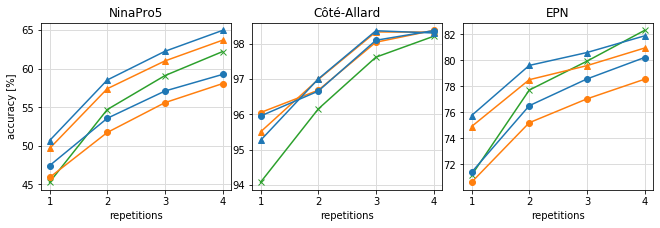
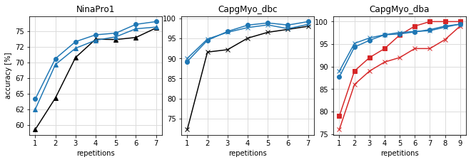

# Experiment 3
We compare the real-time myoelectric interface
(see section 3) using our technique (see section 2)
and the interface proposed by
[Côté-Allard et al.](https://github.com/UlysseCoteAllard/MyoArmbandDataset),
which uses CNN with transfer learning.

This CNN's scheme comprises two networks: source and target,
which share information through an element-wise summation in
a layer-by-layer fashion. Each network has three convolutional
and two fully connected layers.

Transfer learning occurs by freezing the source network's
weights (learned using source users' data) during the target
network's training on the target user's data.

The Côté-Allard approach uses continuous wavelet transform
to extract time-frequency information from windows of 260ms.

The following figure illustrates the classification accuracy
of the Côté-Allard approach and our classifier
(both LDA and QDA) using the three publicly databases,
the Hahne feature set, and two windows (295ms and 260ms).

*Import the library developed to visualize the results*


```python
import Experiments.Experiment3.VisualizationFunctions as VF3
```

## Côté-Allard approach
Legend of the next figure: our QDA classifier 295ms (blue triangle markers),
our LDA classifier 295ms (blue circle markers),
our QDA classifier 260ms (orange triangle markers),
our LDA classifier 260ms (orange circle markers), and
Côté-Allard approach 260ms (orange x markers).


```python
placeExtraWindow='Experiments/Experiment3/results/'
placeOur295='Experiments/Experiment1/results/'
placeCote='Experiments/Experiment3/'
VF3.AnalysisCote(placeExtraWindow,placeOur295, placeCote)
```





The Côté-Allard approach's performance is lower than of our
QDA classifiers (260ms and 295ms) for the three databases.
Using the Friedman rank test and the Holm post-hoc test,
our QDA classifier using windows of 295ms are best-ranked
(ranking 1.9) than the Côté-Allard approach (ranking 2.8)
with 99\% of confidence.

Our approach's data-analysis time (less than 5ms),
as shown in experiment 1, is significantly shorter than
the Côté-Allard approach's one, which is 22.5$\pm$1.2ms
(using a NVIDIA V100 GPU). Therefore, our approach is suitable
for the frequent training of real-time myoelectric interfaces
because it can analyze more sEMG data per window (295ms),
unlike the Côté-Allard approach (260ms), improving
classification accuracy (see previous figure).


```python
VF3.AnalysisFriedman(placeExtraWindow,placeOur295,placeCote)
```

    
    
    ANALYSIS OF WINDOW 260ms
    Number of classifiers:  3 
    Number of evaluations (10(people NinaPro5) x 4(shots) + 17(people Cote) x 4(shots) 30(people EPN) x 7(shots)):  228 
    
    Should we reject H0 (i.e. is there a difference in the means) at the 95.0 % confidence level? True 
    
    vectOurLDA260: 2.5
    vectOurQDA260: 1.7
    vectCote: 1.9
    
     The best classifier is:  vectOurQDA260
                                           p   sig
    vectOurQDA260 vs vectOurLDA260  0.000000  True
    vectOurQDA260 vs vectCote       0.033111  True
    
    
    ANALYSIS OF WINDOW 295ms
    Number of classifiers:  3 
    Number of evaluations (10(people NinaPro5) x 4(shots) + 17(people Cote) x 4(shots) 30(people EPN) x 7(shots)):  228 
    
    Should we reject H0 (i.e. is there a difference in the means) at the 95.0 % confidence level? True 
    
    vectOurLDA295: 2.3
    vectOurQDA295: 1.6
    vectCote: 2.1
    
     The best classifier is:  vectOurQDA295
                                               p   sig
    vectOurQDA295 vs vectOurLDA295  4.884981e-15  True
    vectOurQDA295 vs vectCote       7.792643e-07  True
    
    
    ANALYSIS BOTH WINDOWS (260ms AND 295ms)
    Number of classifiers:  5 
    Number of evaluations (10(people NinaPro5) x 4(shots) + 17(people Cote) x 4(shots) 30(people EPN) x 7(shots)):  228 
    
    Should we reject H0 (i.e. is there a difference in the means) at the 95.0 % confidence level? True 
    
    vectOurLDA260: 4.1
    vectOurQDA260: 2.8
    vectOurLDA295: 3.2
    vectOurQDA295: 2.0
    vectCote: 2.9
    
     The best classifier is:  vectOurQDA295
                                               p   sig
    vectOurQDA295 vs vectOurLDA260  0.000000e+00  True
    vectOurQDA295 vs vectOurLDA295  6.661338e-16  True
    vectOurQDA295 vs vectCote       1.445701e-10  True
    vectOurQDA295 vs vectOurQDA260  1.541030e-08  True
    

## Yu and Chen approach

We use three more datasets (NinaPro1, CapgMyo_dba, and CapgMyo_dbc)
to compare our interface directly with the two inter-user approaches
proposed by [Yu et al.](https://www.mdpi.com/1424-8220/21/7/2540) and
[Chen et al.](https://ieeexplore.ieee.org/abstract/document/9141383?casa_token=UQpocsESCKcAAAAA:e6shzcECGbio3MZXwy9VnQ6UIv86WU5WmI2qouDgpzoTBKPTMBbKnjbgTC2XDuHueG2zieRo-g)
who use these three datasets. The next figure shows the accuracy of
our LDA classifier and the accuracy reported by [Yu et al.](https://www.mdpi.com/1424-8220/21/7/2540)
(for NinaPro1 and CapgMyo_dbc) and
[Chen et al.](https://ieeexplore.ieee.org/abstract/document/9141383?casa_token=UQpocsESCKcAAAAA:e6shzcECGbio3MZXwy9VnQ6UIv86WU5WmI2qouDgpzoTBKPTMBbKnjbgTC2XDuHueG2zieRo-g)
(for CapgMyo_dba). In NinaPro1,CapgMyo_dba, and CapgMyo_dbc, our LDA classifier
(with windows of 295ms, 280ms, and 100ms) has higher accuracy than Yu and Chen
approaches. Our performance improvement is greater (approximately 5\%) than the
Yu and Chen approaches when the training set has few repetitions (1-4) per class.


```python
VF3.AnalysisYuChen(placeExtraWindow, placeOur295)
```




